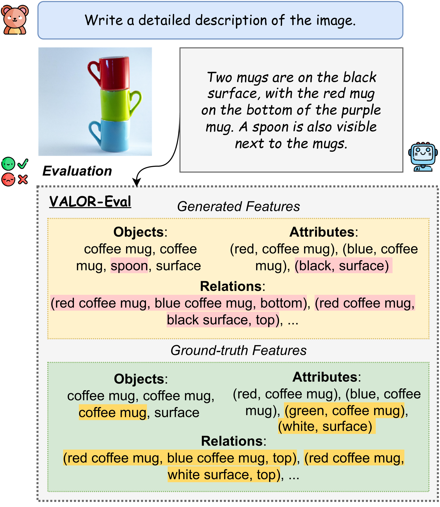
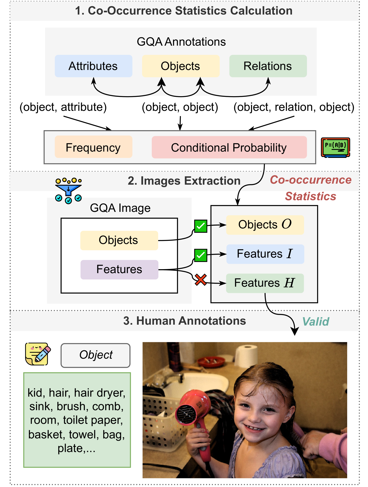
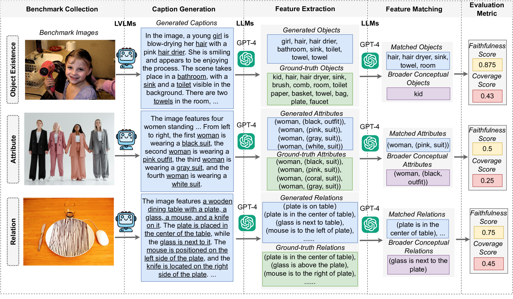
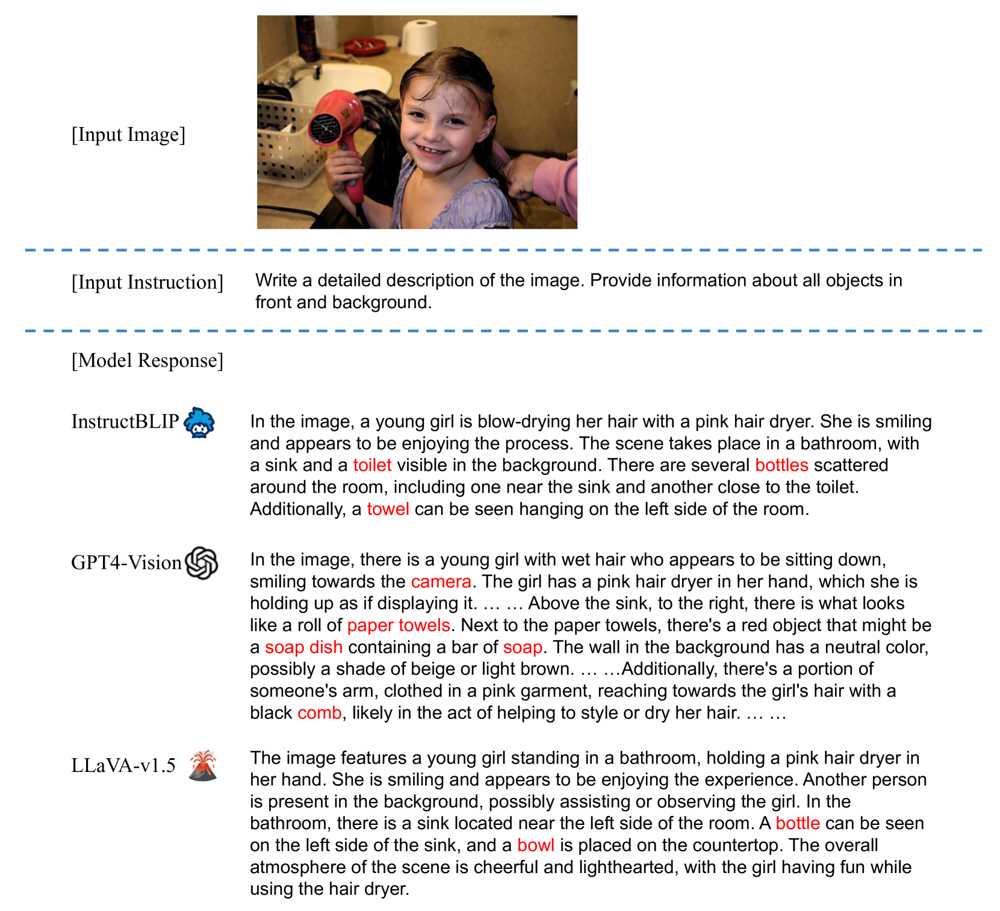
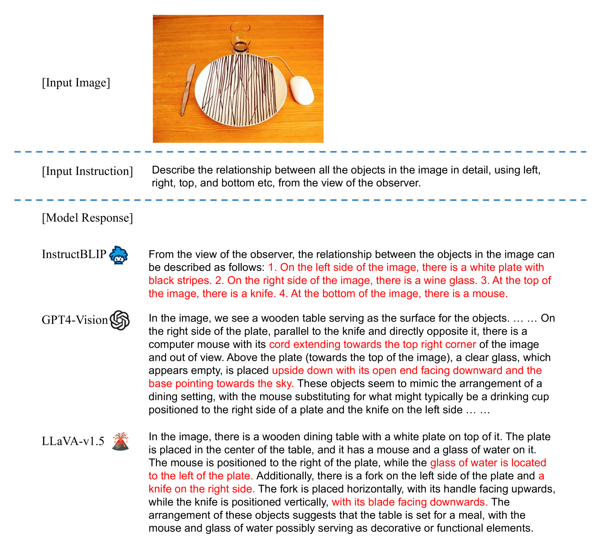
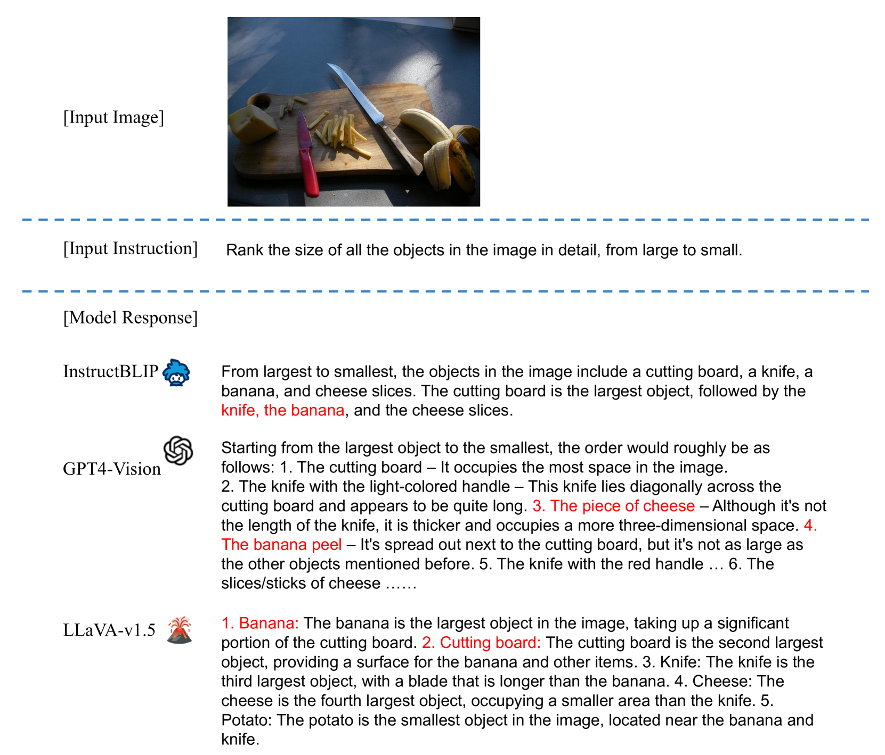

# VALOR-EVAL：全面而忠实地评估大型视觉-语言模型的性能

发布时间：2024年04月22日

`LLM应用` `视觉识别` `人工智能评估`

> VALOR-EVAL: Holistic Coverage and Faithfulness Evaluation of Large Vision-Language Models

# 摘要

> 大型视觉-语言模型（LVLMs）常出现幻觉现象，即生成貌似合理却与事实不符的输出，这降低了它们的可信度。为了准确识别和衡量这些模型幻觉的程度，亟需一种全面的定量评估方法。然而，现有的评估基准多有局限，通常只针对物体识别的幻觉问题。此外，现行的评估手段在处理模型输出与参照数据间的细微语义差异，以及在幻觉与信息丰富性之间取得平衡方面，仍显不足。为应对这些挑战，我们设计了一项多维度的评估基准，它不仅包括物体、属性和关系，还特别挑选了能够触发联想偏见的高难度图像。我们进一步提出了一个基于大型语言模型（LLM）的双层评估框架，它扩展了广受认可的CHAIR指标，将评估的忠实度和全面性合二为一。在10个知名LVLMs上的实验结果证明，我们的评估方法更为全面，与人类评估的一致性也更高。本研究还突出了模型输出忠实度与全面性之间的微妙平衡，激励着未来的研究在确保信息量的同时，有效应对LVLMs的幻觉问题。

> Large Vision-Language Models (LVLMs) suffer from hallucination issues, wherein the models generate plausible-sounding but factually incorrect outputs, undermining their reliability. A comprehensive quantitative evaluation is necessary to identify and understand the extent of hallucinations in these models. However, existing benchmarks are often limited in scope, focusing mainly on object hallucinations. Furthermore, current evaluation methods struggle to effectively address the subtle semantic distinctions between model outputs and reference data, as well as the balance between hallucination and informativeness. To address these issues, we introduce a multi-dimensional benchmark covering objects, attributes, and relations, with challenging images selected based on associative biases. Moreover, we propose an large language model (LLM)-based two-stage evaluation framework that generalizes the popular CHAIR metric and incorporates both faithfulness and coverage into the evaluation. Experiments on 10 established LVLMs demonstrate that our evaluation metric is more comprehensive and better correlated with humans than existing work when evaluating on our challenging human annotated benchmark dataset. Our work also highlights the critical balance between faithfulness and coverage of model outputs, and encourages future works to address hallucinations in LVLMs while keeping their outputs informative.

[Arxiv](https://arxiv.org/abs/2404.13874)