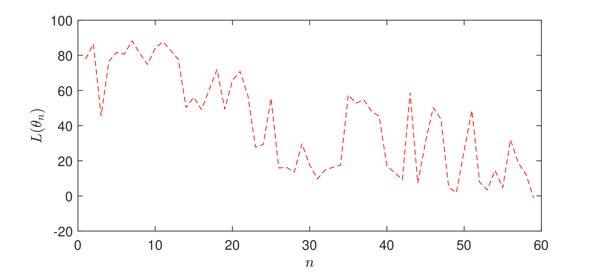

# 本文探讨了一种基于多智能体揭示偏好的自适应机制设计方法，旨在优化智能体间的交互和决策过程。

发布时间：2024年04月23日

`分类：Agent` `经济学` `算法设计`

> Adaptive Mechanism Design using Multi-Agent Revealed Preferences

# 摘要

> 本研究提出了一种算法架构，旨在灵活实现机制设计目标，即寻找能够激发社会最优纳什均衡的机制，而无需事先知晓参与者的效用函数。通过一种探测方案，设计者可以逐步实施机制并观察所引发的纳什均衡反应。我们首先确定了一组必要且充分的条件，这些条件以线性规划的可行性形式呈现，确保在这些条件下，实证纳什均衡反应能够达到社会最优。接着，我们基于这些条件构建了一个损失函数，并证明了当机制使得纳什均衡系统反应达到社会最优时，该损失函数能够实现全局最小化。我们进一步开发了一种基于模拟退火的梯度算法，并通过证明其以概率收敛到全局最小值集，从而完成了自适应机制设计的构想。

> This paper constructs an algorithmic framework for adaptively achieving the mechanism design objective, finding a mechanism inducing socially optimal Nash equilibria, without knowledge of the utility functions of the agents. We consider a probing scheme where the designer can iteratively enact mechanisms and observe Nash equilibria responses. We first derive necessary and sufficient conditions, taking the form of linear program feasibility, for the existence of utility functions under which the empirical Nash equilibria responses are socially optimal. Then, we utilize this to construct a loss function with respect to the mechanism, and show that its global minimization occurs at mechanisms under which Nash equilibria system responses are also socially optimal. We develop a simulated annealing-based gradient algorithm, and prove that it converges in probability to this set of global minima, thus achieving adaptive mechanism design.

[Arxiv](https://arxiv.org/abs/2404.15391)