# BattleAgent：通过在历史战役中进行多模态动态模拟，为历史研究提供补充分析。

发布时间：2024年04月23日

`Agent` `历史研究` `人工智能`

> BattleAgent: Multi-modal Dynamic Emulation on Historical Battles to Complement Historical Analysis

# 摘要

> 本文提出了 BattleAgent，一个融合了大型视觉-语言模型与多智能体系统的仿真平台。该系统致力于模拟多个智能体间的复杂互动，以及智能体与其环境间的长期交互。它不仅复现了领导者的决策机制，也捕捉了普通参与者如士兵的视角。通过细致的多模态交互，仿真展示了智能体的先进功能，并可根据特定情境定制智能体结构，以执行侦察、挖掘战壕等多样化战斗活动。这些元素共同作用，生动地再现历史事件，深入揭示了不同角色的内心世界。BattleAgent 的技术框架为历史战役提供了一个详尽且沉浸式的舞台，使智能体能够参与、观察并对战斗情境的变化做出动态反应。这种方法有望显著提升我们对历史事件的认识，尤其是通过个人经历的视角。它还能辅助历史研究，弥补传统历史叙述的不足，这些叙述往往缺乏对普通人经历的记录，只关注决策者的视角。BattleAgent 彰显了 AI 在激活社会重大事件中的人文关怀，促进了对人类社会更深层次的理解，并推动了社会的进步。

> This paper presents BattleAgent, an emulation system that combines the Large Vision-Language Model and Multi-agent System. This novel system aims to simulate complex dynamic interactions among multiple agents, as well as between agents and their environments, over a period of time. It emulates both the decision-making processes of leaders and the viewpoints of ordinary participants, such as soldiers. The emulation showcases the current capabilities of agents, featuring fine-grained multi-modal interactions between agents and landscapes. It develops customizable agent structures to meet specific situational requirements, for example, a variety of battle-related activities like scouting and trench digging. These components collaborate to recreate historical events in a lively and comprehensive manner while offering insights into the thoughts and feelings of individuals from diverse viewpoints. The technological foundations of BattleAgent establish detailed and immersive settings for historical battles, enabling individual agents to partake in, observe, and dynamically respond to evolving battle scenarios. This methodology holds the potential to substantially deepen our understanding of historical events, particularly through individual accounts. Such initiatives can also aid historical research, as conventional historical narratives often lack documentation and prioritize the perspectives of decision-makers, thereby overlooking the experiences of ordinary individuals. BattelAgent illustrates AI's potential to revitalize the human aspect in crucial social events, thereby fostering a more nuanced collective understanding and driving the progressive development of human society.

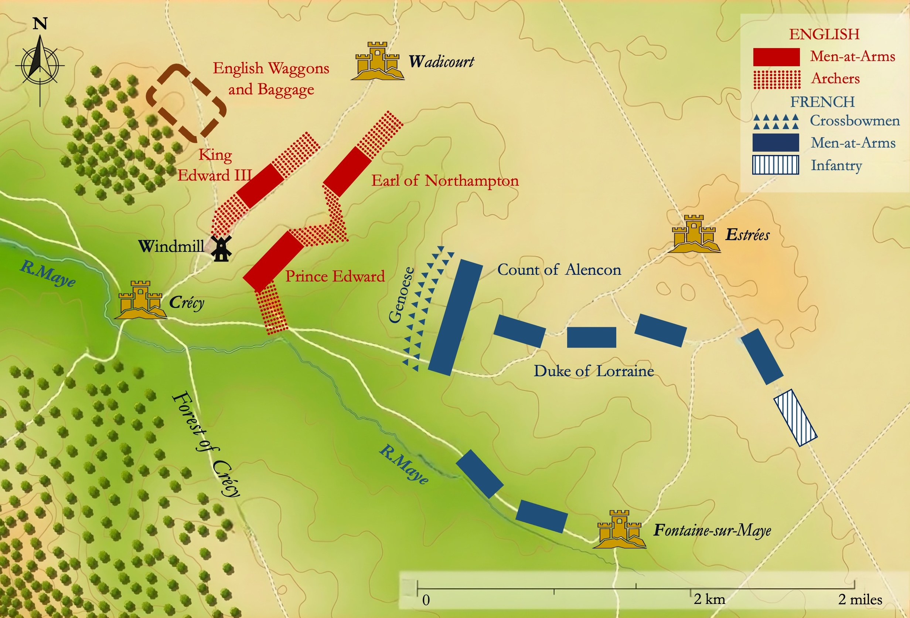

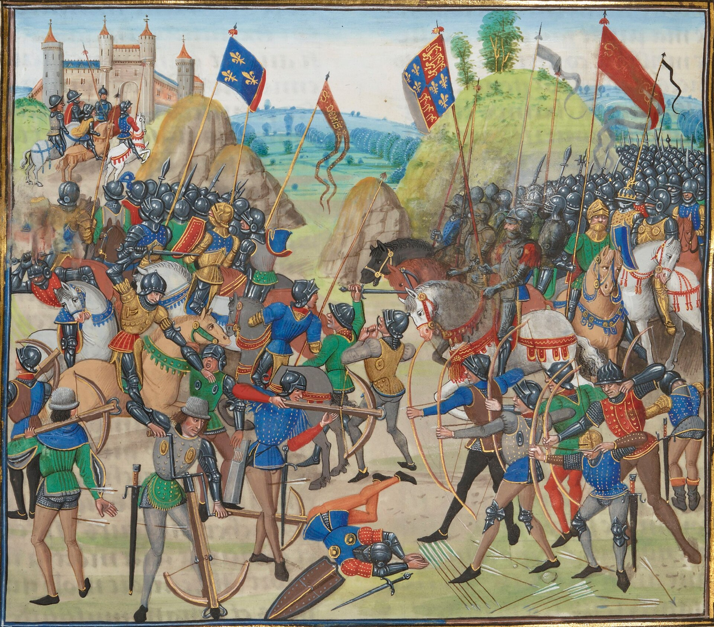

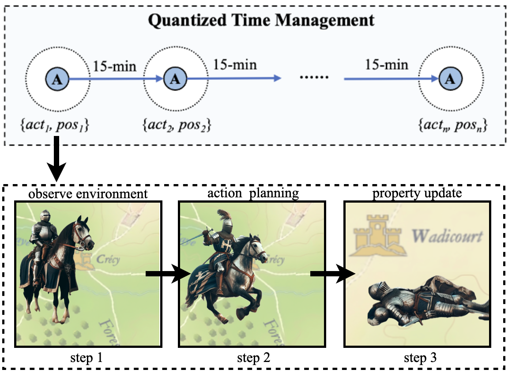

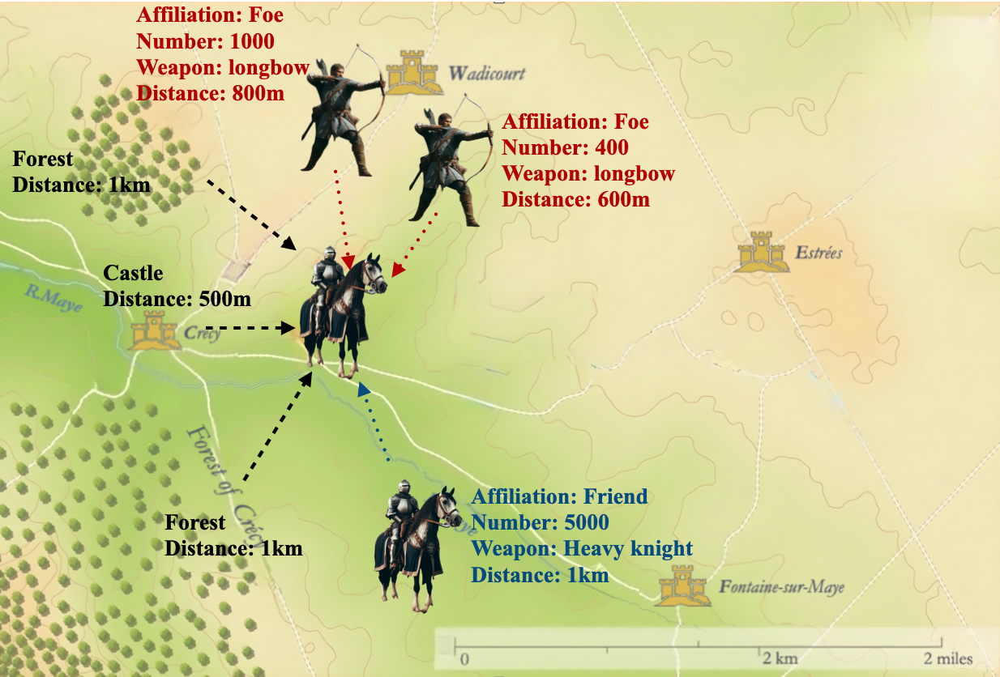

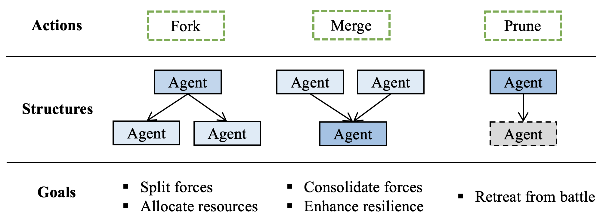

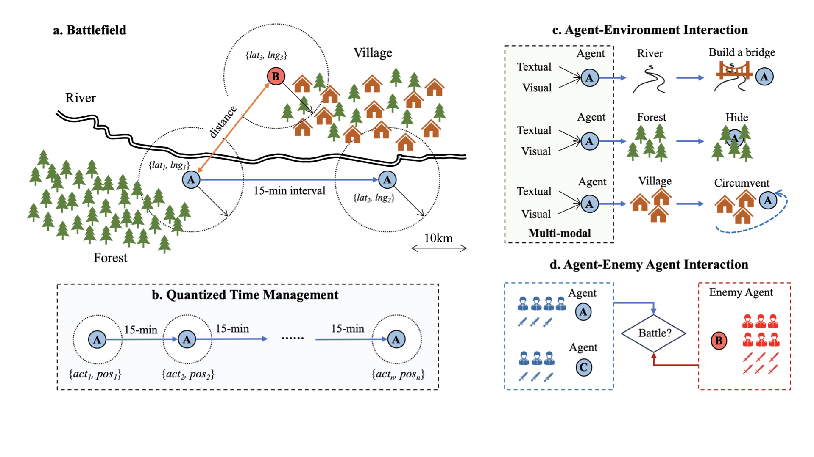

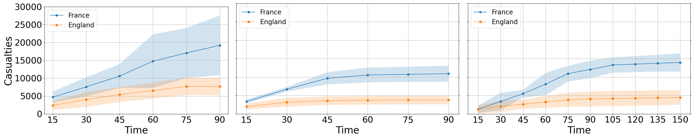

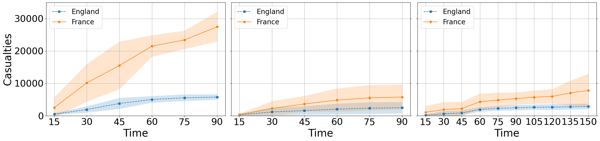

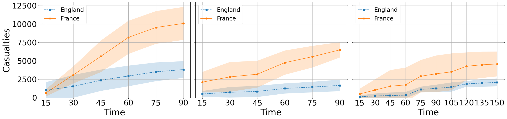

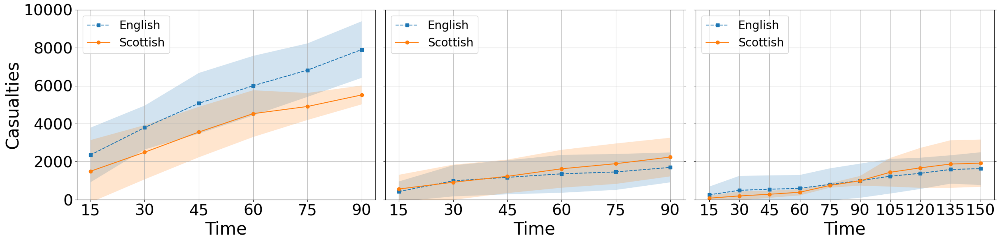

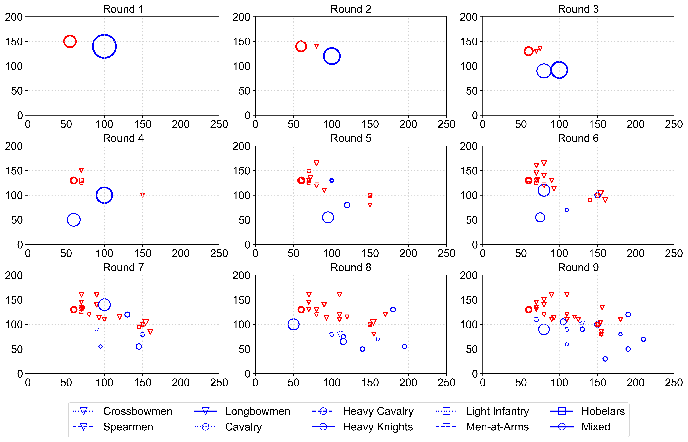

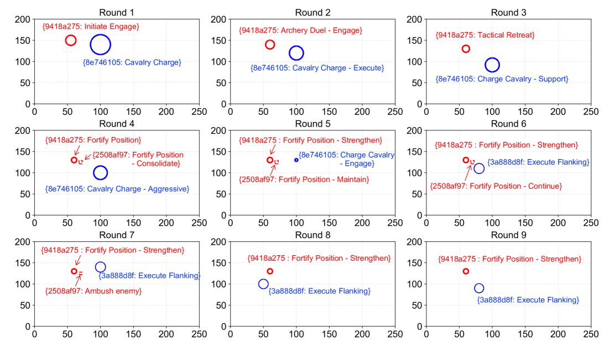

[Arxiv](https://arxiv.org/abs/2404.15532)