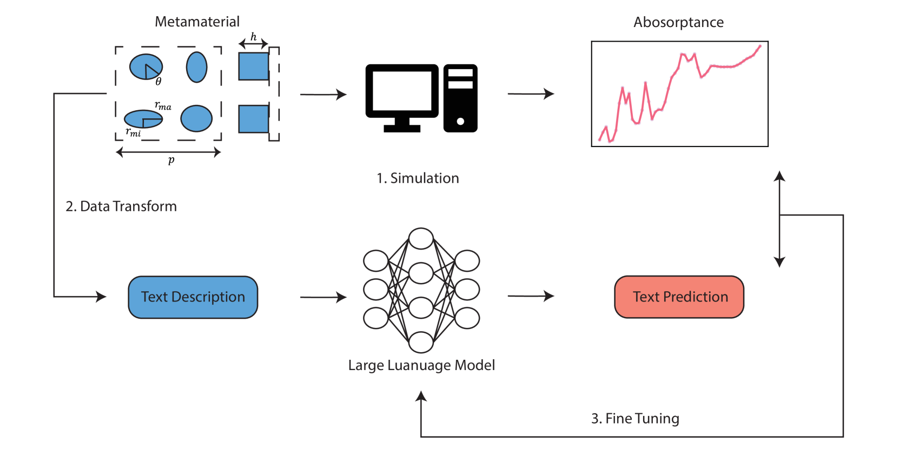
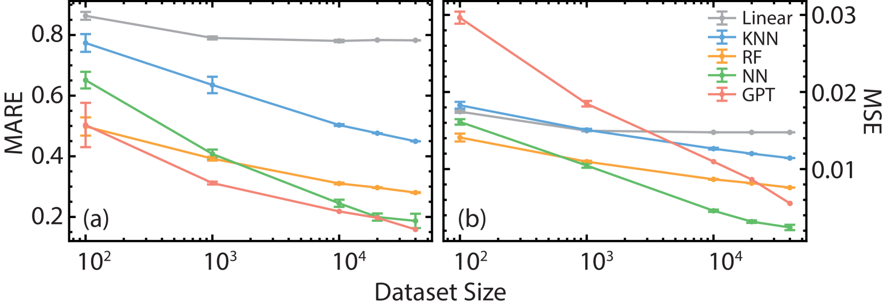
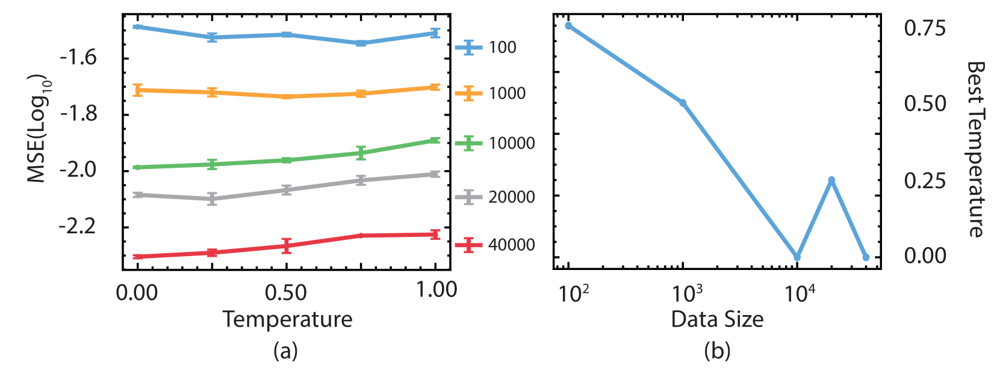
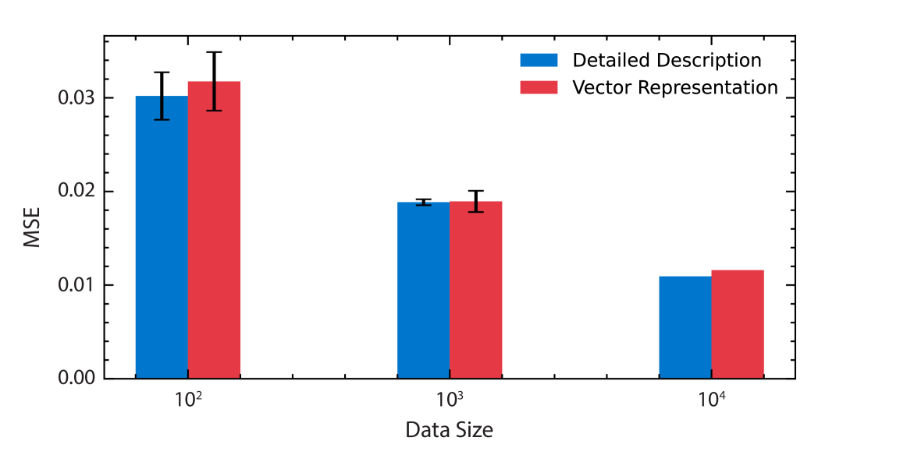
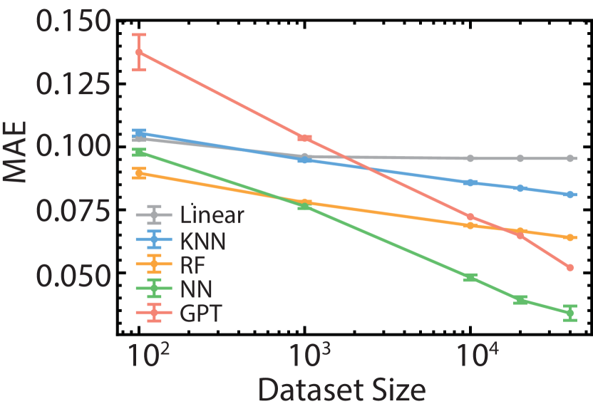

# 大型语言模型能否掌握超材料的物理原理？一项基于ChatGPT的实证探索

发布时间：2024年04月23日

`LLM应用` `电磁学` `机器学习`

> Can Large Language Models Learn the Physics of Metamaterials? An Empirical Study with ChatGPT

# 摘要

> 诸如ChatGPT、Gemini、LlaMa和Claude等大型语言模型（LLMs）经过海量互联网文本的训练，展现出对复杂问题的响应能力，其回答往往与人类无异。本文介绍了一种经过微调的LLM，它能够基于仅描述超表面几何结构的文本提示，预测一系列频率上的电磁谱。与传统的机器学习技术相比，如前馈神经网络、随机森林、线性回归和K最近邻（KNN）算法，微调后的LLM（FT-LLM）在所有测试的数据集规模上均展现出更低的误差率，甚至超过了深度神经网络。此外，我们还证明了LLM解决逆问题的潜力，它能够根据所需的谱来提供必要的几何结构。LLMs在处理大数据、挖掘数据中的隐含模式以及在高维空间中运作方面拥有超越人类的能力，这些优势可能为科研带来益处。我们认为，通过对特定领域的大型数据集进行微调，LLMs能够深入理解该领域的复杂性，从而成为研究和分析的得力助手。

> Large language models (LLMs) such as ChatGPT, Gemini, LlaMa, and Claude are trained on massive quantities of text parsed from the internet and have shown a remarkable ability to respond to complex prompts in a manner often indistinguishable from humans. We present a LLM fine-tuned on up to 40,000 data that can predict electromagnetic spectra over a range of frequencies given a text prompt that only specifies the metasurface geometry. Results are compared to conventional machine learning approaches including feed-forward neural networks, random forest, linear regression, and K-nearest neighbor (KNN). Remarkably, the fine-tuned LLM (FT-LLM) achieves a lower error across all dataset sizes explored compared to all machine learning approaches including a deep neural network. We also demonstrate the LLM's ability to solve inverse problems by providing the geometry necessary to achieve a desired spectrum. LLMs possess some advantages over humans that may give them benefits for research, including the ability to process enormous amounts of data, find hidden patterns in data, and operate in higher-dimensional spaces. We propose that fine-tuning LLMs on large datasets specific to a field allows them to grasp the nuances of that domain, making them valuable tools for research and analysis.

[Arxiv](https://arxiv.org/abs/2404.15458)