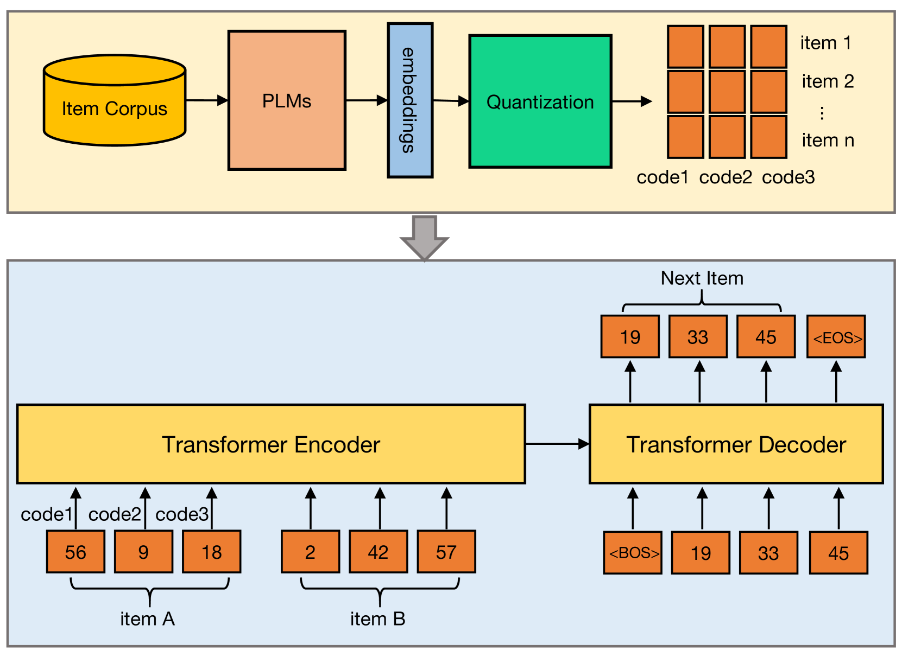
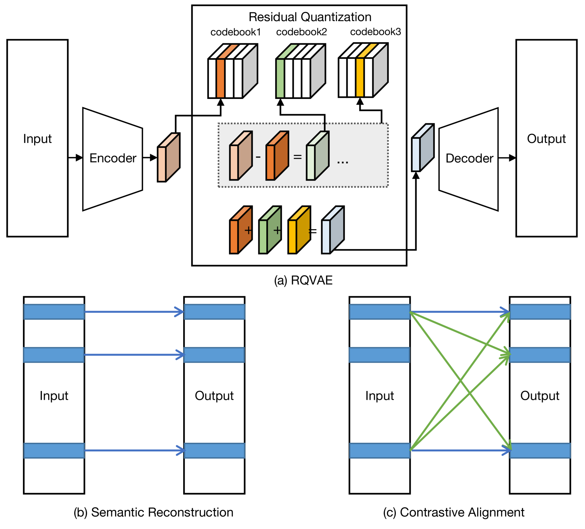
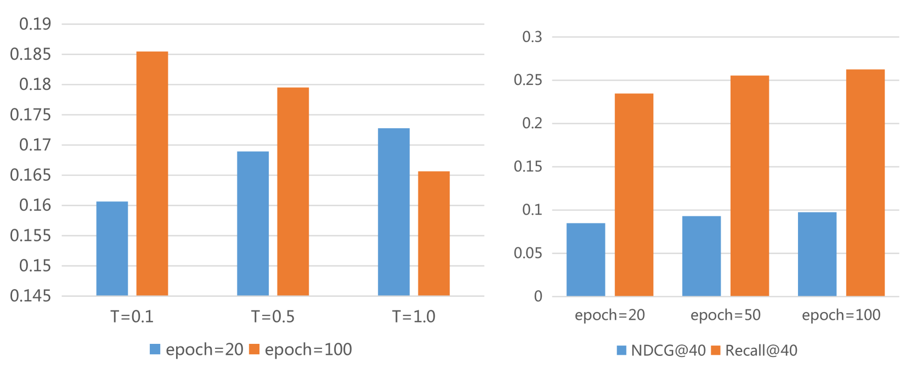
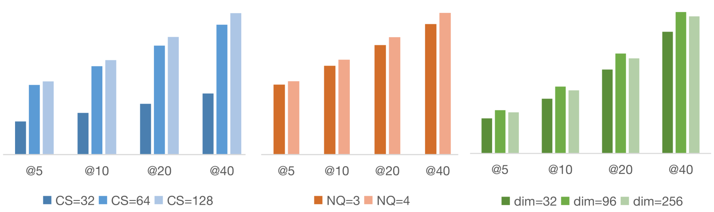

# 对比量化语义编码技术在生成推荐系统中的应用

发布时间：2024年04月23日

`LLM应用` `推荐系统`

> Contrastive Quantization based Semantic Code for Generative Recommendation

# 摘要

> 大型语言模型的兴起催生了一种新颖的推荐系统检索技术——生成式检索，该技术分为两个阶段：首先是构建离散的代码，其次是利用变换器架构对代码进行顺序解码。现有技术多通过基于文本表示的量化重建来生成项目语义代码，但这忽略了在推荐系统中建模项目关系时不可或缺的项目差异。本文提出了一种新方法，同时考虑项目间关系和语义信息来构建项目代码表示。具体而言，我们利用预训练的语言模型来提取项目文本描述，并将其转换为项目嵌入。接着，我们引入对比目标来增强基于编码器-解码器的 RQVAE 模型，以学习项目代码。我们以解码器生成的样本嵌入作为正样本，以其他样本的嵌入作为负样本，有效提升了项目间的差异性，更好地维护了项目的邻域信息。最终，我们在序列推荐模型上对语义代码进行训练和测试，实验结果显示，我们的方法在 MIND 数据集的 NDCG@5 上提升了 43.76%，在 Office 数据集的 Recall@10 上提升了 80.95%，均优于先前的方法。

> With the success of large language models, generative retrieval has emerged as a new retrieval technique for recommendation. It can be divided into two stages: the first stage involves constructing discrete Codes (i.e., codes), and the second stage involves decoding the code sequentially via the transformer architecture. Current methods often construct item semantic codes by reconstructing based quantization on item textual representation, but they fail to capture item discrepancy that is essential in modeling item relationships in recommendation sytems. In this paper, we propose to construct the code representation of items by simultaneously considering both item relationships and semantic information. Specifically, we employ a pre-trained language model to extract item's textual description and translate it into item's embedding. Then we propose to enhance the encoder-decoder based RQVAE model with contrastive objectives to learn item code. To be specific, we employ the embeddings generated by the decoder from the samples themselves as positive instances and those from other samples as negative instances. Thus we effectively enhance the item discrepancy across all items, better preserving the item neighbourhood. Finally, we train and test semantic code with with generative retrieval on a sequential recommendation model. Our experiments demonstrate that our method improves NDCG@5 with 43.76% on the MIND dataset and Recall@10 with 80.95% on the Office dataset compared to the previous baselines.

[Arxiv](https://arxiv.org/abs/2404.14774)