# 本文探讨了在动态环境中，利用时空占用网格图进行分散式多智能体的轨迹规划问题。

发布时间：2024年04月23日

`Agent` `机器人技术`

> Decentralized Multi-Agent Trajectory Planning in Dynamic Environments with Spatiotemporal Occupancy Grid Maps

# 摘要

> 本研究提出了一种分散式轨迹规划架构，专为多台微型空中机器人（MAVs）在充满静态及动态障碍物的环境中实现避碰设计。该架构采用预测性时空占用网格图（SOGM），以预测未来邻近区域的空间占用情况，作为环境的映射方式。在此基础上，我们对运动动力学A*搜索算法和走廊约束轨迹优化算法进行了扩展，有效应对了各种形状的静态和动态障碍物。通过机器人间共享规划轨迹并将其映射至SOGM，实现了通信机器人的避碰整合。仿真结果显示，该方法在包含不同数量和形状障碍物的动态环境中，性能与当前最先进技术相当。最终，该方法在实际实验中得到了成功验证。

> This paper proposes a decentralized trajectory planning framework for the collision avoidance problem of multiple micro aerial vehicles (MAVs) in environments with static and dynamic obstacles. The framework utilizes spatiotemporal occupancy grid maps (SOGM), which forecast the occupancy status of neighboring space in the near future, as the environment representation. Based on this representation, we extend the kinodynamic A* and the corridor-constrained trajectory optimization algorithms to efficiently tackle static and dynamic obstacles with arbitrary shapes. Collision avoidance between communicating robots is integrated by sharing planned trajectories and projecting them onto the SOGM. The simulation results show that our method achieves competitive performance against state-of-the-art methods in dynamic environments with different numbers and shapes of obstacles. Finally, the proposed method is validated in real experiments.

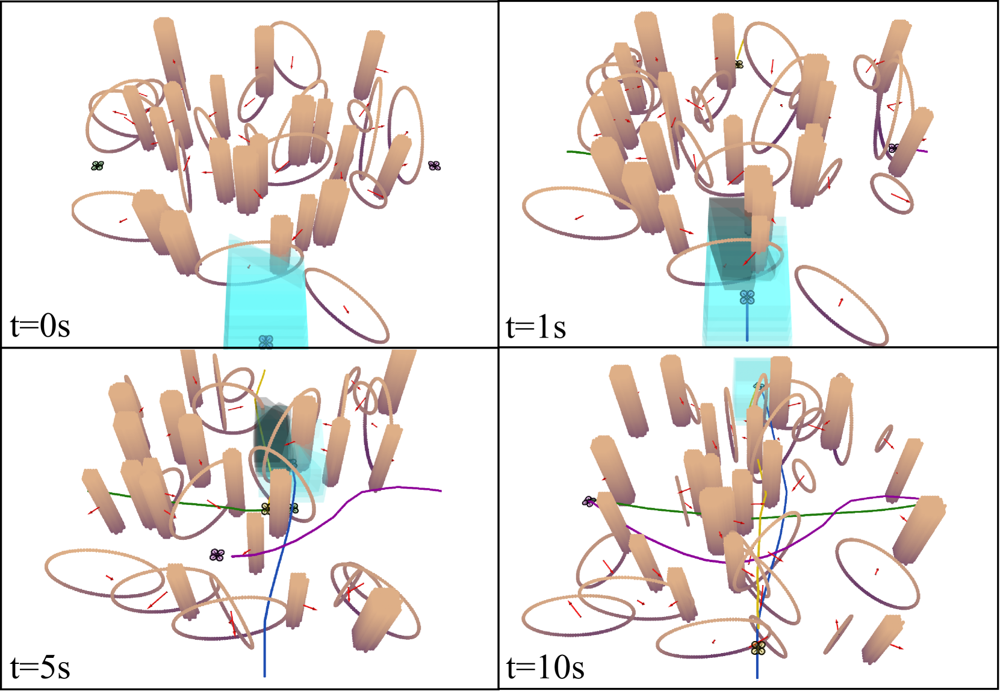

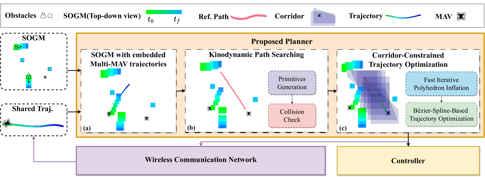

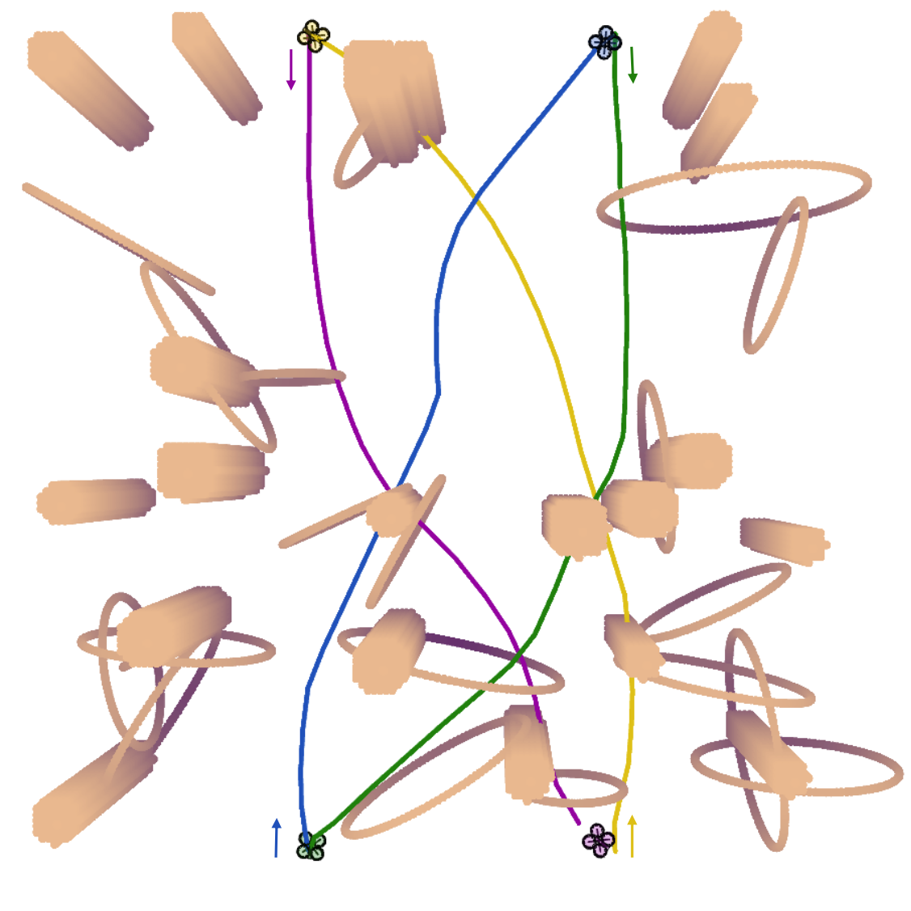

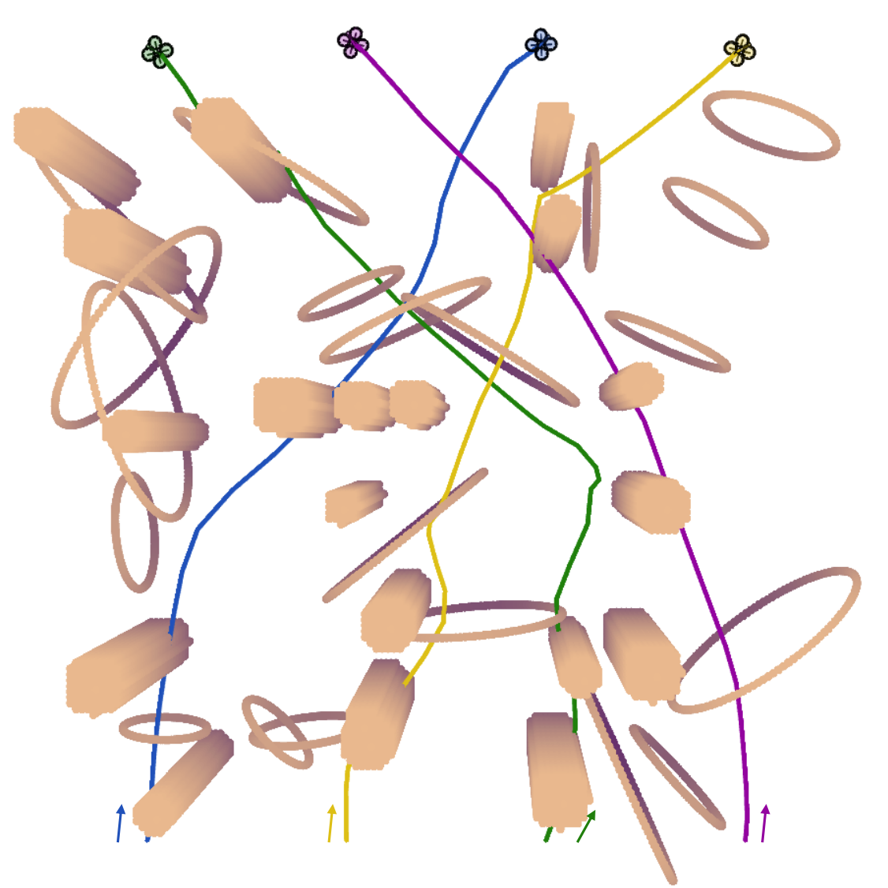

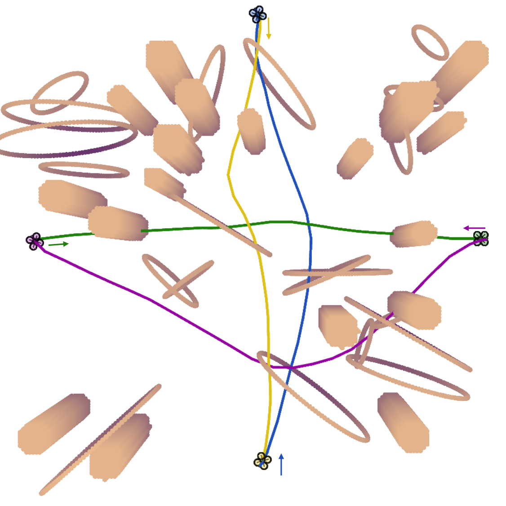

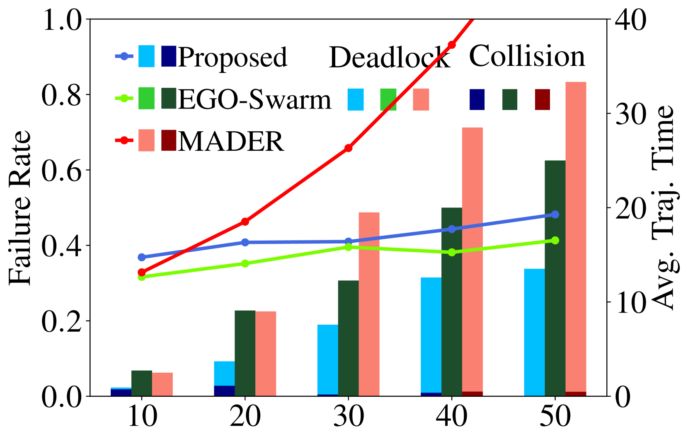

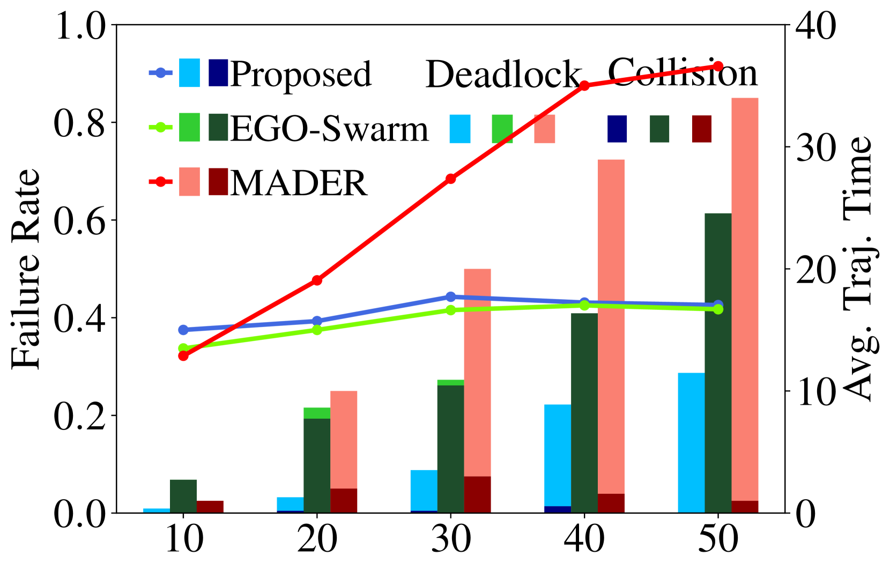

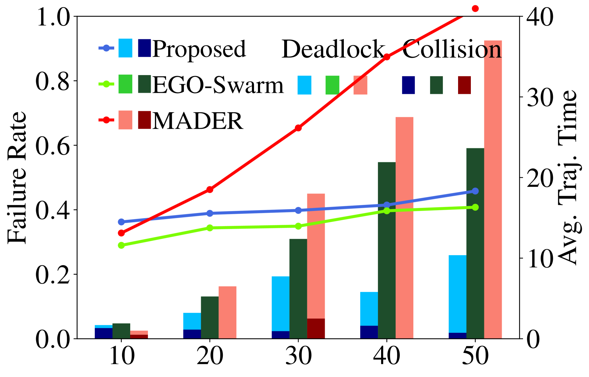

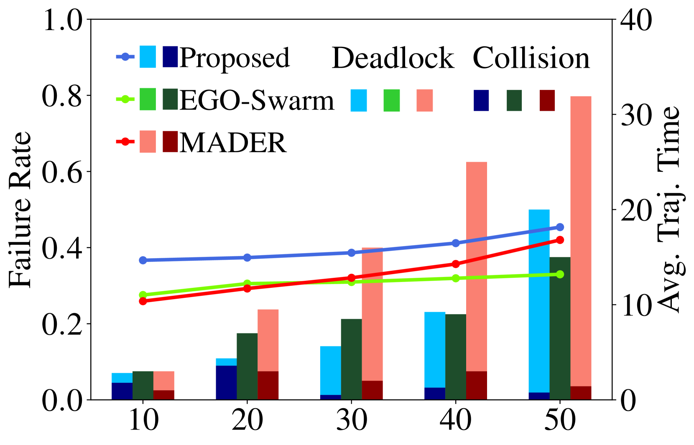

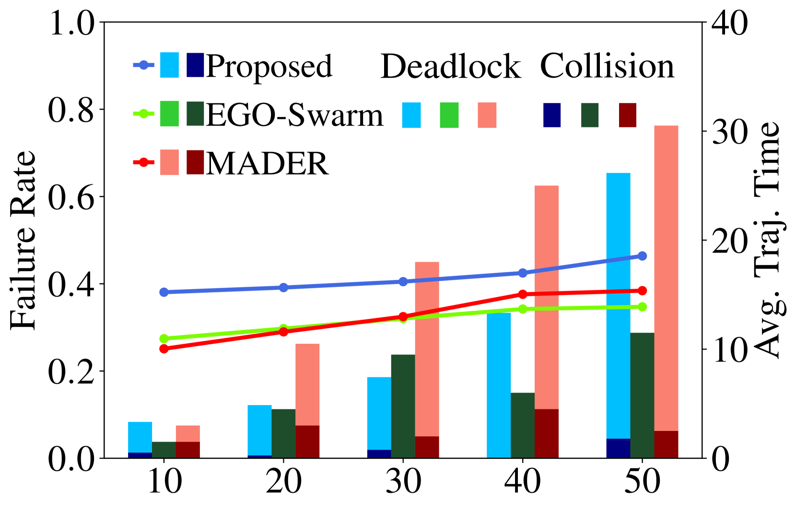

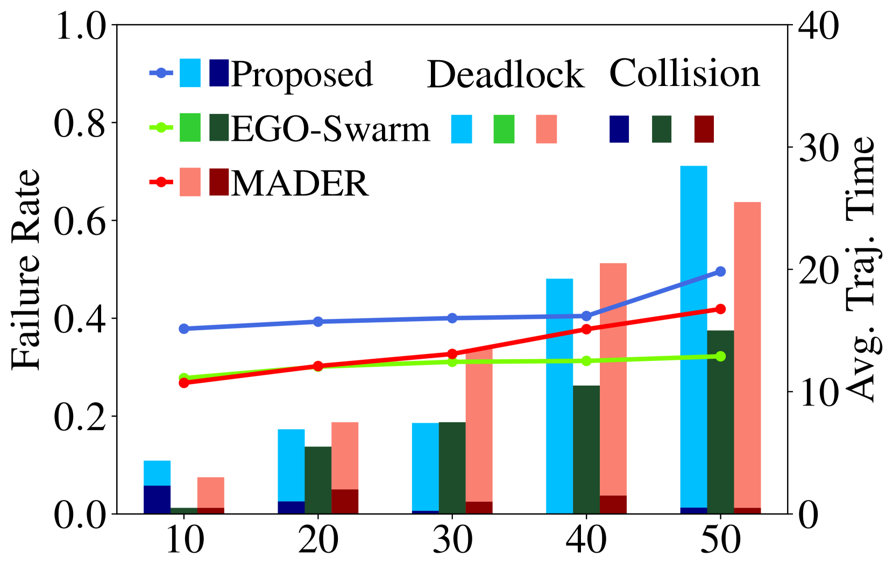

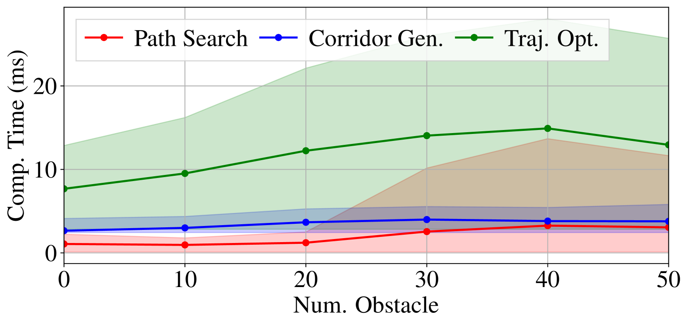

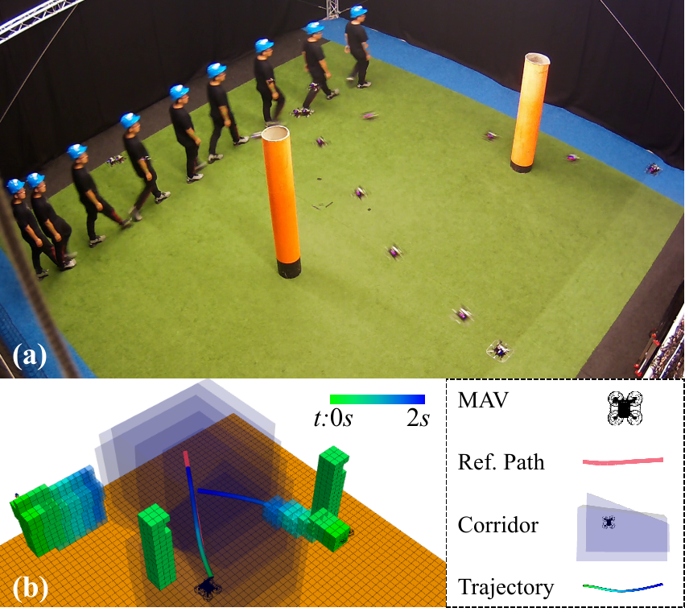

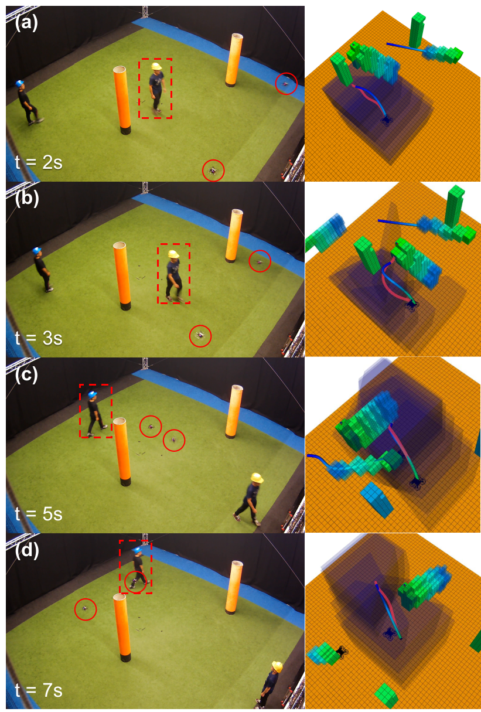

[Arxiv](https://arxiv.org/abs/2404.15602)