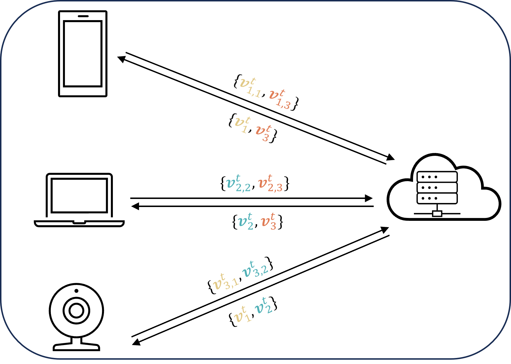
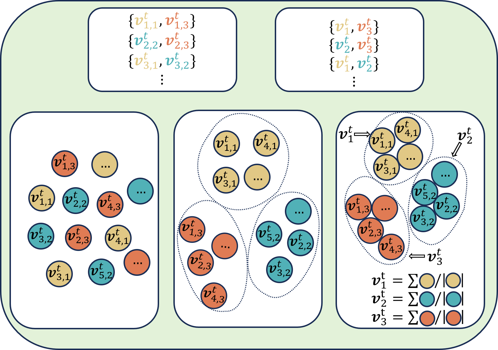
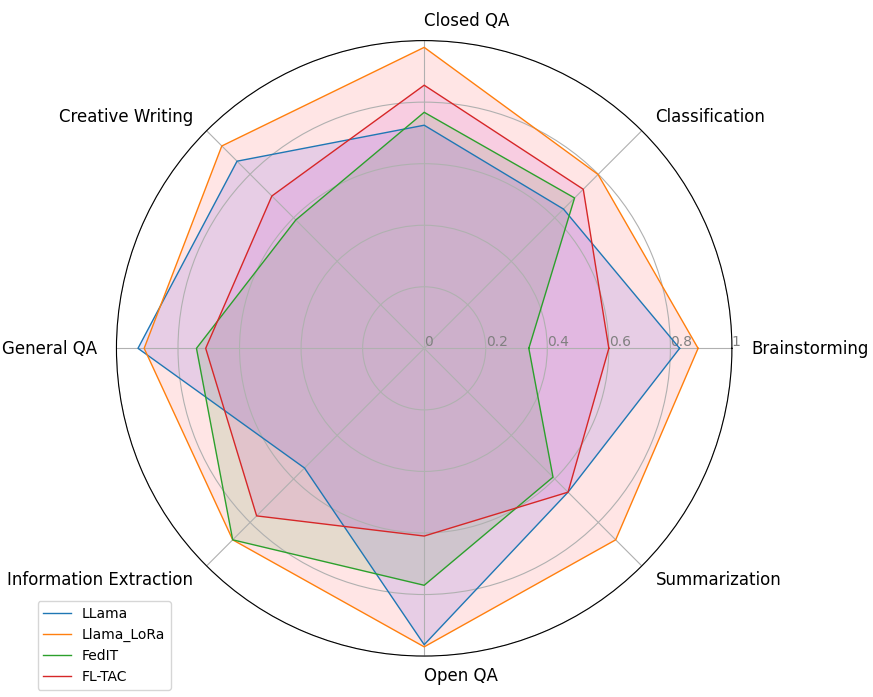
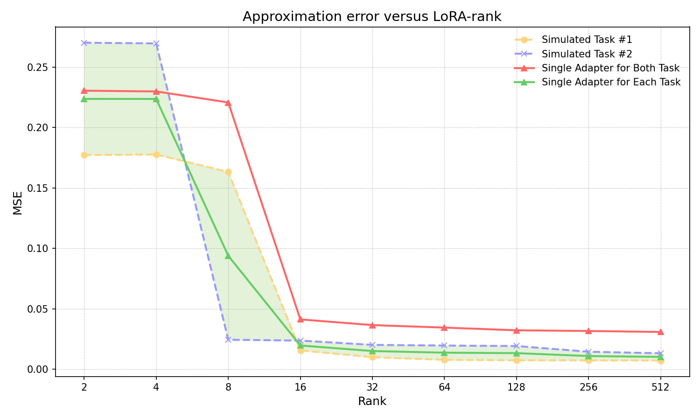

# FL-TAC：在联合学习框架下，通过低秩矩阵和任务定制的适配器聚类技术，实现了更高效的微调过程。

发布时间：2024年04月23日

`LLM应用` `联邦学习` `机器学习`

> FL-TAC: Enhanced Fine-Tuning in Federated Learning via Low-Rank, Task-Specific Adapter Clustering

# 摘要

> 大规模预训练模型在通过微调适应下游任务方面展现出巨大潜力，但往往因难以收集到足够的高质量、任务特定数据而受限。联邦学习（FL）通过在多样化任务数据的大规模客户端上进行微调，提供了解决方案，尽管它因预训练模型的庞大体积导致通信成本高昂。本研究通过低秩微调技术，针对FL框架中大型预训练模型的微调通信开销问题提出了解决方案。我们首先在客户端为每个任务训练低秩适配器，然后在服务器端对相似适配器进行聚类，以实现任务特定的聚合。通过在GLUE和CIFAR-10/100等语言与视觉任务上的广泛实验，我们观察到任务特定适配器在FL训练过程中的发展，并证实了所提出的低秩任务特定适配器聚类（TAC）方法的有效性。

> Although large-scale pre-trained models hold great potential for adapting to downstream tasks through fine-tuning, the performance of such fine-tuned models is often limited by the difficulty of collecting sufficient high-quality, task-specific data. Federated Learning (FL) offers a promising solution by enabling fine-tuning across large-scale clients with a variety of task data, but it is bottlenecked by significant communication overhead due to the pre-trained models' extensive size. This paper addresses the high communication cost for fine-tuning large pre-trained models within FL frameworks through low-rank fine-tuning. Specifically, we train a low-rank adapter for each individual task on the client side, followed by server-side clustering for similar group of adapters to achieve task-specific aggregation. Extensive experiments on various language and vision tasks, such as GLUE and CIFAR-10/100, reveal the evolution of task-specific adapters throughout the FL training process and verify the effectiveness of the proposed low-rank task-specific adapter clustering (TAC) method.

[Arxiv](https://arxiv.org/abs/2404.15384)