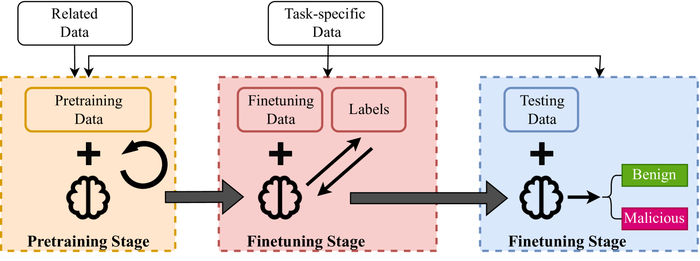
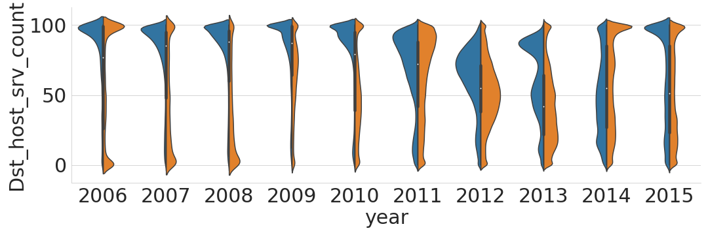
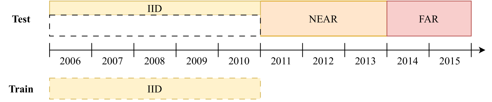
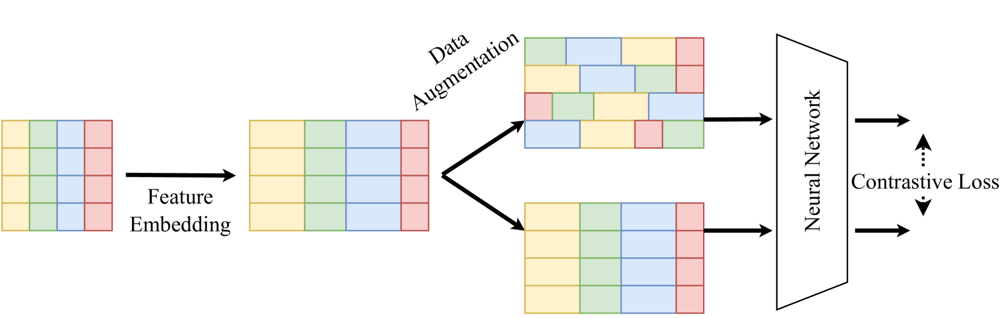
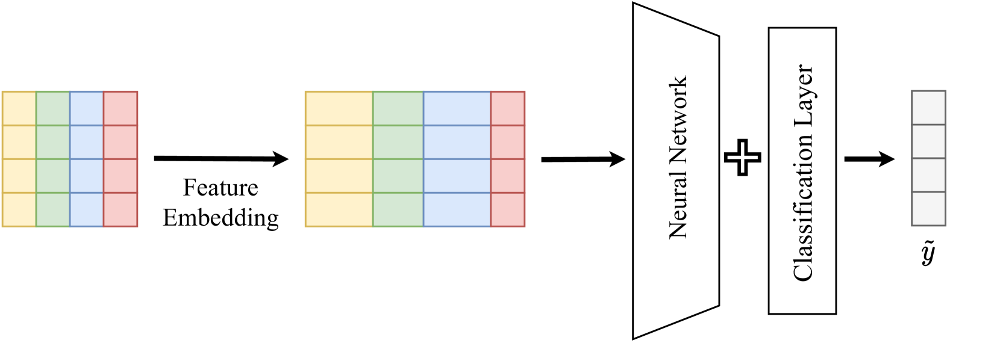
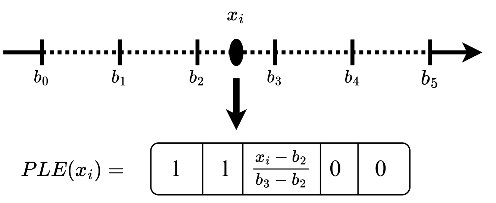
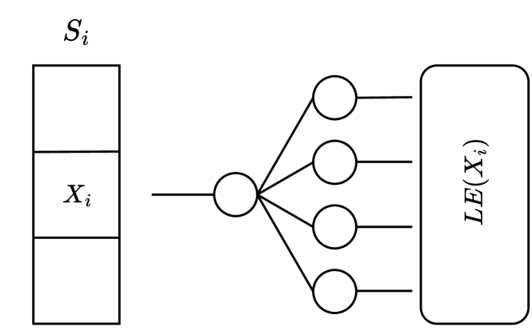

# 采用对比预训练策略，减轻特征分布变化对入侵检测的影响

发布时间：2024年04月23日

`分类：Agent` `网络安全`

> Feature Distribution Shift Mitigation with Contrastive Pretraining for Intrusion Detection

# 摘要

> 近年来，深度学习在网络入侵检测领域的应用日益受到关注。然而，特征分布的变动性问题仍是一大挑战，它削弱了模型随时间推移的性能。模型预训练作为一项新兴的训练策略，已在计算机视觉和自然语言处理领域展现出其对抗特征分布变动的能力。为了探索其在网络入侵检测中的潜力，我们设计了SwapCon模型，该模型在预训练阶段压缩了不变的特征信息，并在微调阶段进一步优化。通过Kyoto2006+数据集，我们证实了特征分布变动的存在，并展示了适当规模的预训练如何显著提升模型对此类变动的抵抗力，性能提升超过8%。此外，我们发现合适的数值嵌入策略也能显著提升预训练模型的表现。进一步的实验结果还显示，SwapCon模型在性能上大幅超越了基于XGBoost和KNN的模型。

> In recent years, there has been a growing interest in using Machine Learning (ML), especially Deep Learning (DL) to solve Network Intrusion Detection (NID) problems. However, the feature distribution shift problem remains a difficulty, because the change in features' distributions over time negatively impacts the model's performance. As one promising solution, model pretraining has emerged as a novel training paradigm, which brings robustness against feature distribution shift and has proven to be successful in Computer Vision (CV) and Natural Language Processing (NLP). To verify whether this paradigm is beneficial for NID problem, we propose SwapCon, a ML model in the context of NID, which compresses shift-invariant feature information during the pretraining stage and refines during the finetuning stage. We exemplify the evidence of feature distribution shift using the Kyoto2006+ dataset. We demonstrate how pretraining a model with the proper size can increase robustness against feature distribution shifts by over 8%. Moreover, we show how an adequate numerical embedding strategy also enhances the performance of pretrained models. Further experiments show that the proposed SwapCon model also outperforms eXtreme Gradient Boosting (XGBoost) and K-Nearest Neighbor (KNN) based models by a large margin.

[Arxiv](https://arxiv.org/abs/2404.15382)