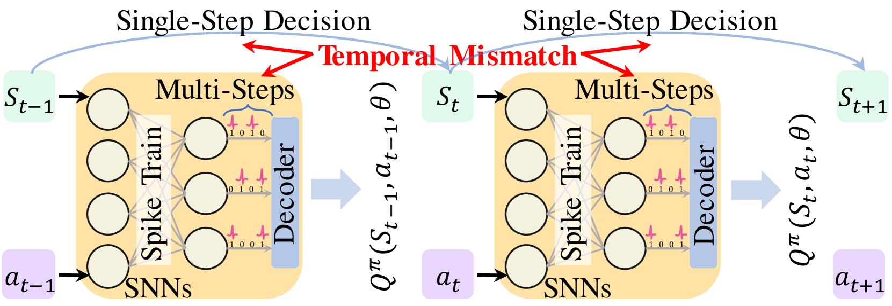
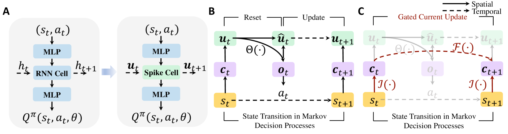
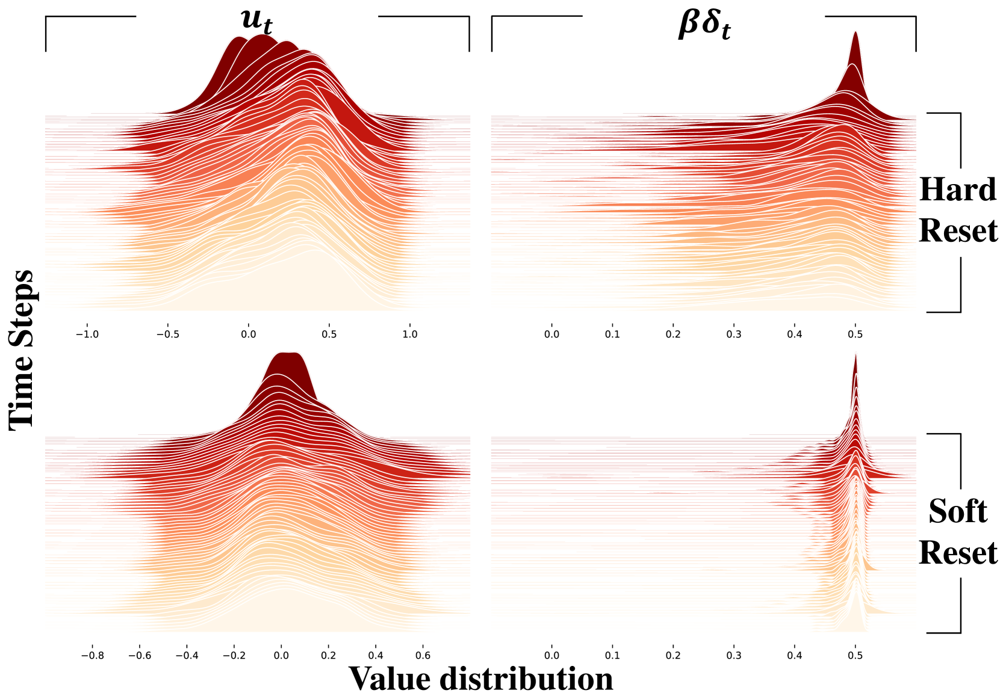
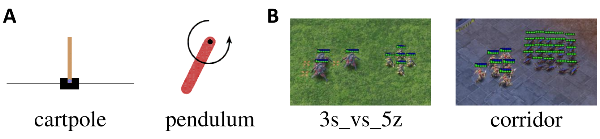
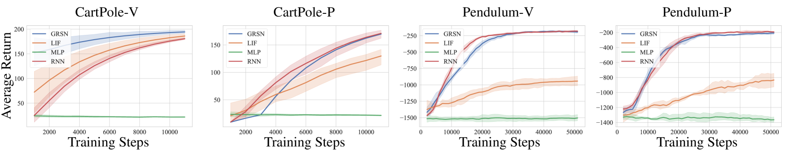
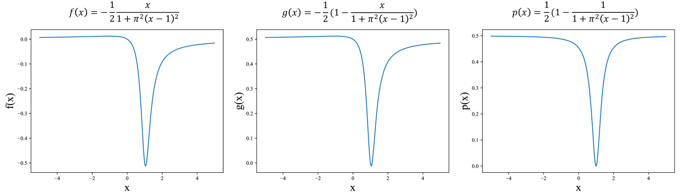
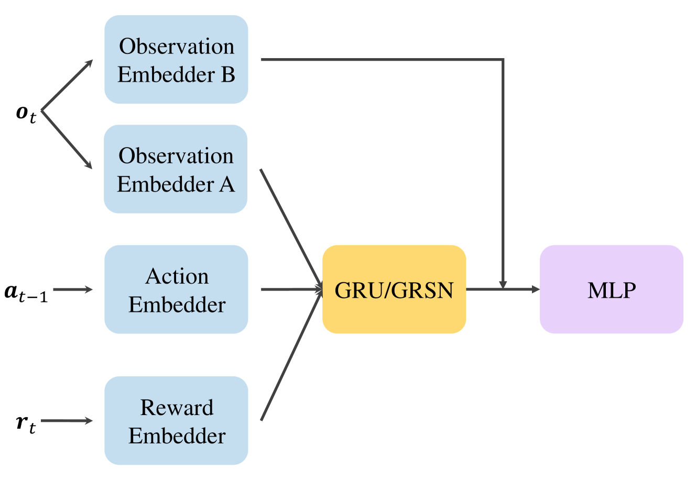

# GRSN：为 POMDP 和 MARL 打造的门控循环脉冲神经网络

发布时间：2024年04月23日

`Agent` `神经网络`

> GRSN: Gated Recurrent Spiking Neurons for POMDPs and MARL

# 摘要

> 尖峰神经网络（SNNs）以其高效节能和迅速推理的特性，在众多领域得到广泛应用。应用于强化学习（RL）的 SNNs 能够显著降低智能体的计算资源需求，并在资源受限的环境下优化算法表现。不过，现有尖峰强化学习（SRL）算法中存在一个问题：多时间步的模拟结果仅能对应于 RL 中的一个决策步骤，这与大脑的真实时间动态差异显著，也未能充分发挥 SNNs 在处理时间序列数据方面的潜力。为解决这一时序不匹配问题，并进一步挖掘尖峰神经元的时间动态特性，我们提出了一种创新的时序对齐范式（TAP），该范式通过尖峰神经元的单步更新机制来积累 RL 中的历史状态信息，并通过引入门控单元来提升尖峰神经元的记忆容量。实验结果显示，该方法在解决部分可观测马尔可夫决策过程（POMDPs）和多智能体协作问题上，能够达到与循环神经网络（RNNs）相当的性能，同时功耗降低了大约 50%。

> Spiking neural networks (SNNs) are widely applied in various fields due to their energy-efficient and fast-inference capabilities. Applying SNNs to reinforcement learning (RL) can significantly reduce the computational resource requirements for agents and improve the algorithm's performance under resource-constrained conditions. However, in current spiking reinforcement learning (SRL) algorithms, the simulation results of multiple time steps can only correspond to a single-step decision in RL. This is quite different from the real temporal dynamics in the brain and also fails to fully exploit the capacity of SNNs to process temporal data. In order to address this temporal mismatch issue and further take advantage of the inherent temporal dynamics of spiking neurons, we propose a novel temporal alignment paradigm (TAP) that leverages the single-step update of spiking neurons to accumulate historical state information in RL and introduces gated units to enhance the memory capacity of spiking neurons. Experimental results show that our method can solve partially observable Markov decision processes (POMDPs) and multi-agent cooperation problems with similar performance as recurrent neural networks (RNNs) but with about 50% power consumption.

[Arxiv](https://arxiv.org/abs/2404.15597)