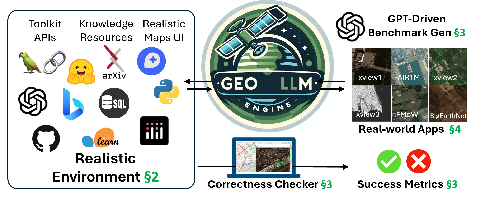
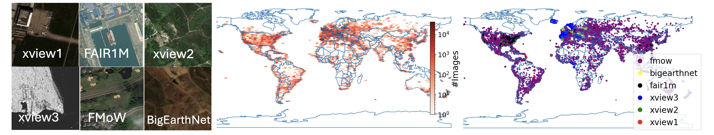
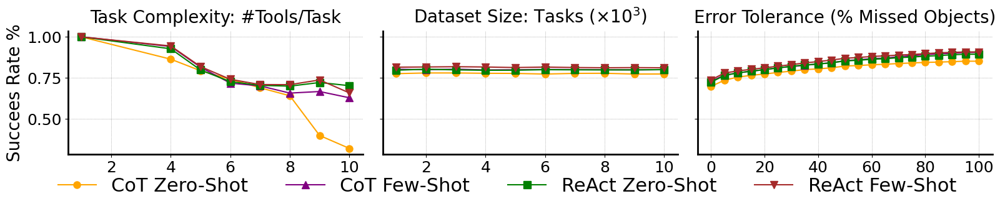
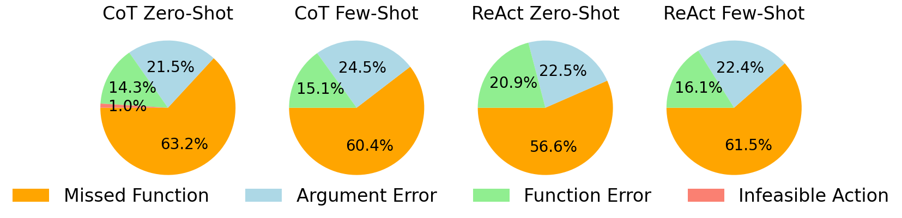

# GeoLLM-Engine：打造地理空间领域智能副驾驶的现实平台

发布时间：2024年04月23日

`Agent` `人工智能`

> GeoLLM-Engine: A Realistic Environment for Building Geospatial Copilots

# 摘要

> 地理空间副驾驶利用自然语言指令，为地球观测应用开辟了巨大潜力。但目前的技术依赖于简化的单一任务和模板化指令，与现实应用场景存在差异。本研究介绍了GeoLLM-Engine，这是一个为复杂任务设计的工具辅助代理环境，这些任务通常由分析师在遥感平台上执行。我们通过集成地理空间API、动态地图界面和多模态知识库，增强了环境的功能性，以准确评估代理对高级自然语言指令的理解和任务执行的准确性。我们的大规模并行引擎在100个GPT-4-Turbo节点上运行，处理了超过五十万个多工具任务和110万张卫星图像，减少了人工参与的基准测试策划的负担。我们超越了传统的单任务图像描述模式，探索了最先进的代理和提示技术在长期提示下的表现。

> Geospatial Copilots unlock unprecedented potential for performing Earth Observation (EO) applications through natural language instructions. However, existing agents rely on overly simplified single tasks and template-based prompts, creating a disconnect with real-world scenarios. In this work, we present GeoLLM-Engine, an environment for tool-augmented agents with intricate tasks routinely executed by analysts on remote sensing platforms. We enrich our environment with geospatial API tools, dynamic maps/UIs, and external multimodal knowledge bases to properly gauge an agent's proficiency in interpreting realistic high-level natural language commands and its functional correctness in task completions. By alleviating overheads typically associated with human-in-the-loop benchmark curation, we harness our massively parallel engine across 100 GPT-4-Turbo nodes, scaling to over half a million diverse multi-tool tasks and across 1.1 million satellite images. By moving beyond traditional single-task image-caption paradigms, we investigate state-of-the-art agents and prompting techniques against long-horizon prompts.

[Arxiv](https://arxiv.org/abs/2404.15500)