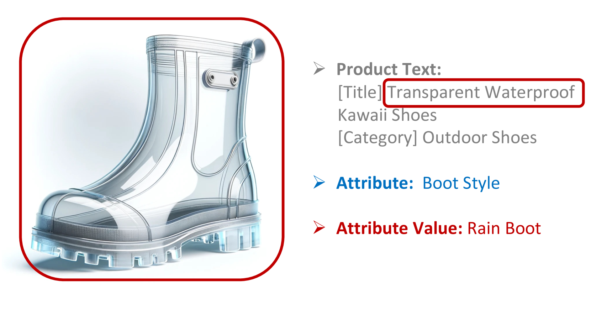
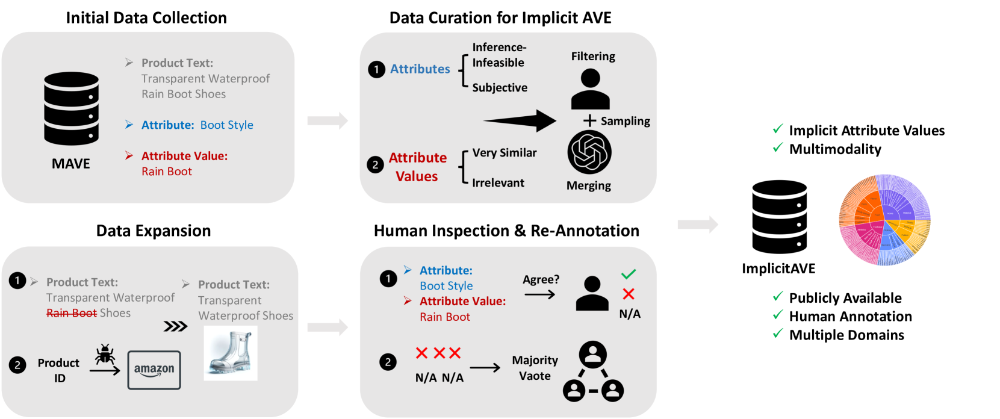
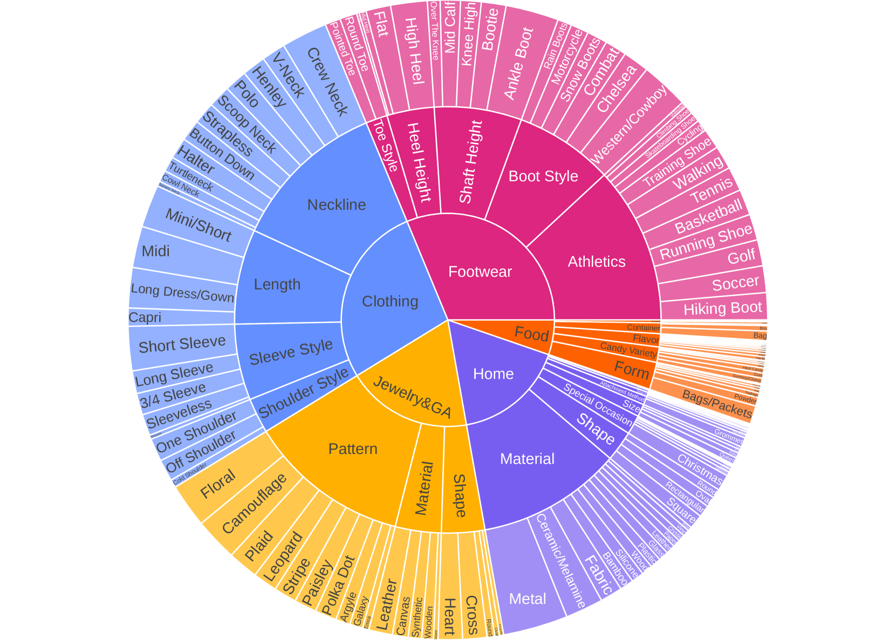
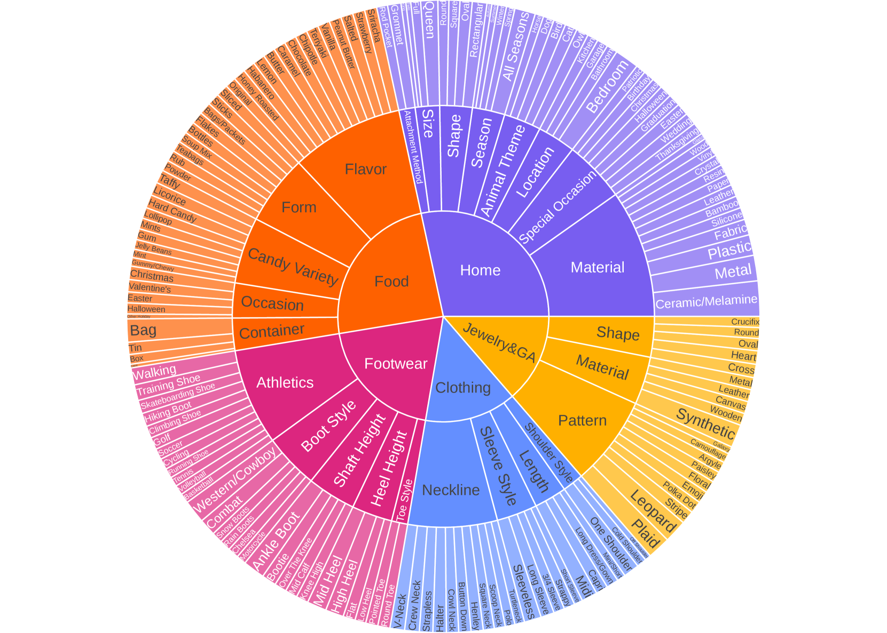
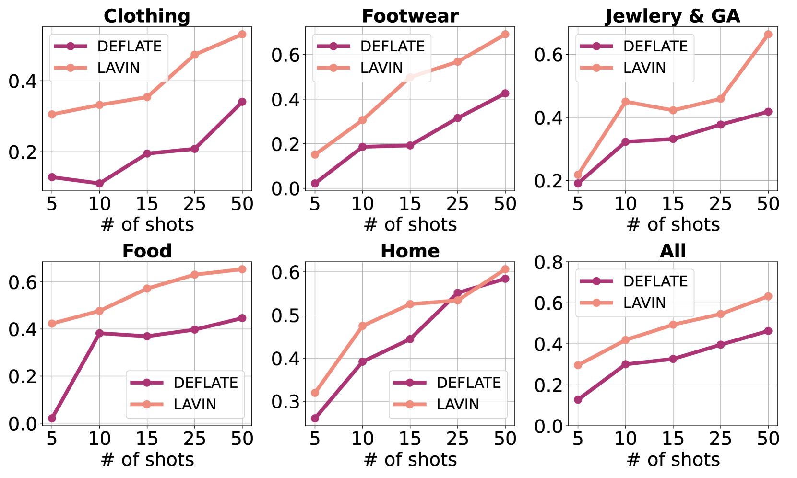
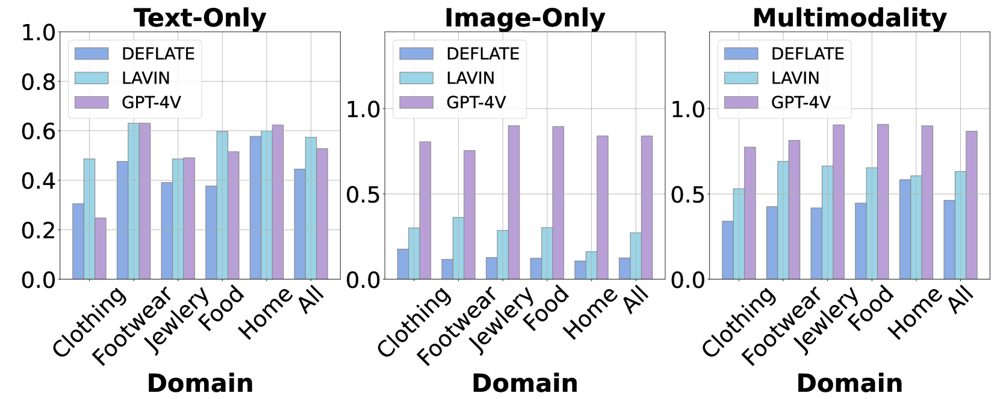
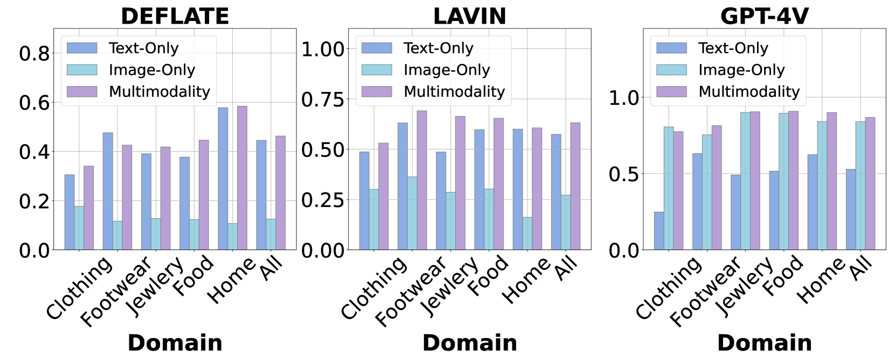
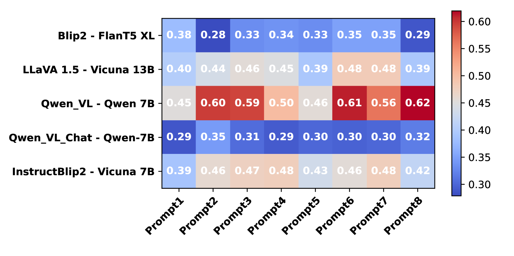
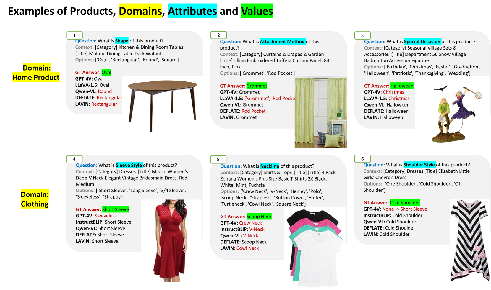

# ImplicitAVE：一个开源数据集，专为隐式属性值提取设计，同时提供一个多模态大型语言模型（LLM）的性能基准。

发布时间：2024年04月23日

`LLM应用` `人工智能`

> ImplicitAVE: An Open-Source Dataset and Multimodal LLMs Benchmark for Implicit Attribute Value Extraction

# 摘要

> 目前用于属性值抽取（AVE）的数据集多集中于明显属性值，而对隐性属性值视而不见，往往缺乏产品图片，不向公众开放，且在多个领域的深度人工审查不足。为克服这些不足，我们推出了ImplicitAVE——首个公开的隐性属性值抽取多模态数据集。ImplicitAVE基于MAVE数据集，经过精心筛选和扩充，纳入了隐性AVE和多模态特征，形成了一个优化后的数据集，包含68,000个训练样本和1,600个测试样本，覆盖五个不同领域。我们还研究了多模态大型语言模型（MLLMs）在隐性AVE中的应用，为MLLMs在ImplicitAVE数据集上的性能设立了全面的评估标准。对六种最新的MLLMs及其十一种变体进行了广泛场景下的评估，发现隐性属性抽取对MLLMs而言仍是一大挑战。本研究的成果包括开发并发布了ImplicitAVE数据集，对多种MLLMs在隐性AVE任务上的应用进行了探索和评估，为未来研究提供了宝贵的洞见和可能的研究方向。相关数据集和代码已在 https://github.com/HenryPengZou/ImplicitAVE 上公开。

> Existing datasets for attribute value extraction (AVE) predominantly focus on explicit attribute values while neglecting the implicit ones, lack product images, are often not publicly available, and lack an in-depth human inspection across diverse domains. To address these limitations, we present ImplicitAVE, the first, publicly available multimodal dataset for implicit attribute value extraction. ImplicitAVE, sourced from the MAVE dataset, is carefully curated and expanded to include implicit AVE and multimodality, resulting in a refined dataset of 68k training and 1.6k testing data across five domains. We also explore the application of multimodal large language models (MLLMs) to implicit AVE, establishing a comprehensive benchmark for MLLMs on the ImplicitAVE dataset. Six recent MLLMs with eleven variants are evaluated across diverse settings, revealing that implicit value extraction remains a challenging task for MLLMs. The contributions of this work include the development and release of ImplicitAVE, and the exploration and benchmarking of various MLLMs for implicit AVE, providing valuable insights and potential future research directions. Dataset and code are available at https://github.com/HenryPengZou/ImplicitAVE

[Arxiv](https://arxiv.org/abs/2404.15592)