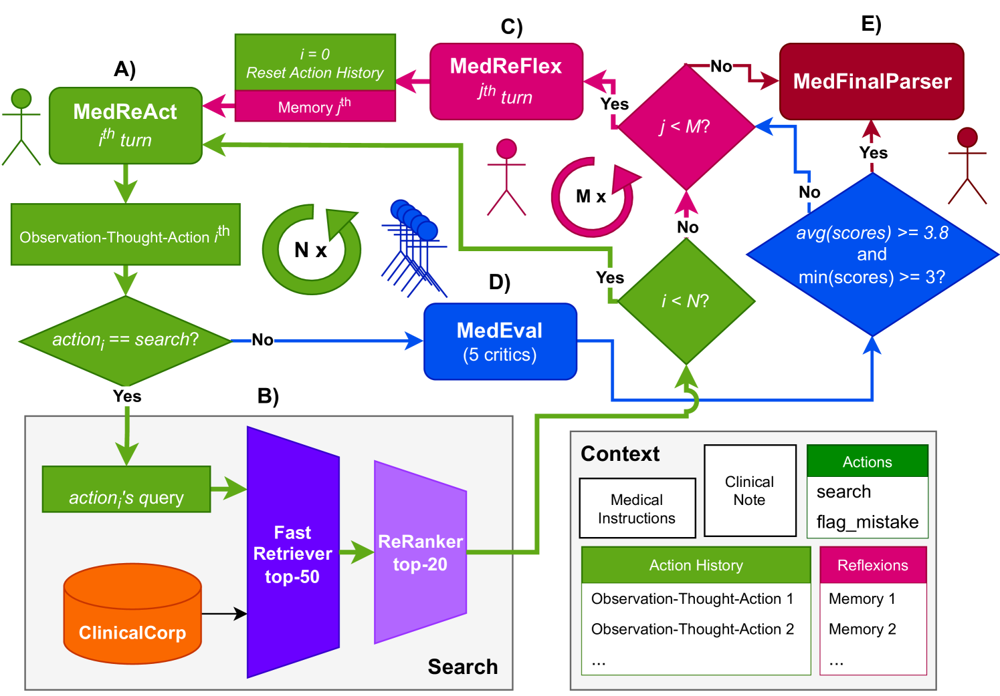
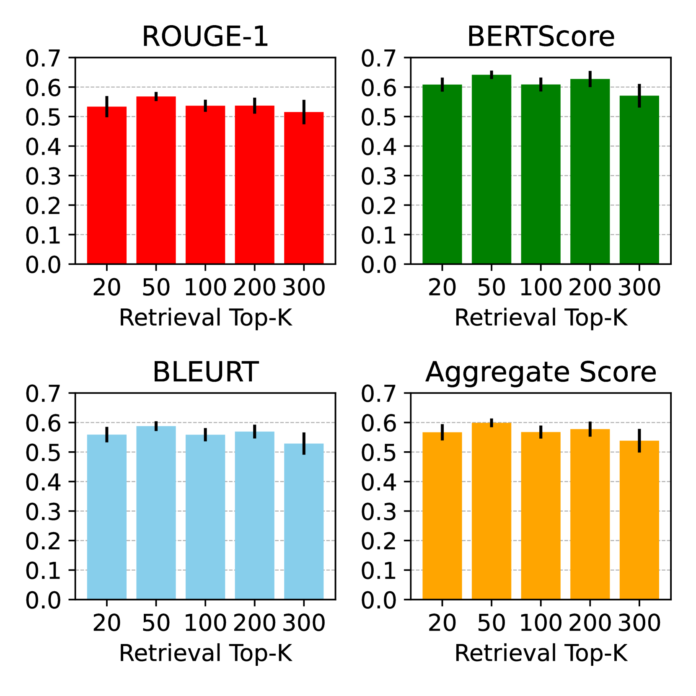
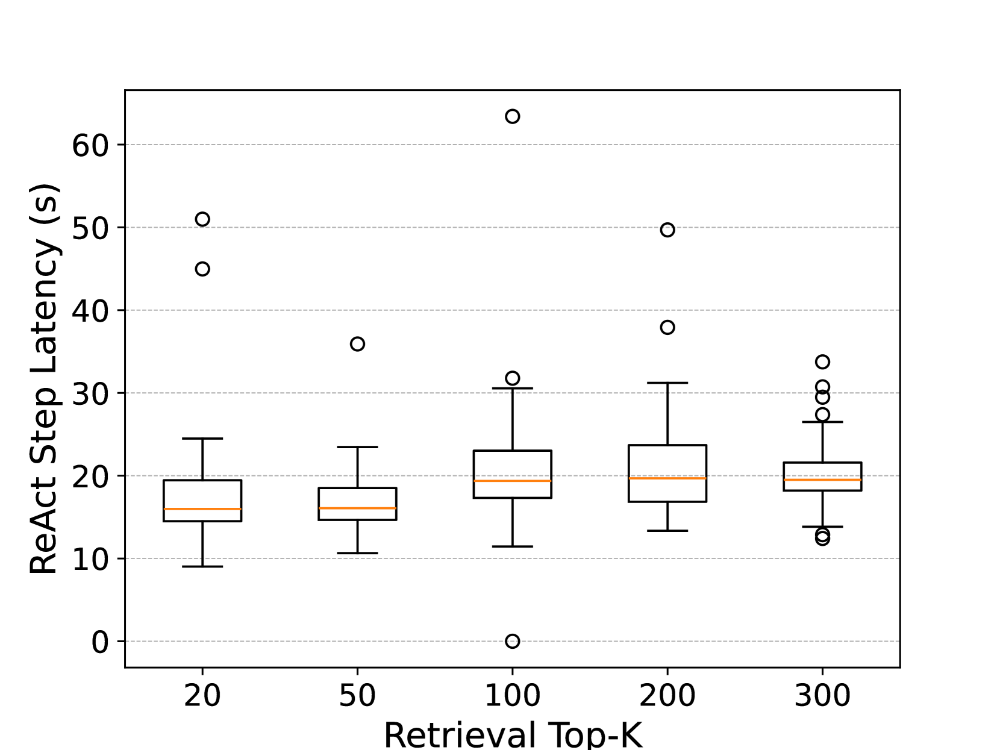
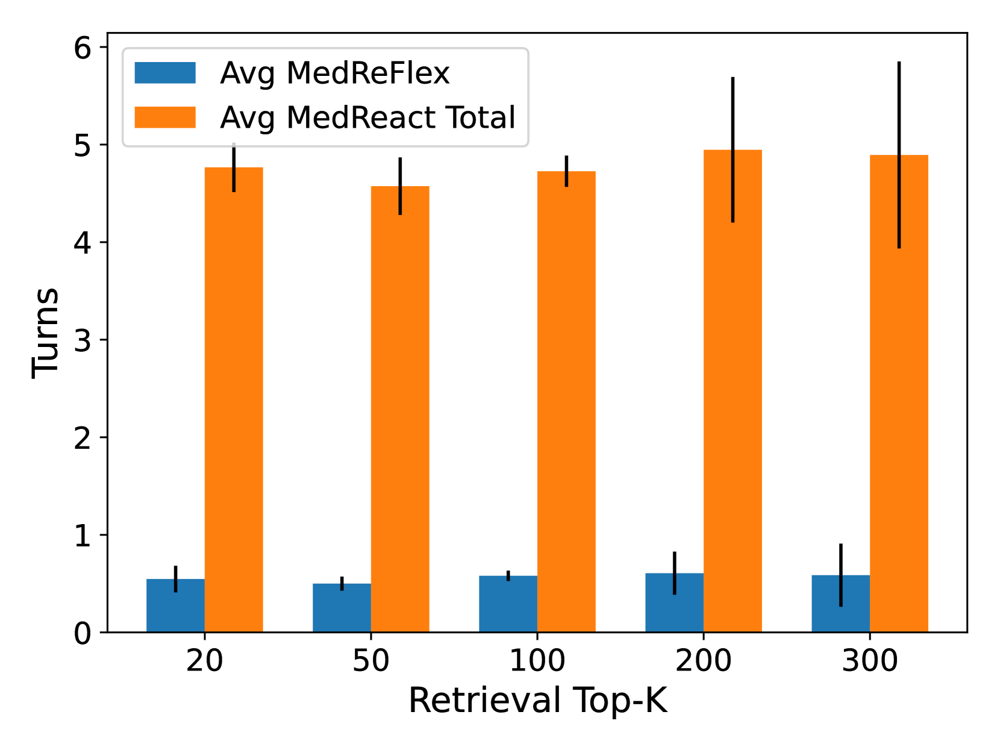
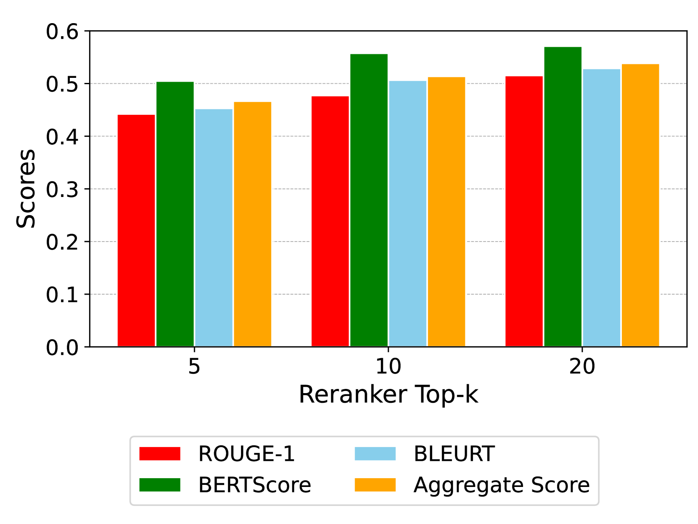
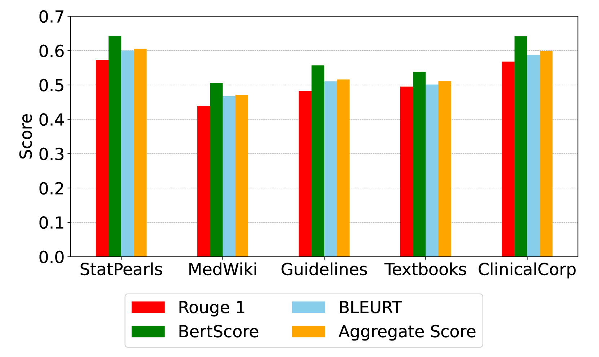
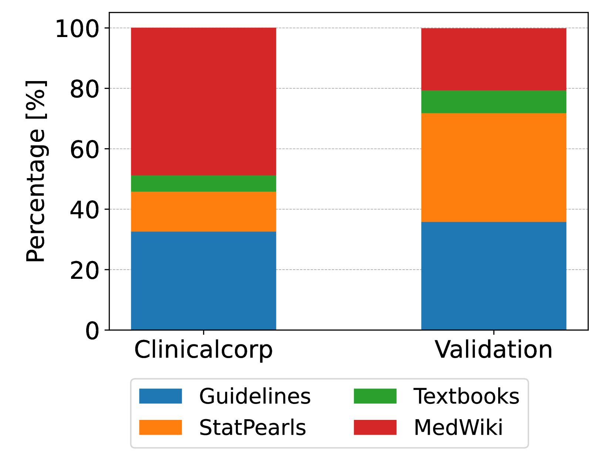
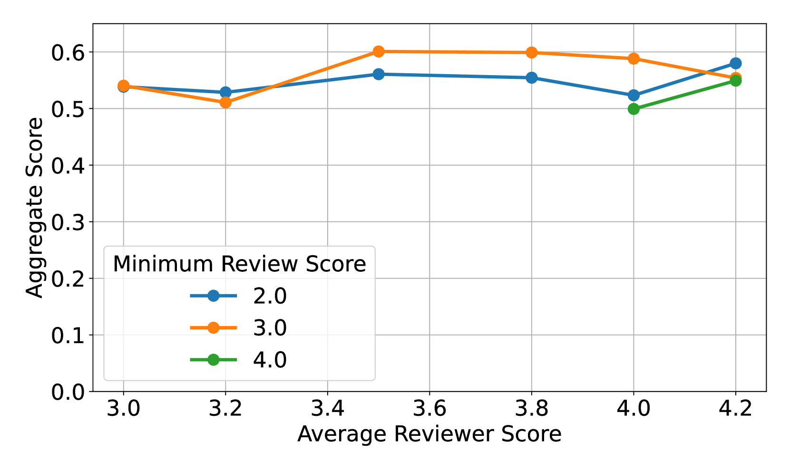

# 在 2024 年 MEDIQA-CORR 竞赛中，IryoNLP 项目借助医疗代理的力量，致力于攻克医疗错误检测与纠正的挑战。

发布时间：2024年04月23日

`分类：RAG`

> IryoNLP at MEDIQA-CORR 2024: Tackling the Medical Error Detection & Correction Task On the Shoulders of Medical Agents

# 摘要

> 在临床领域的自然语言处理应用中，依托大型语言模型来检测和修正临床笔记中的错误，这一方法展现出巨大潜力，尤其是在标注数据稀缺的复杂知识型任务中。本文提出了 MedReAct'N'MedReFlex 系统，该系统整合了四款基于大型语言模型的医疗代理。MedReAct 代理首先通过观察、分析并采取行动来识别临床笔记中的潜在错误，并生成路径引导搜索。接着，MedEval 代理利用五个评估器对这些错误及其修正建议进行评估。若 MedReAct 的修正措施不足，MedReFlex 代理将介入，进行深入分析并提出新的策略。最终，MedFinalParser 代理负责将输出格式化，既保持原文风格，又确保错误修正的准确性。我们的方法核心是我们基于 ClinicalCorp 语料库构建的 RAG 流程。我们还预处理并开源了 MedWiki 数据集，以支持临床 RAG 应用。实验结果表明，通过 MedReAct'N'MedReFlex 框架，我们的 RAG 方法在 ClinicalCorp 数据集上展现了显著效果，在 MEDIQA-CORR 2024 排行榜上荣获第九名。

> In natural language processing applied to the clinical domain, utilizing large language models has emerged as a promising avenue for error detection and correction on clinical notes, a knowledge-intensive task for which annotated data is scarce. This paper presents MedReAct'N'MedReFlex, which leverages a suite of four LLM-based medical agents. The MedReAct agent initiates the process by observing, analyzing, and taking action, generating trajectories to guide the search to target a potential error in the clinical notes. Subsequently, the MedEval agent employs five evaluators to assess the targeted error and the proposed correction. In cases where MedReAct's actions prove insufficient, the MedReFlex agent intervenes, engaging in reflective analysis and proposing alternative strategies. Finally, the MedFinalParser agent formats the final output, preserving the original style while ensuring the integrity of the error correction process. One core component of our method is our RAG pipeline based on our ClinicalCorp corpora. Among other well-known sources containing clinical guidelines and information, we preprocess and release the open-source MedWiki dataset for clinical RAG application. Our results demonstrate the central role of our RAG approach with ClinicalCorp leveraged through the MedReAct'N'MedReFlex framework. It achieved the ninth rank on the MEDIQA-CORR 2024 final leaderboard.

[Arxiv](https://arxiv.org/abs/2404.15488)