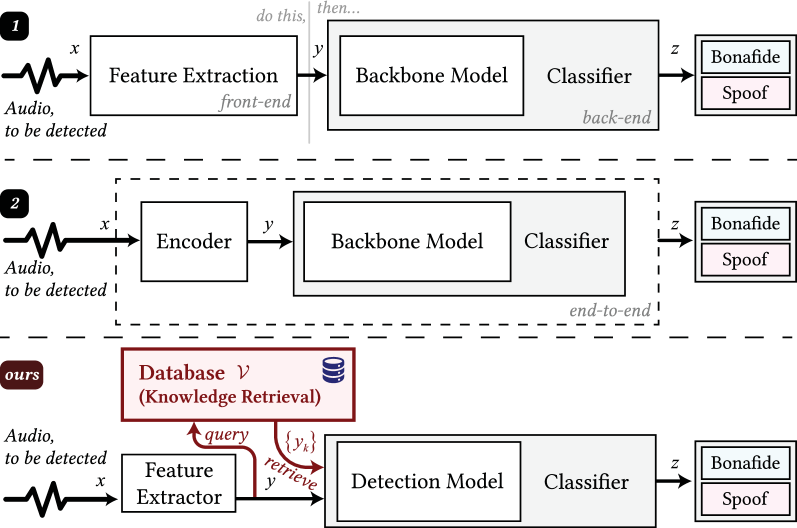
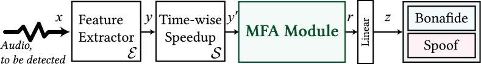
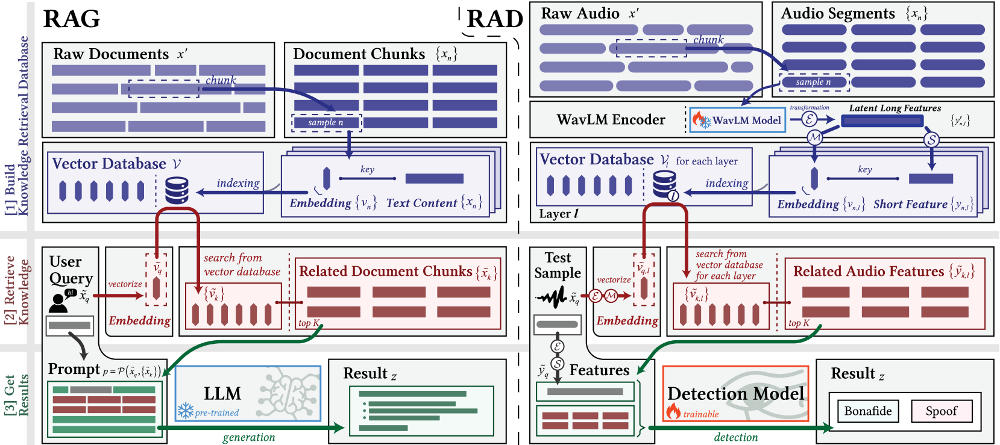
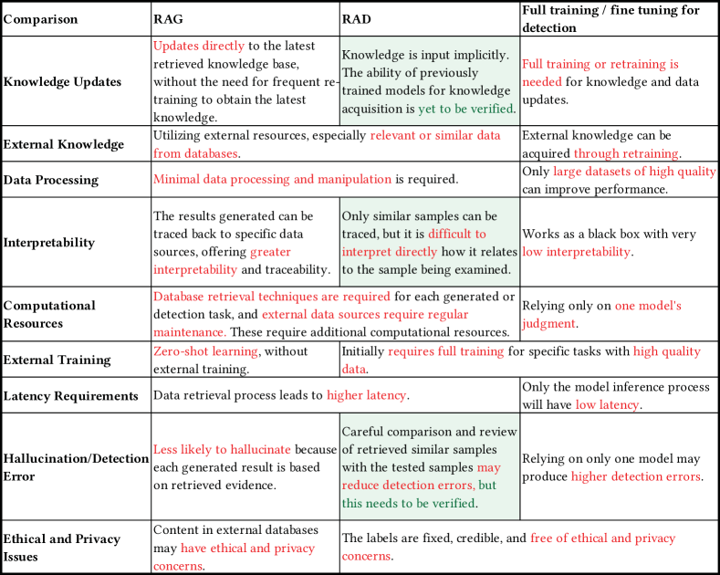
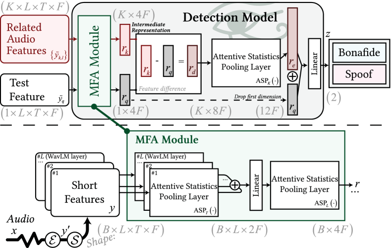

# 增强检索音频深度伪造检测

发布时间：2024年04月23日

`分类：LLM应用

这篇论文提出了一种新颖的检索增强检测框架，用于检测音频深度伪造。它通过引入相似的检索样本来提升检测效果，并扩展了多融合注意力分类器以适配检测框架。这项工作主要关注于应用大型语言模型（LLM）的技术来解决实际问题，即提高深度伪造检测的性能。因此，它应该被归类为LLM应用。` `音频处理`

> Retrieval-Augmented Audio Deepfake Detection

# 摘要

> 随着文本到语音和声音转换技术的进步，我们能够创造出极为逼真的音频深度伪造，这引发了对其潜在滥用的担忧。目前，大多数深度伪造检测方法主要依赖单一模型的模糊知识，这不仅限制了检测性能，也带来了透明度的挑战。借鉴检索增强生成的理念，我们提出了一种新颖的检索增强检测框架，通过引入相似的检索样本来提升检测效果。此外，我们还对多融合注意力分类器进行了扩展，以适配我们的检测框架。大量实验证明，我们的框架在多个数据集上均优于现有方法，尤其在ASVspoof 2021的深度伪造数据集上取得了突破性成果，并在2019年和2021年的LA数据集上也展现了强劲的竞争力。深入分析显示，检索器能够精准地找到与查询音频声学特征高度相似的同一说话人的样本，这显著提升了检测的准确性。

> With recent advances in speech synthesis including text-to-speech (TTS) and voice conversion (VC) systems enabling the generation of ultra-realistic audio deepfakes, there is growing concern about their potential misuse. However, most deepfake (DF) detection methods rely solely on the fuzzy knowledge learned by a single model, resulting in performance bottlenecks and transparency issues. Inspired by retrieval-augmented generation (RAG), we propose a retrieval-augmented detection (RAD) framework that augments test samples with similar retrieved samples for enhanced detection. We also extend the multi-fusion attentive classifier to integrate it with our proposed RAD framework. Extensive experiments show the superior performance of the proposed RAD framework over baseline methods, achieving state-of-the-art results on the ASVspoof 2021 DF set and competitive results on the 2019 and 2021 LA sets. Further sample analysis indicates that the retriever consistently retrieves samples mostly from the same speaker with acoustic characteristics highly consistent with the query audio, thereby improving detection performance.

[Arxiv](https://arxiv.org/abs/2404.13892)