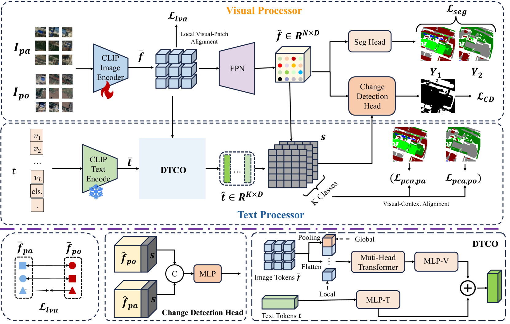
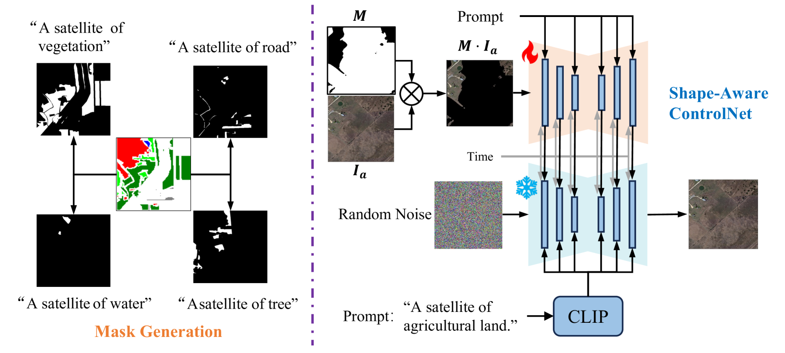
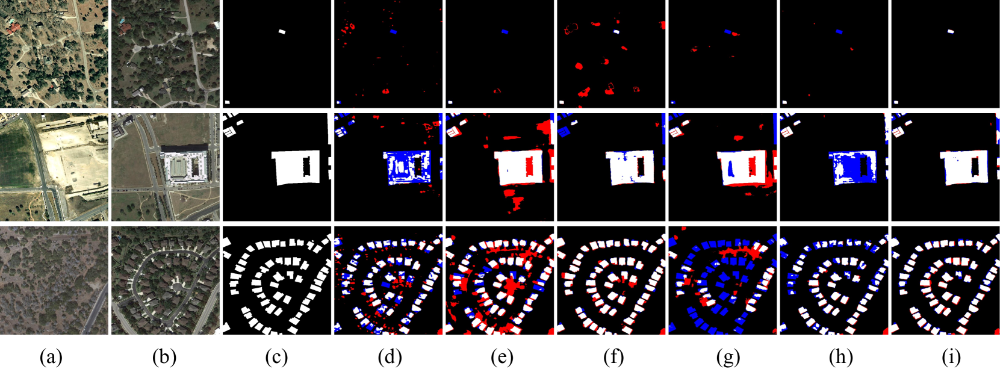
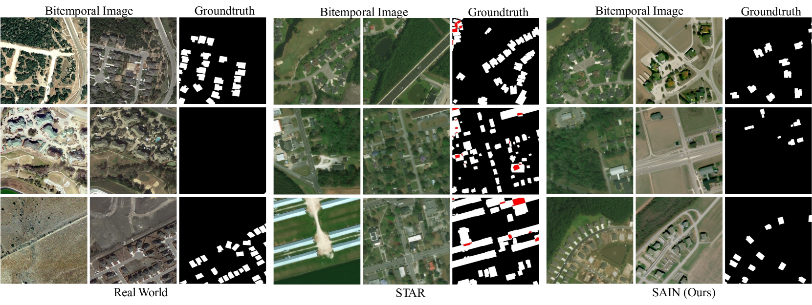

# 单时相的遥感变化检测在领域泛化任务中提供了监督学习的方法。

发布时间：2024年04月23日

`LLM应用` `遥感图像分析` `人工智能`

> Single-temporal Supervised Remote Change Detection for Domain Generalization

# 摘要

> 变化检测技术在遥感图像分析领域扮演着重要角色。传统方法需针对不同数据集独立训练模型，这限制了其跨领域的泛化能力。而且，它们还依赖于大量的高质量配对标记数据，这不仅成本高昂，也难以实现。本文提出了一种新颖的多模态对比学习方法——ChangeCLIP，它基于视觉-语言预训练，旨在提升变化检测任务的领域泛化能力。文章还引入了一种动态上下文优化技术，以增强提示学习的效果。为了克服现有方法对数据的依赖性，我们开发了一种单时相、可控的人工智能生成训练策略（SAIN），允许模型在无需成对图像的情况下，通过大量单时相图像进行训练，从而获得卓越的泛化性能。通过在多个真实变化检测数据集上的实验，我们证明了ChangeCLIP的优越性和强大的泛化能力，其性能超越了当前最尖端的检测方法。相关代码将公开提供。

> Change detection is widely applied in remote sensing image analysis. Existing methods require training models separately for each dataset, which leads to poor domain generalization. Moreover, these methods rely heavily on large amounts of high-quality pair-labelled data for training, which is expensive and impractical. In this paper, we propose a multimodal contrastive learning (ChangeCLIP) based on visual-language pre-training for change detection domain generalization. Additionally, we propose a dynamic context optimization for prompt learning. Meanwhile, to address the data dependency issue of existing methods, we introduce a single-temporal and controllable AI-generated training strategy (SAIN). This allows us to train the model using a large number of single-temporal images without image pairs in the real world, achieving excellent generalization. Extensive experiments on series of real change detection datasets validate the superiority and strong generalization of ChangeCLIP, outperforming state-of-the-art change detection methods. Code will be available.

[Arxiv](https://arxiv.org/abs/2404.11326)