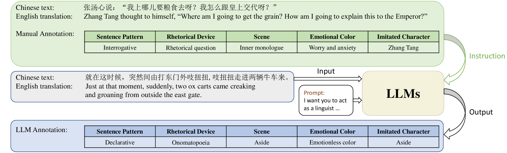
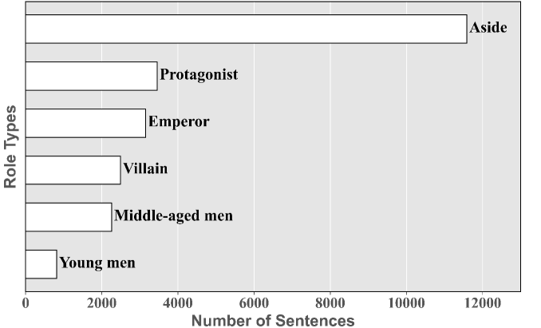

# StoryTTS：一款极具表现力的文本到语音数据集，配备了详尽的文本表达性标注。

发布时间：2024年04月23日

`LLM应用` `文本到语音`

> StoryTTS: A Highly Expressive Text-to-Speech Dataset with Rich Textual Expressiveness Annotations

# 摘要

> 在富有表现力的文本到语音（ETTS）系统中，尽管声学表现力一直是研究的重点，但文本的内在表现力却往往被忽视，特别是在艺术作品的ETTS应用中。本文提出了StoryTTS数据集，这是一个集合了普通话讲故事节目中的声学和文本双重表现力的高质量ETTS资源。我们建立了一套系统的标注框架，全面捕捉文本的表现力，并从语言学和修辞学角度出发，将StoryTTS中的文本表现力细分为五个独特维度。通过少量的人工标注示例引导大型语言模型进行批量标注，我们构建了一个包含61小时连续、韵律性强的语音材料，这些材料都配有精确的文本转录和详尽的文本表现力标注。StoryTTS的推出旨在推动ETTS研究深入挖掘文本和声学特征的潜力。实验证明，当TTS模型结合StoryTTS中的文本表现力标注时，能够显著提升语音的表现力。

> While acoustic expressiveness has long been studied in expressive text-to-speech (ETTS), the inherent expressiveness in text lacks sufficient attention, especially for ETTS of artistic works. In this paper, we introduce StoryTTS, a highly ETTS dataset that contains rich expressiveness both in acoustic and textual perspective, from the recording of a Mandarin storytelling show. A systematic and comprehensive labeling framework is proposed for textual expressiveness. We analyze and define speech-related textual expressiveness in StoryTTS to include five distinct dimensions through linguistics, rhetoric, etc. Then we employ large language models and prompt them with a few manual annotation examples for batch annotation. The resulting corpus contains 61 hours of consecutive and highly prosodic speech equipped with accurate text transcriptions and rich textual expressiveness annotations. Therefore, StoryTTS can aid future ETTS research to fully mine the abundant intrinsic textual and acoustic features. Experiments are conducted to validate that TTS models can generate speech with improved expressiveness when integrating with the annotated textual labels in StoryTTS.

[Arxiv](https://arxiv.org/abs/2404.14946)