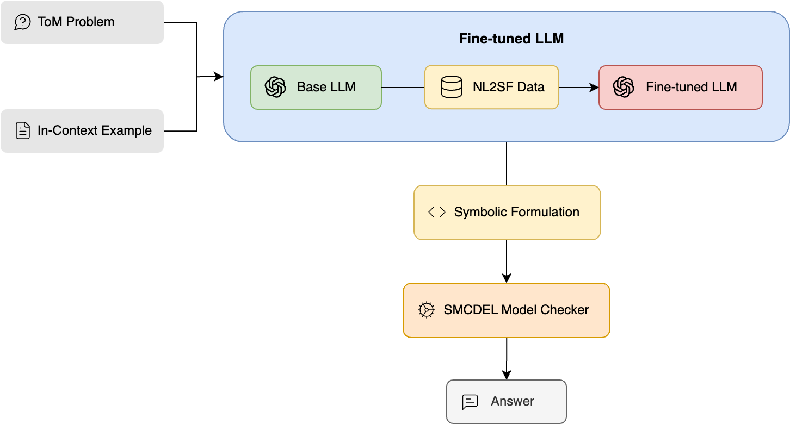
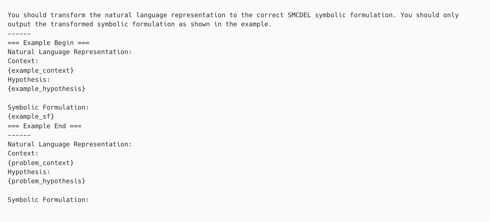
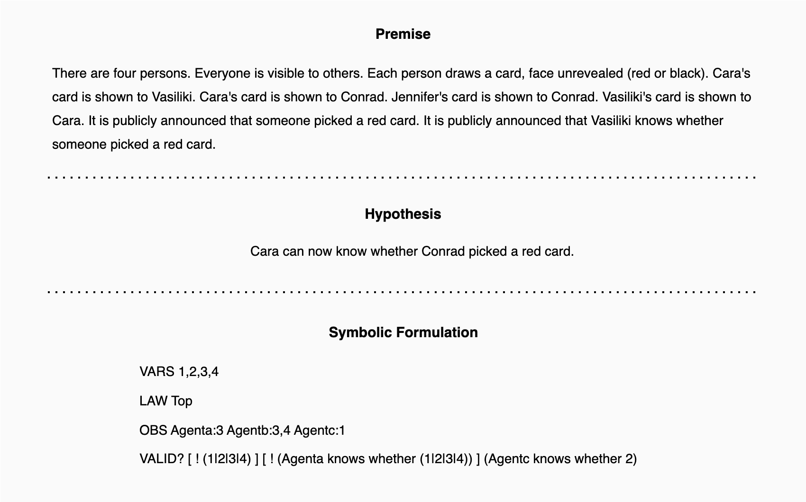
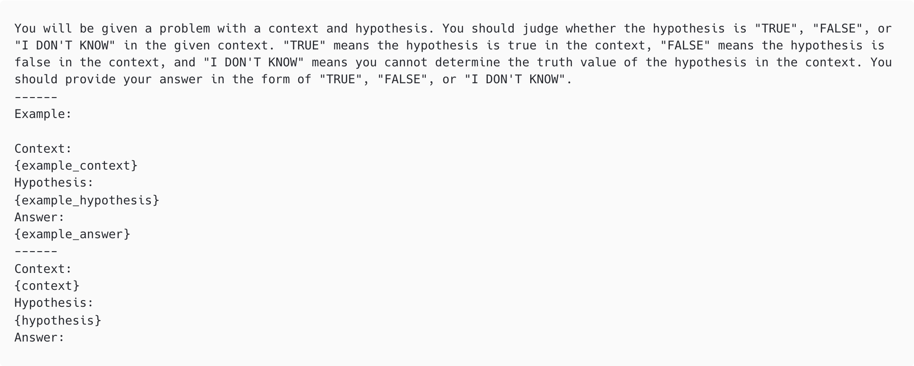
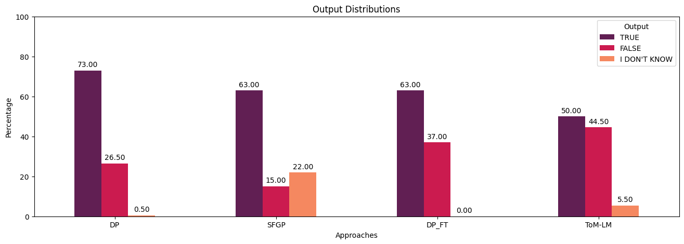

# ToM-LM：将心理理论推理外包给大型语言模型中的外部符号执行器

发布时间：2024年04月23日

`分类：LLM应用` `心理学` `人工智能`

> ToM-LM: Delegating Theory Of Mind Reasoning to External Symbolic Executors in Large Language Models

# 摘要

> 心理理论（ToM）涉及个体对他人心理状态的认知能力。虽然大型语言模型（LLMs）在这一能力上已初显成效，但面对复杂的ToM推理挑战仍然力有未逮。本研究采用外部符号执行器——SMCDEL模型检查器，结合微调策略，以增强LLMs的ToM推理技巧。我们的方法首先对LLM进行微调，使其能够通过自然语言与符号公式的配对来理解ToM问题，随后通过一个上下文示例指导模型一次性生成相应的符号公式。该符号公式由SMCDEL模型检查器执行，以实现清晰且可验证的ToM推理过程，并得出结论。我们的研究成果，即ToM-LM模型，在所有对比基线中均取得了显著提升。此外，本研究还提出了一种新颖视角，即将ToM推理中关于信念推理的部分外部化，并探讨了将其扩展至ToM推理其他方面的可能。

> Theory of Mind (ToM) refers to the ability of individuals to attribute mental states to others. While Large Language Models (LLMs) have shown some promise with ToM ability, they still struggle with complex ToM reasoning. Our approach leverages an external symbolic executor, specifically the SMCDEL model checker, and fine-tuning to improve the ToM reasoning ability of LLMs. In our approach, an LLM is first fine-tuned through pairs of natural language and symbolic formulation representation of ToM problems and is then instructed to generate the symbolic formulation with a one-shot in-context example. The generated symbolic formulation is then executed by the SMCDEL model checker to perform transparent and verifiable ToM reasoning and give the final result. We demonstrate that our approach, ToM-LM, shows a significant improvement over all the constructed baselines. Our study proposes a novel view about externalizing a particular component of ToM reasoning, mainly reasoning about beliefs, and suggests generalizing it to other aspects of ToM reasoning.

[Arxiv](https://arxiv.org/abs/2404.15515)