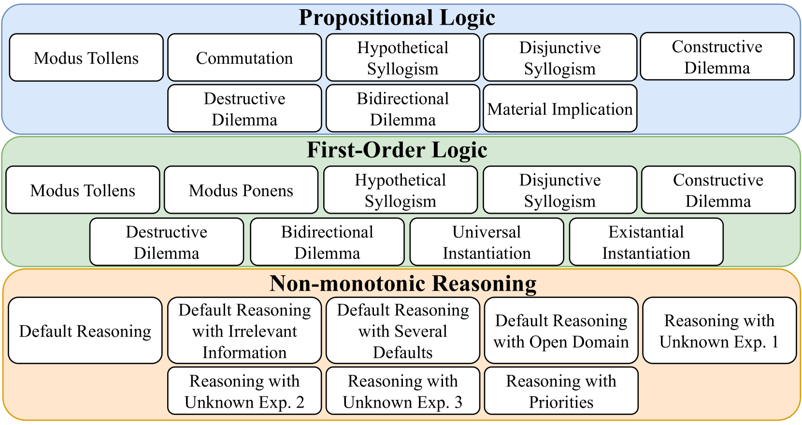
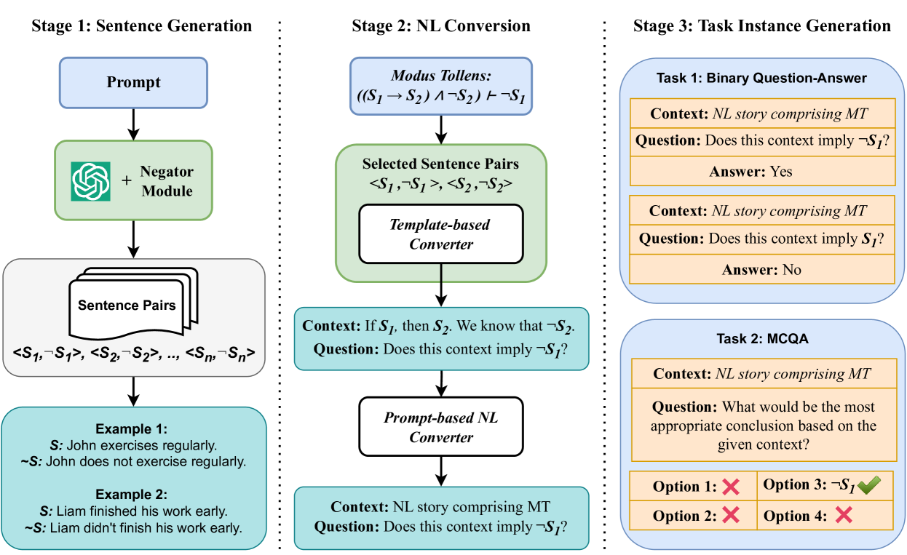
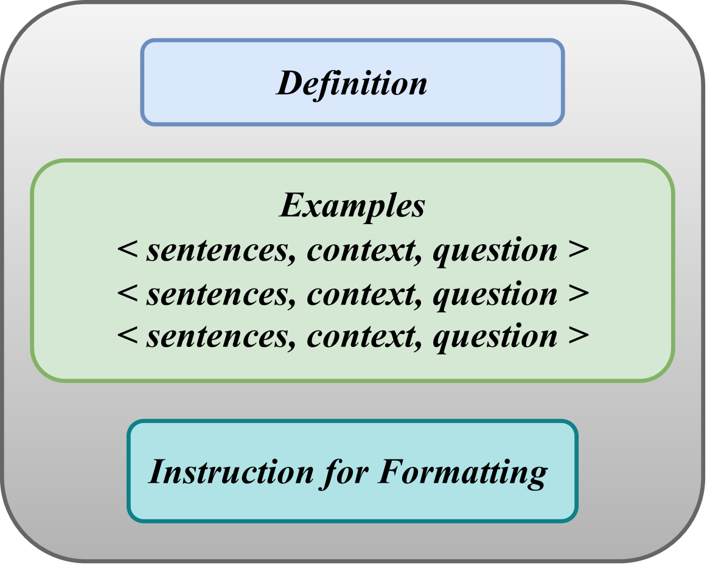
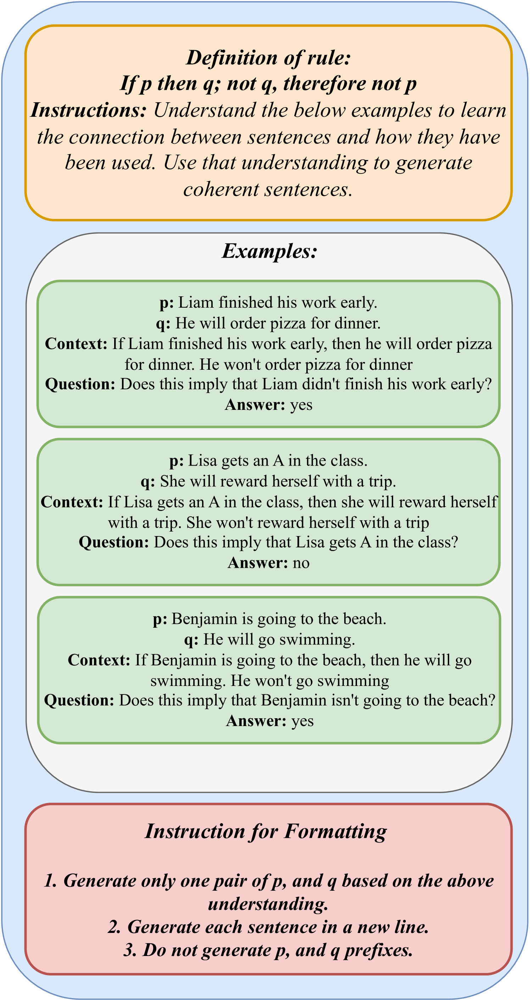
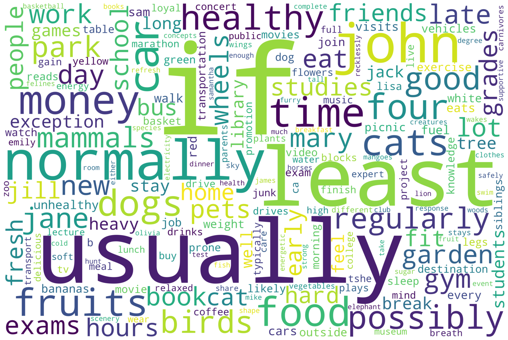

# 迈向对大型语言模型逻辑推理能力进行系统评估的探索

发布时间：2024年04月23日

`LLM应用` `逻辑推理`

> Towards Systematic Evaluation of Logical Reasoning Ability of Large Language Models

# 摘要

> 最新研究的大规模语言模型（LLMs）在众多语言理解任务上展现了卓越的性能。然而，它们是否真正具备对自然语言进行“推理”的能力？这一问题正受到越来越多的研究关注。研究者们已经探讨了包括常识、数值和定性推理在内的多种推理技能，但关键的“逻辑推理”能力尚未得到充分研究。目前对LLMs逻辑推理能力的研究主要集中在命题逻辑和一阶逻辑的少数推理规则上，如肯定前件和否定后件。为了克服这一局限，我们对LLMs在25种不同推理模式上的逻辑推理能力进行了全面评估，这些模式覆盖了命题逻辑、一阶逻辑和非单调逻辑。为了系统化评估，我们推出了LogicBench——一个专注于单一推理规则使用的自然语言问答数据集。我们对包括GPT-4、ChatGPT、Gemini、Llama-2和Mistral在内的多种LLMs进行了深入分析，并采用了思维链提示的方法。实验结果显示，现有的LLMs在LogicBench上的表现并不理想，尤其是在处理涉及复杂推理和否定的情况时。此外，它们有时会忽略对得出正确结论至关重要的上下文信息。我们认为，本研究的发现将推动未来对LLMs逻辑推理能力评估和提升的进一步研究。相关数据和代码可在 https://github.com/Mihir3009/LogicBench 查看。

> Recently developed large language models (LLMs) have been shown to perform remarkably well on a wide range of language understanding tasks. But, can they really "reason" over the natural language? This question has been receiving significant research attention and many reasoning skills such as commonsense, numerical, and qualitative have been studied. However, the crucial skill pertaining to 'logical reasoning' has remained underexplored. Existing work investigating this reasoning ability of LLMs has focused only on a couple of inference rules (such as modus ponens and modus tollens) of propositional and first-order logic. Addressing the above limitation, we comprehensively evaluate the logical reasoning ability of LLMs on 25 different reasoning patterns spanning over propositional, first-order, and non-monotonic logics. To enable systematic evaluation, we introduce LogicBench, a natural language question-answering dataset focusing on the use of a single inference rule. We conduct detailed analysis with a range of LLMs such as GPT-4, ChatGPT, Gemini, Llama-2, and Mistral using chain-of-thought prompting. Experimental results show that existing LLMs do not fare well on LogicBench; especially, they struggle with instances involving complex reasoning and negations. Furthermore, they sometimes overlook contextual information necessary for reasoning to arrive at the correct conclusion. We believe that our work and findings facilitate future research for evaluating and enhancing the logical reasoning ability of LLMs. Data and code are available at https://github.com/Mihir3009/LogicBench.

[Arxiv](https://arxiv.org/abs/2404.15522)