# 视觉增量生成器结合大型多模态模型，为半监督的组合图像检索任务提供支持。

发布时间：2024年04月23日

`分类：LLM应用

这篇论文提出了一种新的半监督组合图像检索（CIR）方法，通过使用大型语言模型的视觉增量生成器（VDG）来生成描述两图像视觉差异的文本。这种方法在CIR基准测试中取得了突破性成果，超越了传统的监督学习方法。这表明了大型语言模型（LLM）在图像检索领域的应用潜力，因此将这篇论文归类为LLM应用。` `图像检索` `人工智能`

> Visual Delta Generator with Large Multi-modal Models for Semi-supervised Composed Image Retrieval

# 摘要

> 组合图像检索（CIR）旨在根据文本修改指令，检索与查询相似的图像。现行技术主要通过标记三元组（参考图像、文本、目标图像）对CIR模型实施监督学习，但这类特定的三元组不如图像-文本对那样普遍，这限制了CIR技术的普及和扩展。相较之下，零样本CIR训练起来相对简便，它使用图像-标题对，忽略了图像间的关系，但准确度通常较低。我们提出了一种新的半监督CIR方法，该方法在辅助数据库中寻找参考图像及其相关目标图像，并通过我们的基于大型语言模型的视觉增量生成器（VDG）来生成描述两图像视觉差异（即视觉增量）的文本。VDG具备流畅的语言生成能力和模型无关性，能够生成伪三元组，从而显著提升CIR模型的性能。这种方法在CIR基准测试中取得了突破性成果，超越了传统的监督学习方法。

> Composed Image Retrieval (CIR) is a task that retrieves images similar to a query, based on a provided textual modification. Current techniques rely on supervised learning for CIR models using labeled triplets of the reference image, text, target image. These specific triplets are not as commonly available as simple image-text pairs, limiting the widespread use of CIR and its scalability. On the other hand, zero-shot CIR can be relatively easily trained with image-caption pairs without considering the image-to-image relation, but this approach tends to yield lower accuracy. We propose a new semi-supervised CIR approach where we search for a reference and its related target images in auxiliary data and learn our large language model-based Visual Delta Generator (VDG) to generate text describing the visual difference (i.e., visual delta) between the two. VDG, equipped with fluent language knowledge and being model agnostic, can generate pseudo triplets to boost the performance of CIR models. Our approach significantly improves the existing supervised learning approaches and achieves state-of-the-art results on the CIR benchmarks.

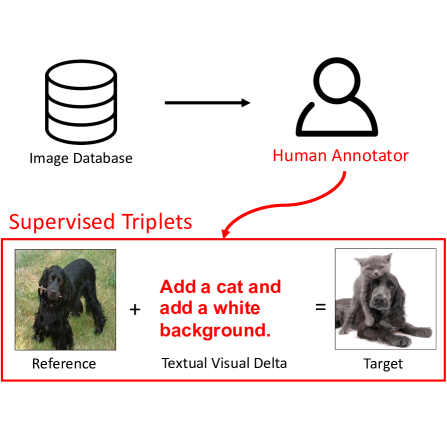

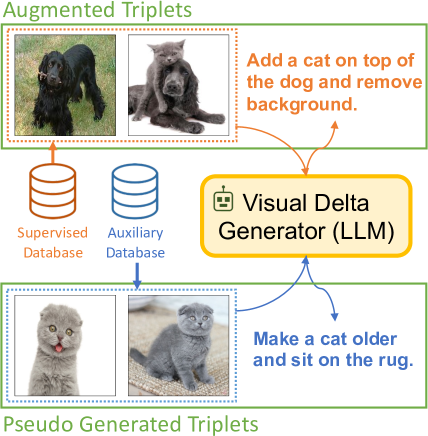

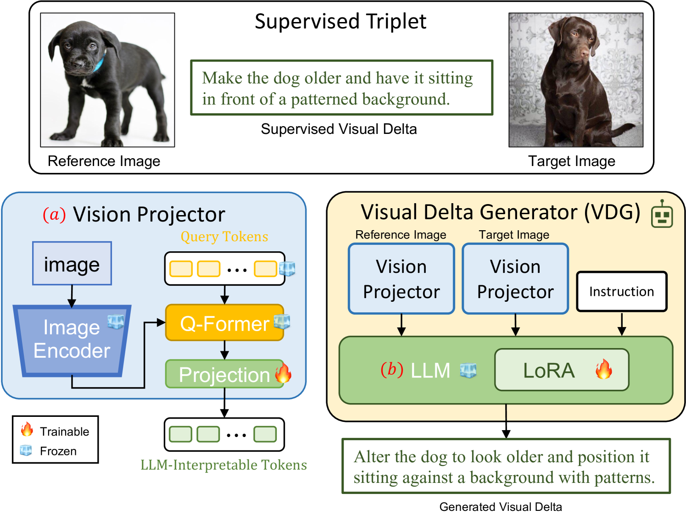

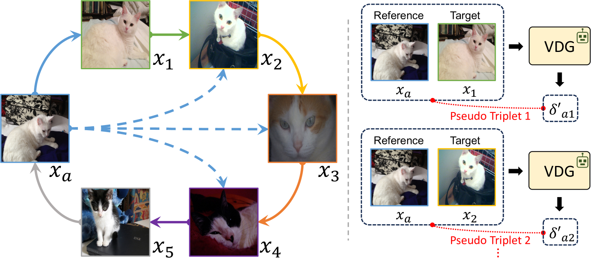

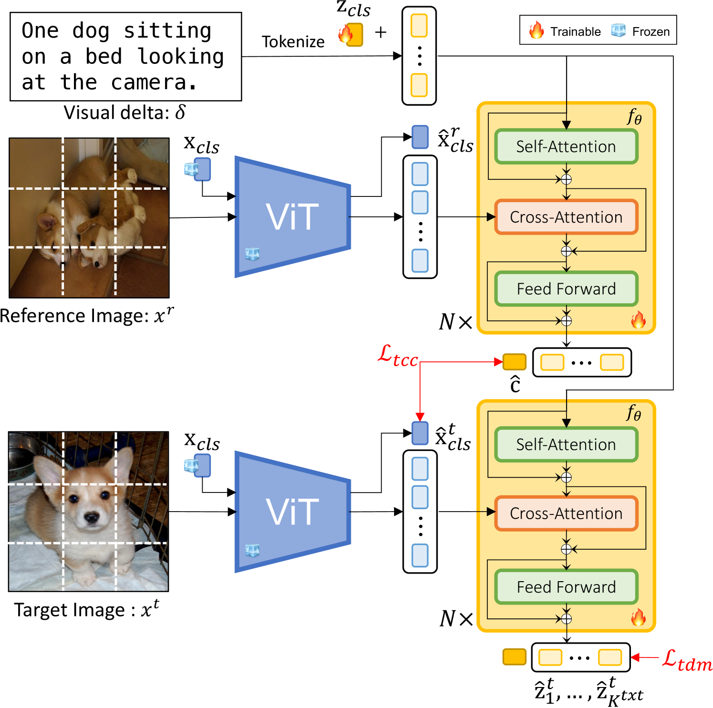

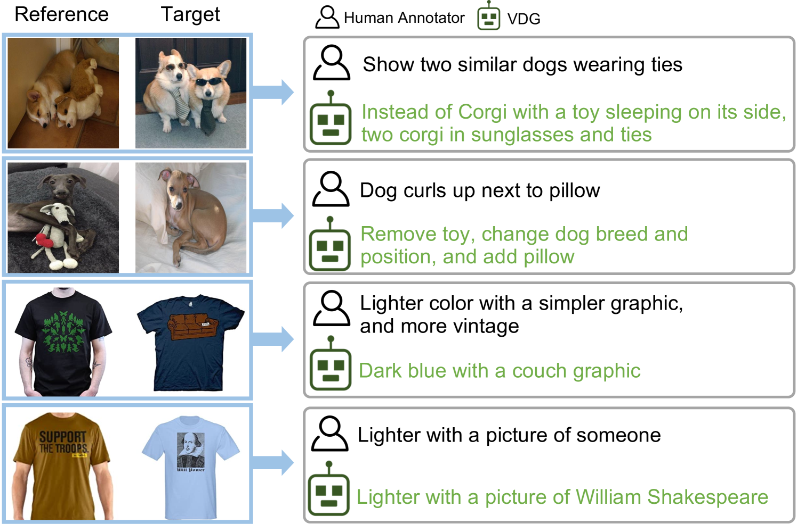

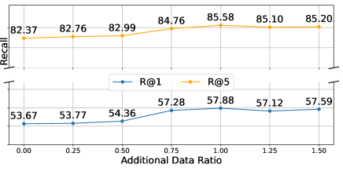

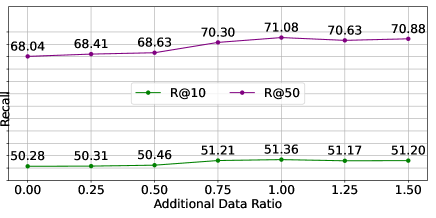

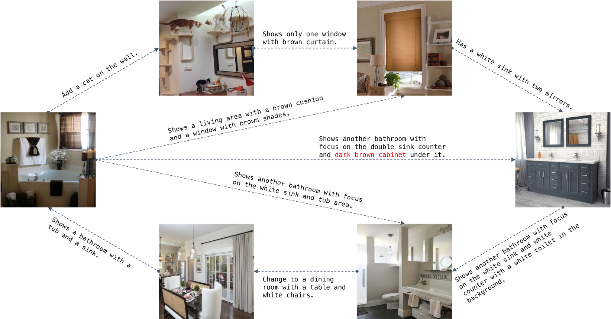

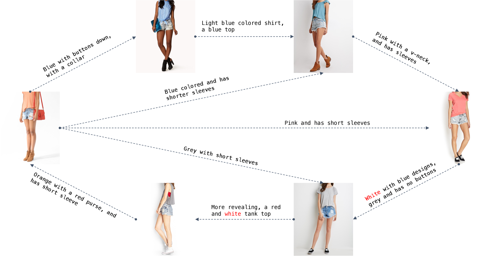

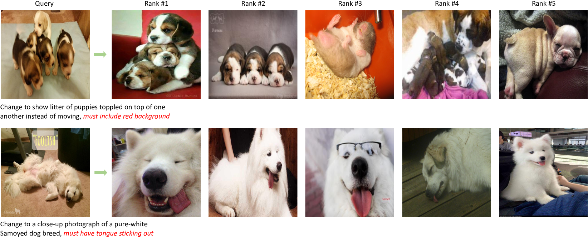

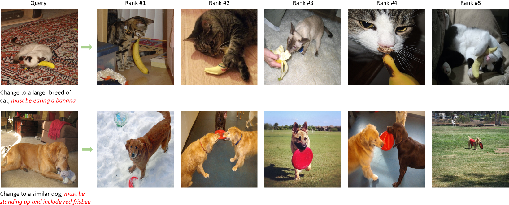

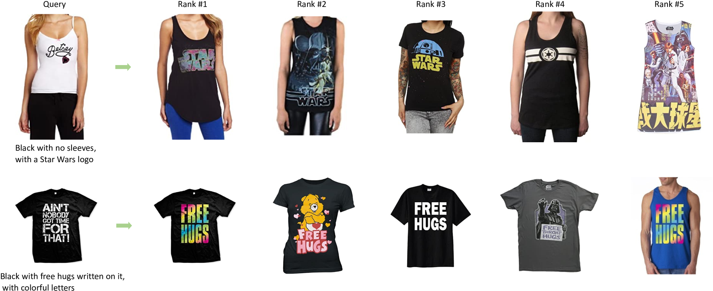

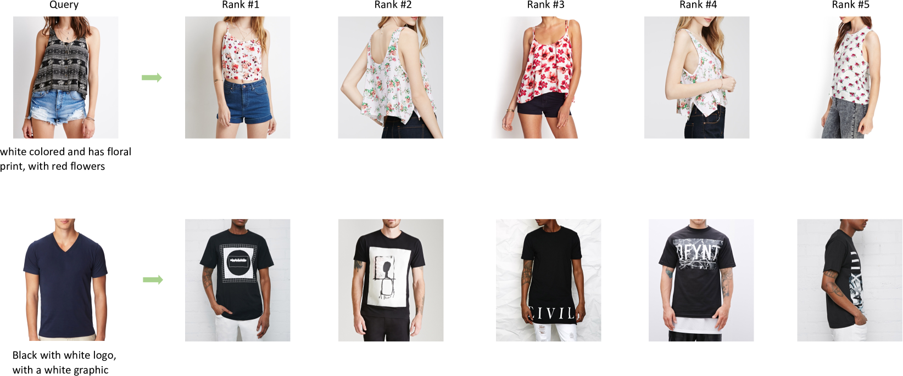

[Arxiv](https://arxiv.org/abs/2404.15516)