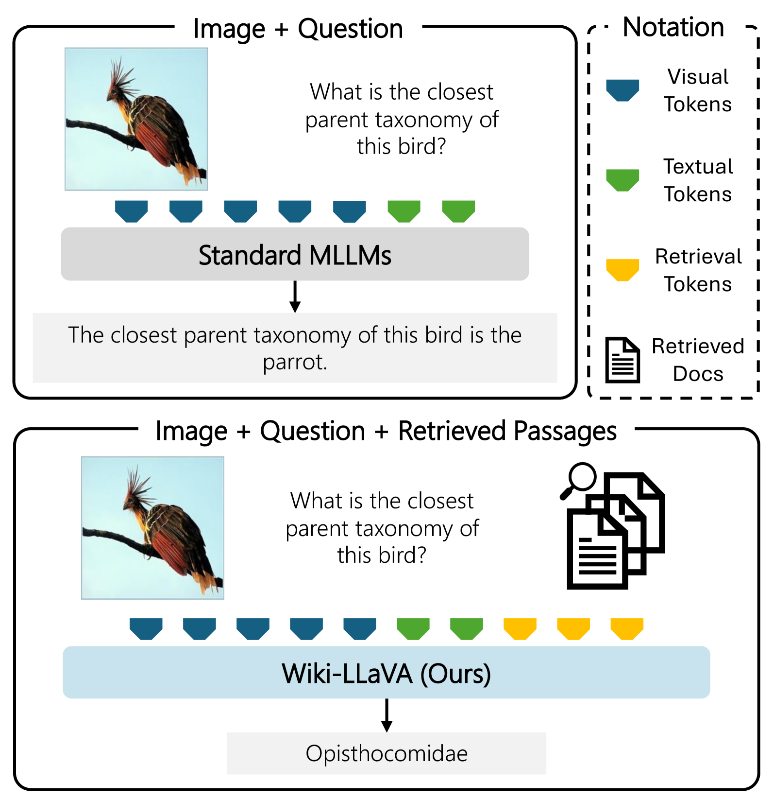
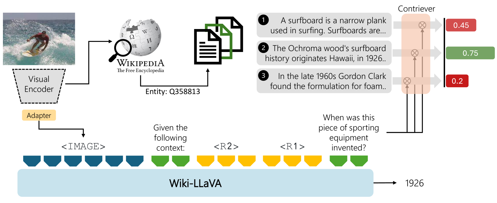
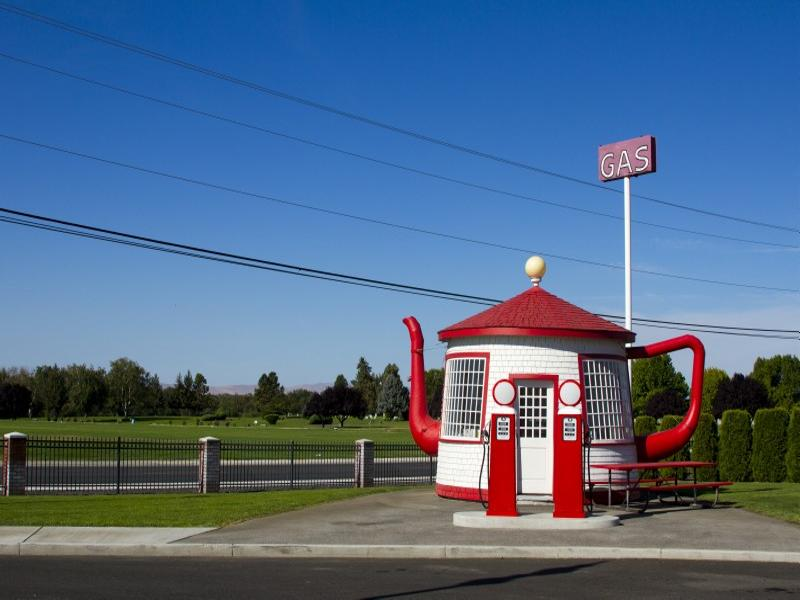
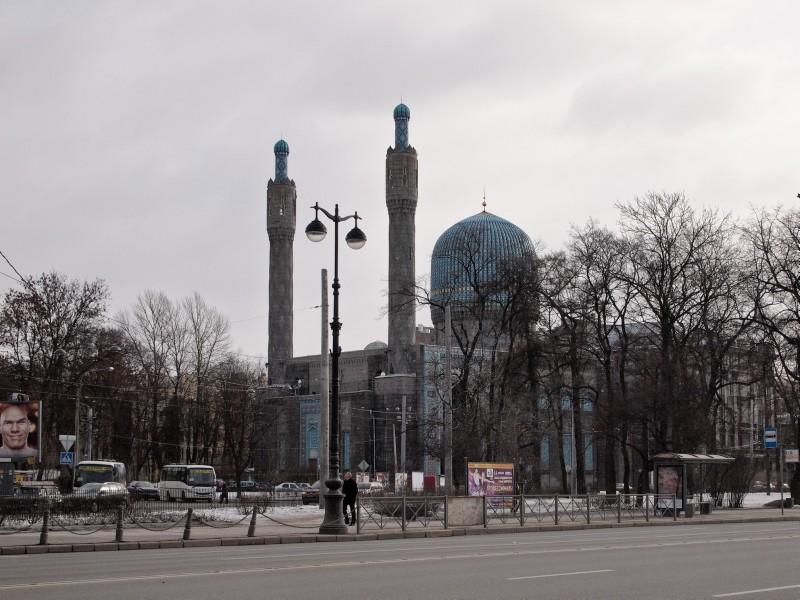
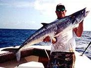
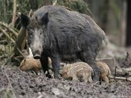
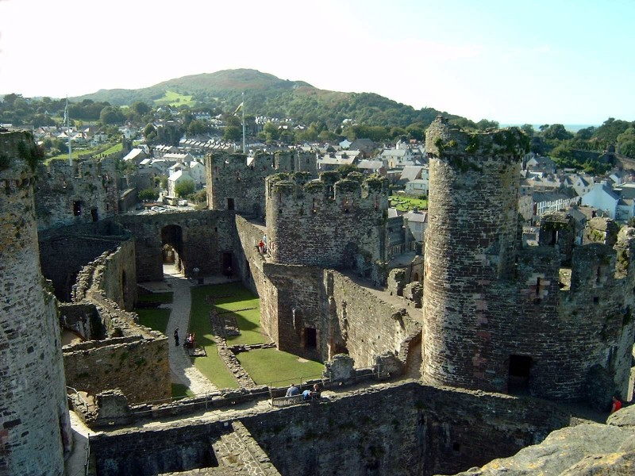
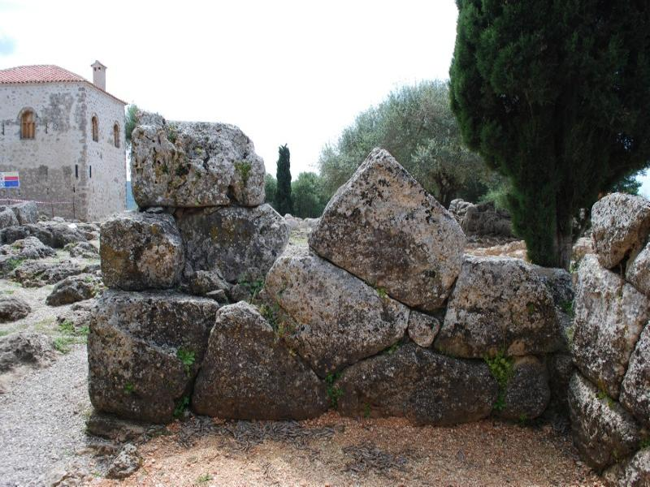
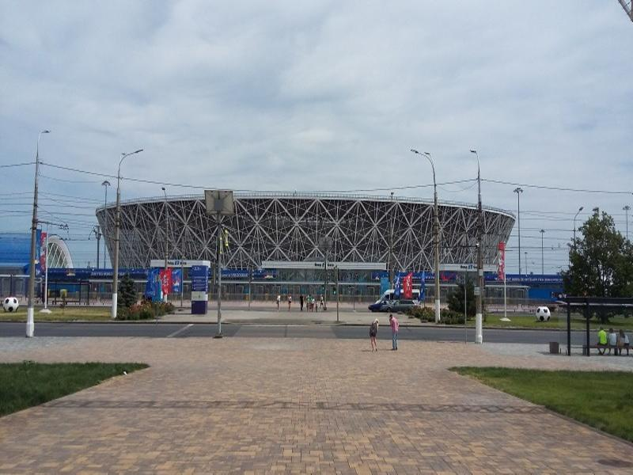
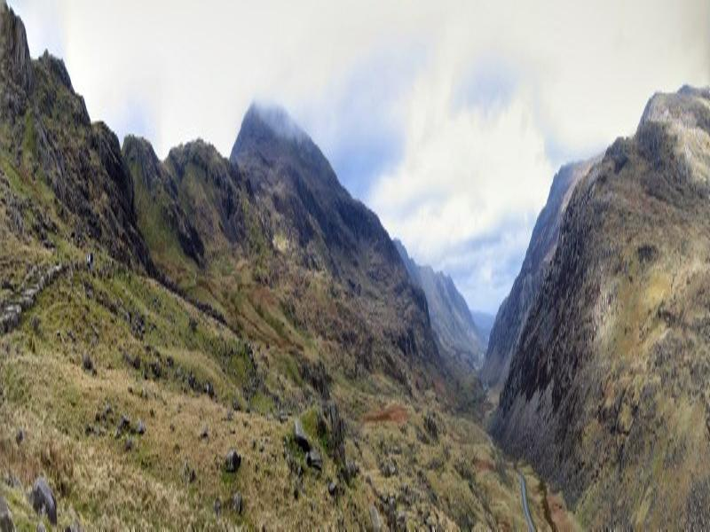

# Wiki-LLaVA：为多模态大型语言模型引入分层检索增强的生成技术

发布时间：2024年04月23日

`分类：LLM应用` `视觉问答` `对话生成`

> Wiki-LLaVA: Hierarchical Retrieval-Augmented Generation for Multimodal LLMs

# 摘要

> 多模态大型语言模型（LLMs）作为LLMs的进化升级，不仅局限于文本模态，更拓展了其应用范围。本研究致力于开发新型架构和视觉-语言适配器，并特别着眼于使模型能够回答需依赖外部知识的查询问题。我们提出的Wiki-LLaVA方法，通过分层检索流程整合了一个外部的多模态文档知识库。利用此方法，能够从知识库中检索出相关文段，为LLM提供额外的上下文信息，从而提升对话生成的效果和精确度。我们在视觉问答领域，针对包含外部数据的定制数据集进行了广泛的实验，验证了我们方法的有效性。

> Multimodal LLMs are the natural evolution of LLMs, and enlarge their capabilities so as to work beyond the pure textual modality. As research is being carried out to design novel architectures and vision-and-language adapters, in this paper we concentrate on endowing such models with the capability of answering questions that require external knowledge. Our approach, termed Wiki-LLaVA, aims at integrating an external knowledge source of multimodal documents, which is accessed through a hierarchical retrieval pipeline. Relevant passages, using this approach, are retrieved from the external knowledge source and employed as additional context for the LLM, augmenting the effectiveness and precision of generated dialogues. We conduct extensive experiments on datasets tailored for visual question answering with external data and demonstrate the appropriateness of our approach.

[Arxiv](https://arxiv.org/abs/2404.15406)