# 利用生成式预训练变换模型，自动化生成加密哈希函数实现的源代码变种。

发布时间：2024年04月24日

`LLM应用` `密码学` `软件工程`

> Automated Creation of Source Code Variants of a Cryptographic Hash Function Implementation Using Generative Pre-Trained Transformer Models

# 摘要

> 本研究探讨了生成预训练变换器（GPT）在创造新颖、准确乃至极具安全隐患的SHA-1密码散列函数实现方面的能力。研究中使用了Llama-2-70b-chat-h、Mistral-7B-Instruct-v0.1和zephyr-7b-alpha等GPT模型，并通过修改localGPT框架及langchain来为模型提供完整的源代码和头文件的词嵌入上下文，进而重写了超过130,000个函数，其中约40,000个成功编译为C代码。研究分析了这些代码的可编译性、算法准确性、内存泄漏、编译器优化稳定性以及与参考实现的字符差异。研究发现，部分生成的函数变体在某些测试向量上正确，而在其他向量上错误，存在高实现安全风险。此外，许多实现虽与SHA-1的参考算法不符，却能产生具备基本哈希特性的哈希值。许多重写的函数存在内存泄漏、整数溢出、越界访问、使用未初始化值和编译器优化不稳定等严重缺陷。通过编译器优化设置和编译二进制文件的SHA-256哈希校验和进行聚类分析，发现了超过100,000个结构新颖且功能正确的SHA-1代码库变体，每个组件C函数都与原始代码有所区别。

> Generative pre-trained transformers (GPT's) are a type of large language machine learning model that are unusually adept at producing novel, and coherent, natural language. In this study the ability of GPT models to generate novel and correct versions, and notably very insecure versions, of implementations of the cryptographic hash function SHA-1 is examined. The GPT models Llama-2-70b-chat-h, Mistral-7B-Instruct-v0.1, and zephyr-7b-alpha are used. The GPT models are prompted to re-write each function using a modified version of the localGPT framework and langchain to provide word embedding context of the full source code and header files to the model, resulting in over 130,000 function re-write GPT output text blocks, approximately 40,000 of which were able to be parsed as C code and subsequently compiled. The generated code is analyzed for being compilable, correctness of the algorithm, memory leaks, compiler optimization stability, and character distance to the reference implementation. Remarkably, several generated function variants have a high implementation security risk of being correct for some test vectors, but incorrect for other test vectors. Additionally, many function implementations were not correct to the reference algorithm of SHA-1, but produced hashes that have some of the basic characteristics of hash functions. Many of the function re-writes contained serious flaws such as memory leaks, integer overflows, out of bounds accesses, use of uninitialised values, and compiler optimization instability. Compiler optimization settings and SHA-256 hash checksums of the compiled binaries are used to cluster implementations that are equivalent but may not have identical syntax - using this clustering over 100,000 novel and correct versions of the SHA-1 codebase were generated where each component C function of the reference implementation is different from the original code.

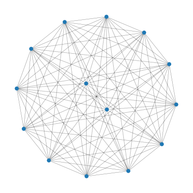

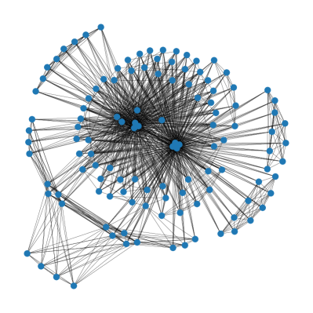

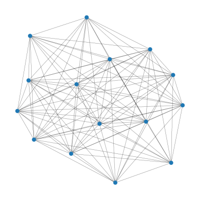

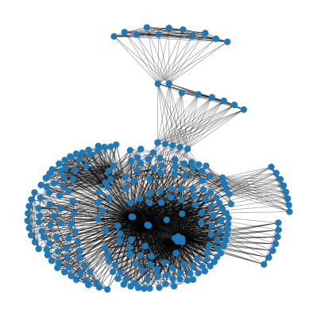

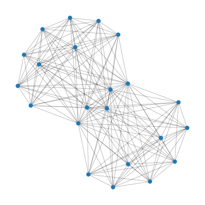

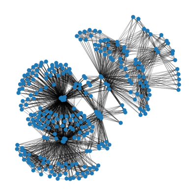

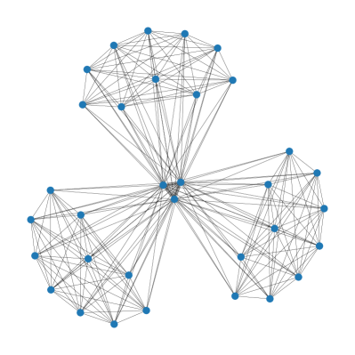

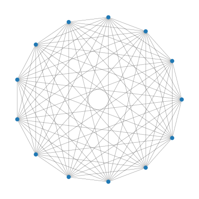

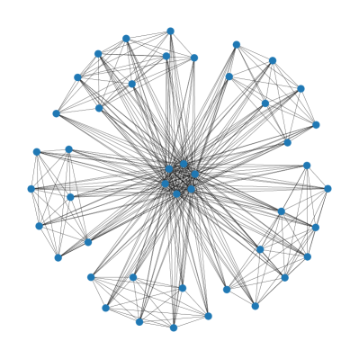

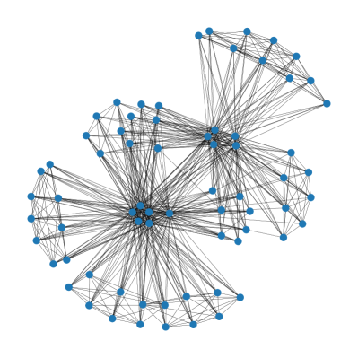

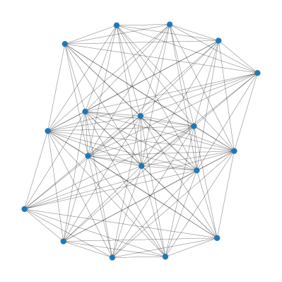

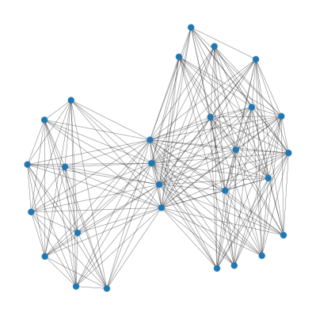

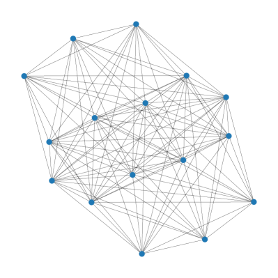

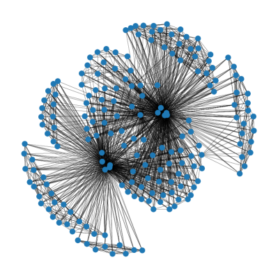

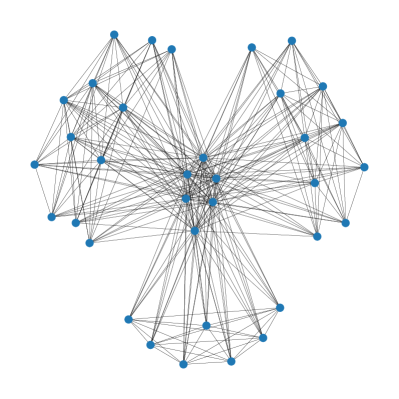

[Arxiv](https://arxiv.org/abs/2404.15681)