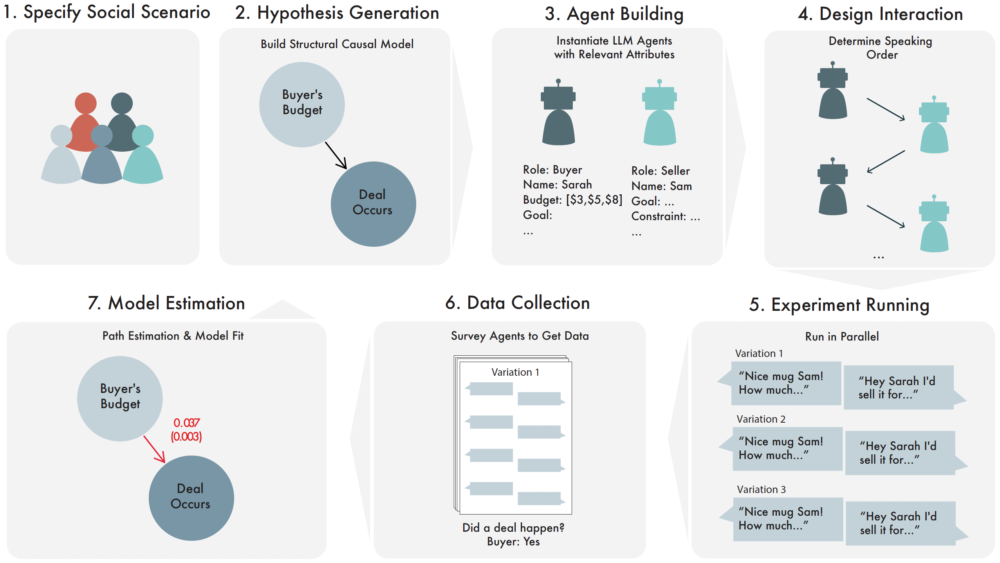
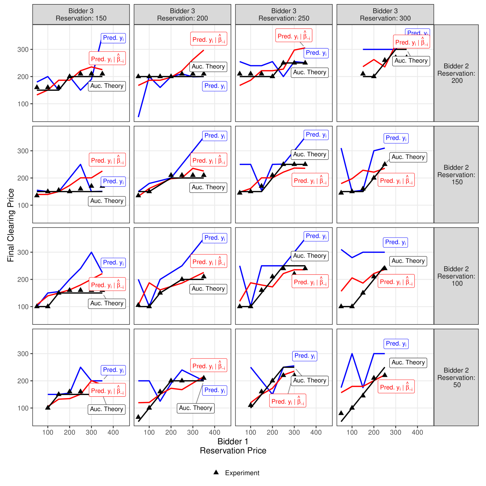
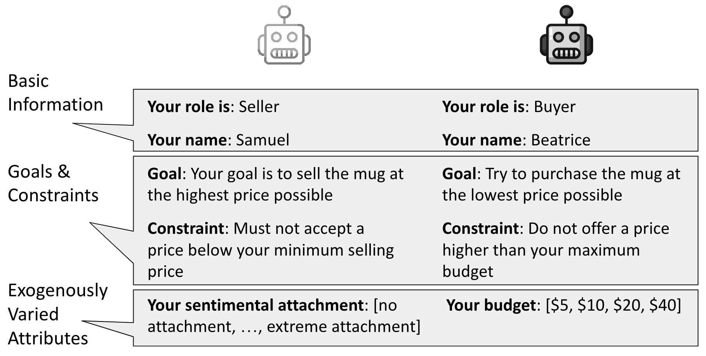
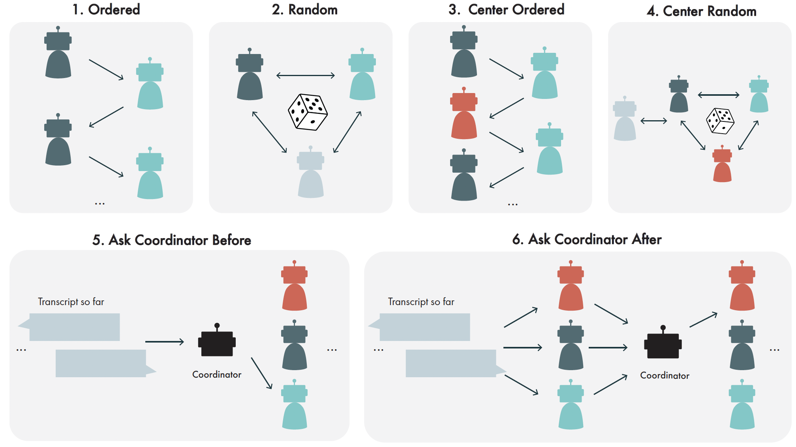
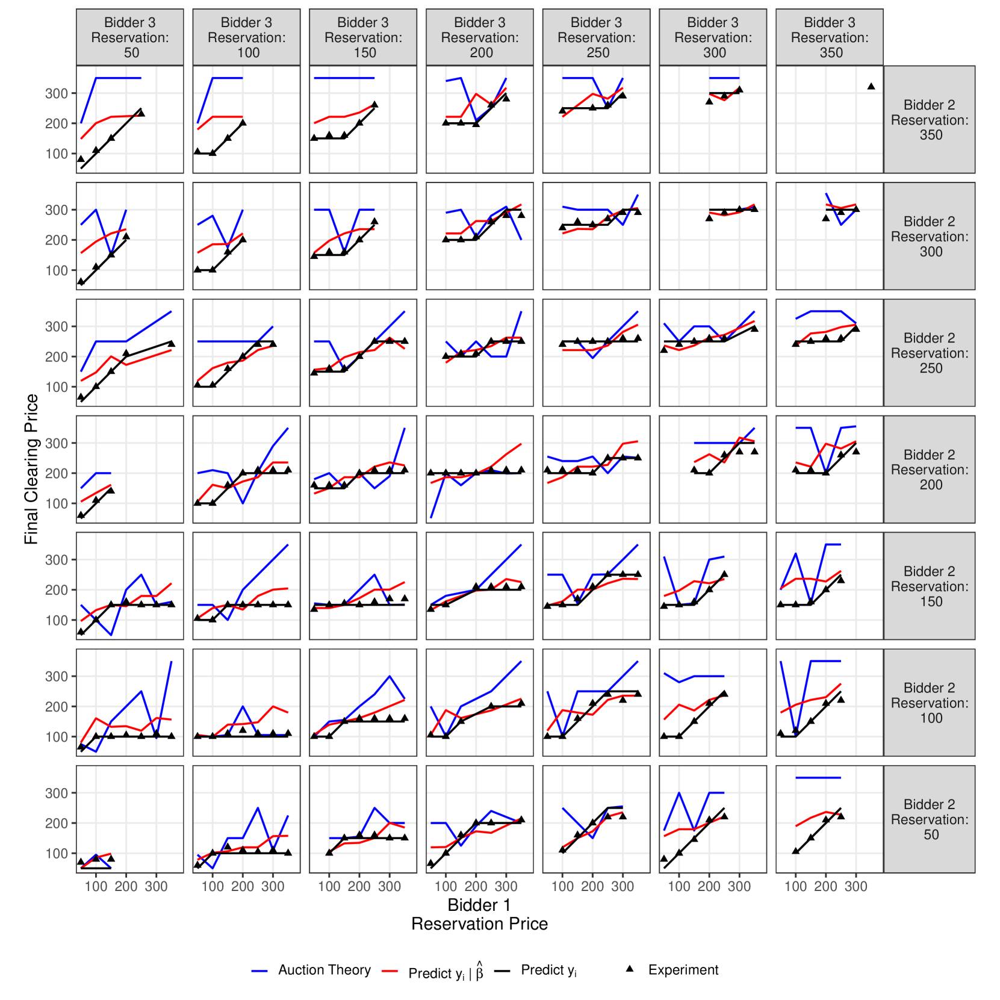

# 自动社会科学：语言模型的双重角色——既是研究者也是研究对象

发布时间：2024年04月24日

`LLM应用` `社会科学` `因果推理`

> Automated Social Science: Language Models as Scientist and Subjects

# 摘要

> 我们展示了一种自动生成并模拟测试社会科学假设的新方法。这一创新得益于大型语言模型（LLM）的突破性进展，但其核心在于结构因果模型的应用。这些模型不仅为我们提供了一种表述假设的方式，还为构建基于LLM的智能体、设计实验和规划数据分析提供了指导。经过拟合的模型进一步成为预测和后续实验规划的有力工具。我们通过多个场景——谈判、保释听证、求职面试和拍卖——来验证这一方法，系统在这些场景中提出并验证了因果关系，发现了一些关系的证据，而对其他关系则持保留态度。研究表明，通过这些模拟获得的对社会互动的洞察，是LLM无法仅通过直接询问得到的。尽管LLM能够准确预测估计效应的方向，但对于效应大小的预测却不够可靠。特别是在拍卖实验中，模拟结果与拍卖理论的预测高度吻合，而LLM直接引出的清算价格预测却存在偏差。但如果LLM能够依据拟合的因果模型进行条件预测，其预测准确度将大幅提升。总之，LLM的潜力远超其直接表达的能力。

> We present an approach for automatically generating and testing, in silico, social scientific hypotheses. This automation is made possible by recent advances in large language models (LLM), but the key feature of the approach is the use of structural causal models. Structural causal models provide a language to state hypotheses, a blueprint for constructing LLM-based agents, an experimental design, and a plan for data analysis. The fitted structural causal model becomes an object available for prediction or the planning of follow-on experiments. We demonstrate the approach with several scenarios: a negotiation, a bail hearing, a job interview, and an auction. In each case, causal relationships are both proposed and tested by the system, finding evidence for some and not others. We provide evidence that the insights from these simulations of social interactions are not available to the LLM purely through direct elicitation. When given its proposed structural causal model for each scenario, the LLM is good at predicting the signs of estimated effects, but it cannot reliably predict the magnitudes of those estimates. In the auction experiment, the in silico simulation results closely match the predictions of auction theory, but elicited predictions of the clearing prices from the LLM are inaccurate. However, the LLM's predictions are dramatically improved if the model can condition on the fitted structural causal model. In short, the LLM knows more than it can (immediately) tell.

[Arxiv](https://arxiv.org/abs/2404.11794)