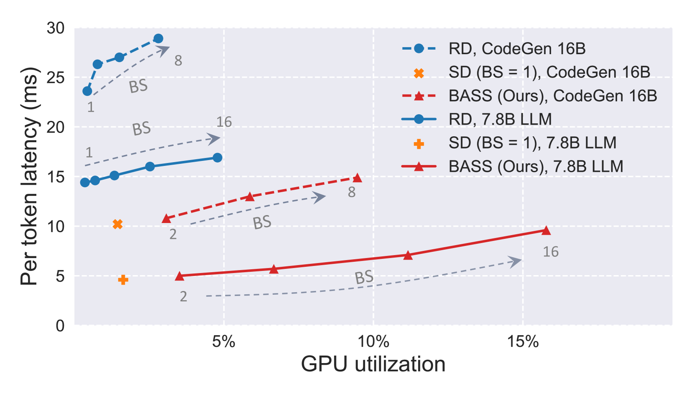
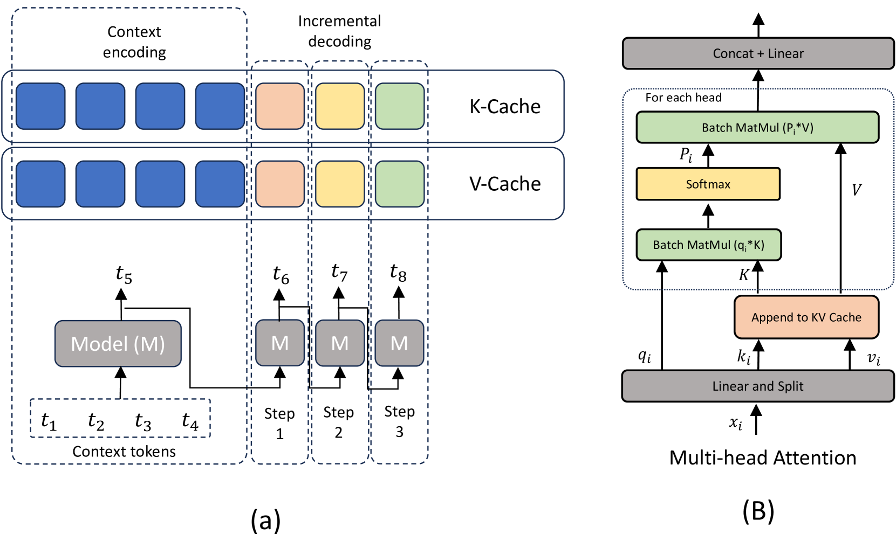
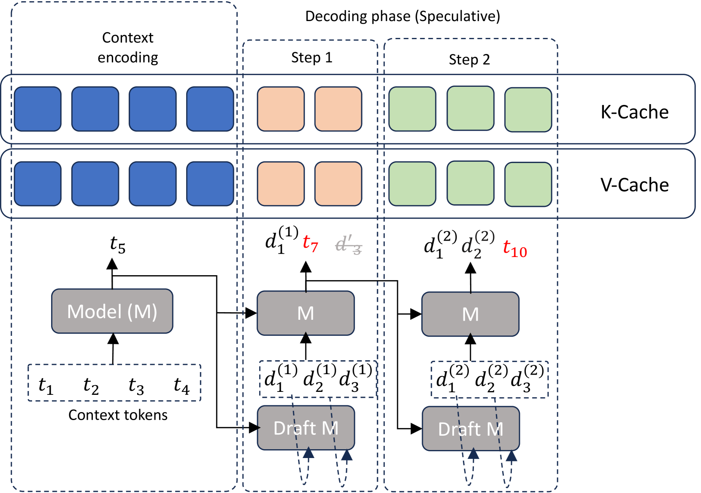
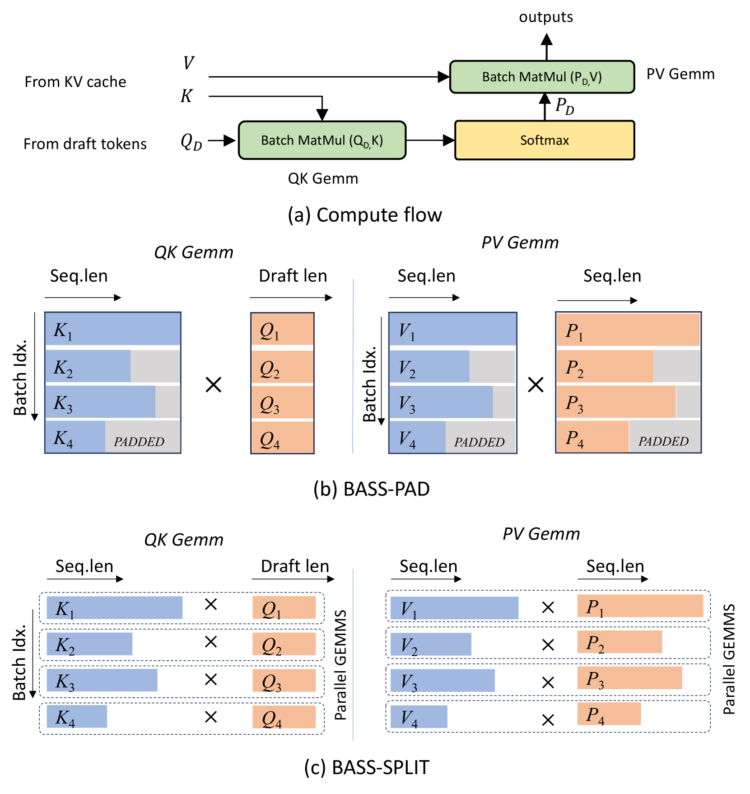
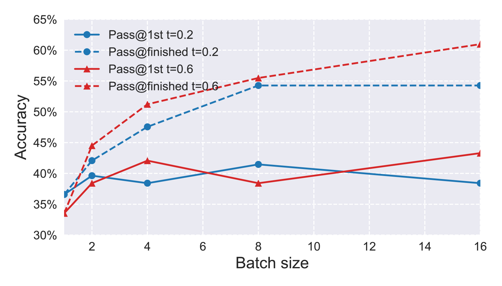
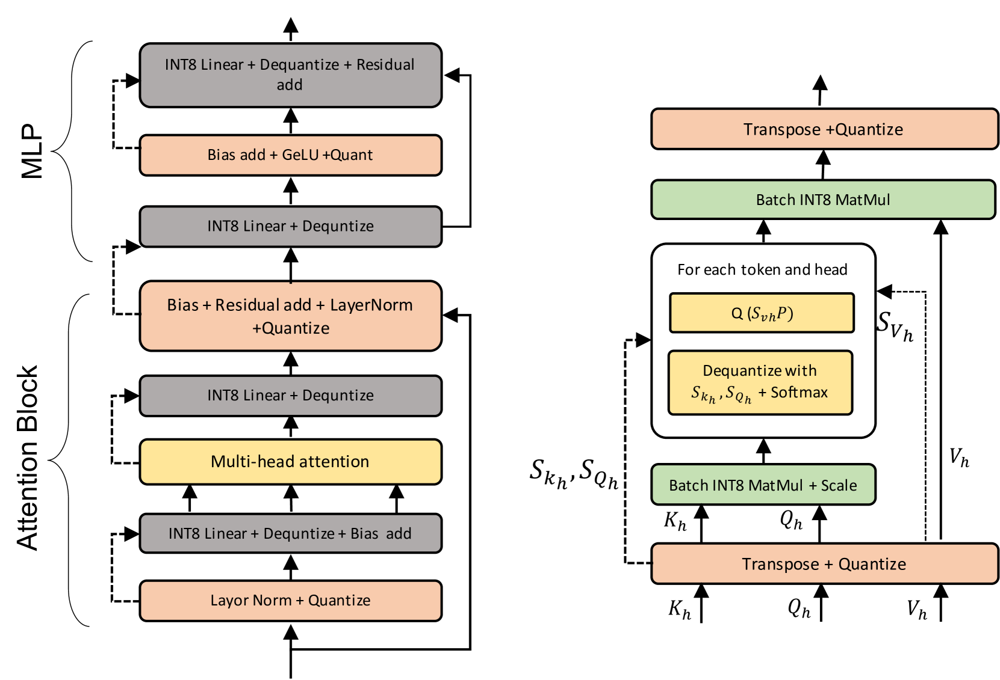

# BASS：批量优化的注意力驱动推测抽样

发布时间：2024年04月24日

`LLM应用` `计算机科学`

> BASS: Batched Attention-optimized Speculative Sampling

# 摘要

> 推测性解码技术正崭露头角，它显著提升了大型语言模型在延迟和吞吐量方面的表现。尽管多数现有解决方案仅针对单一序列生成，但实际应用中对多响应的需求日益增长，这要求我们在保持低延迟优势的同时，实现批量推测性解码，这一挑战颇具难度。本文介绍的批量推测性解码系统，在多序列生成的延迟上达到了新的高度，并在 GPU 利用率和生成质量上展现了卓越的性能。以一个 7.8B 参数的模型为例，在单块 A100 GPU 上，批量大小为 8 时，每个序列的生成速度平均为 5.8 毫秒/令牌，整体吞吐率高达每秒 1.1K 令牌。这一性能不仅刷新了最低延迟的记录，而且比经过优化的常规解码速度快了 2.15 倍。在常规解码无法完成的时间内，我们的系统能够生成达到 HumanEval Pass@First 43% 和 Pass@All 61% 的序列，这一表现远超单序列推测性解码。此外，我们的系统在解码过程中的 GPU 峰值利用率可达 15.8%，是常规解码峰值利用率的三倍多，也大约是单序列推测性解码的十倍。

> Speculative decoding has emerged as a powerful method to improve latency and throughput in hosting large language models. However, most existing implementations focus on generating a single sequence. Real-world generative AI applications often require multiple responses and how to perform speculative decoding in a batched setting while preserving its latency benefits poses non-trivial challenges. This paper describes a system of batched speculative decoding that sets a new state of the art in multi-sequence generation latency and that demonstrates superior GPU utilization as well as quality of generations within a time budget. For example, for a 7.8B-size model on a single A100 GPU and with a batch size of 8, each sequence is generated at an average speed of 5.8ms per token, the overall throughput being 1.1K tokens per second. These results represent state-of-the-art latency and a 2.15X speed-up over optimized regular decoding. Within a time budget that regular decoding does not finish, our system is able to generate sequences with HumanEval Pass@First of 43% and Pass@All of 61%, far exceeding what's feasible with single-sequence speculative decoding. Our peak GPU utilization during decoding reaches as high as 15.8%, more than 3X the highest of that of regular decoding and around 10X of single-sequence speculative decoding.

[Arxiv](https://arxiv.org/abs/2404.15778)