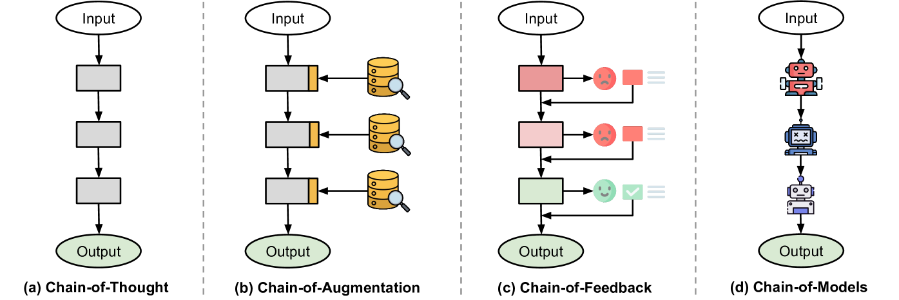

# 探索思维链之外：对大型语言模型链式X范式的全面调查

发布时间：2024年04月24日

`LLM应用` `人工智能`

> Beyond Chain-of-Thought: A Survey of Chain-of-X Paradigms for LLMs

# 摘要

> 链式思考（CoT）作为一种流行的提示技术，成功激发了大型语言模型（LLMs）的卓越推理潜能。受CoT连续思维模式的启发，众多链式X（CoX）策略应运而生，旨在解决不同领域和任务中遇到的挑战。本文全面梳理了在多样化背景下LLMs的CoX策略。我们根据节点类型（即CoX中的X）和应用任务，对这些策略进行了细致分类。此外，我们还探讨了现有CoX策略的研究成果及其深远影响，并展望了未来的发展方向。本研究旨在为希望将CoT理念扩展到更广泛应用场景的研究者提供一份详尽且紧跟时代脉搏的参考资源。

> Chain-of-Thought (CoT) has been a widely adopted prompting method, eliciting impressive reasoning abilities of Large Language Models (LLMs). Inspired by the sequential thought structure of CoT, a number of Chain-of-X (CoX) methods have been developed to address various challenges across diverse domains and tasks involving LLMs. In this paper, we provide a comprehensive survey of Chain-of-X methods for LLMs in different contexts. Specifically, we categorize them by taxonomies of nodes, i.e., the X in CoX, and application tasks. We also discuss the findings and implications of existing CoX methods, as well as potential future directions. Our survey aims to serve as a detailed and up-to-date resource for researchers seeking to apply the idea of CoT to broader scenarios.

[Arxiv](https://arxiv.org/abs/2404.15676)