# Cantor：激发机器学习大型语言模型（MLLM）的多模态思维链

发布时间：2024年04月24日

`LLM应用` `视觉推理` `多模态学习`

> Cantor: Inspiring Multimodal Chain-of-Thought of MLLM

# 摘要

> 随着思维链（CoT）方法赋能的大型语言模型（LLMs）的兴起，视觉推理问题被细化为可操作的子任务，并借助多样化的外部工具逐步攻克。然而，这一模式在决策过程中可能因视觉信息不足和低级感知工具的局限性，导致“确定性幻觉”的挑战。本文主张，整合视觉情境获取与逻辑推理是攻克视觉推理任务的关键。本研究深入多模态CoT领域，利用多模态大型语言模型（MLLMs）及其认知能力，解决复杂的视觉推理问题。我们提出了一个创新的多模态CoT框架——Cantor，它采用感知-决策架构。Cantor作为决策生成器，整合视觉输入以分析图像和问题，确保与实际情境的紧密结合。此外，Cantor借助MLLMs的高级认知功能，充当多面专家，提炼高层次信息，优化CoT生成流程。我们的广泛实验表明，该框架在两个复杂视觉推理数据集上的多模态CoT性能取得了显著提升，无需进行微调或依赖真实理由。项目页面：https://ggg0919.github.io/cantor/ 。

> With the advent of large language models(LLMs) enhanced by the chain-of-thought(CoT) methodology, visual reasoning problem is usually decomposed into manageable sub-tasks and tackled sequentially with various external tools. However, such a paradigm faces the challenge of the potential "determining hallucinations" in decision-making due to insufficient visual information and the limitation of low-level perception tools that fail to provide abstract summaries necessary for comprehensive reasoning. We argue that converging visual context acquisition and logical reasoning is pivotal for tackling visual reasoning tasks. This paper delves into the realm of multimodal CoT to solve intricate visual reasoning tasks with multimodal large language models(MLLMs) and their cognitive capability. To this end, we propose an innovative multimodal CoT framework, termed Cantor, characterized by a perception-decision architecture. Cantor first acts as a decision generator and integrates visual inputs to analyze the image and problem, ensuring a closer alignment with the actual context. Furthermore, Cantor leverages the advanced cognitive functions of MLLMs to perform as multifaceted experts for deriving higher-level information, enhancing the CoT generation process. Our extensive experiments demonstrate the efficacy of the proposed framework, showing significant improvements in multimodal CoT performance across two complex visual reasoning datasets, without necessitating fine-tuning or ground-truth rationales. Project Page: https://ggg0919.github.io/cantor/ .

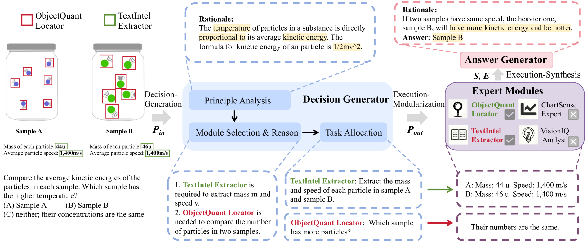

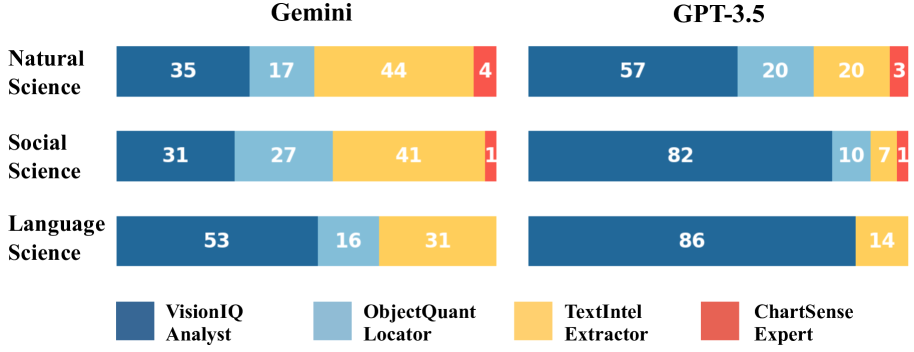

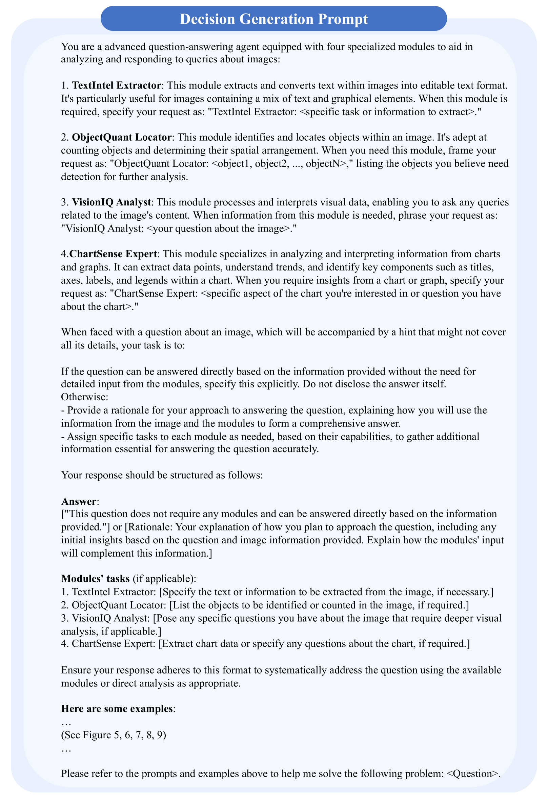

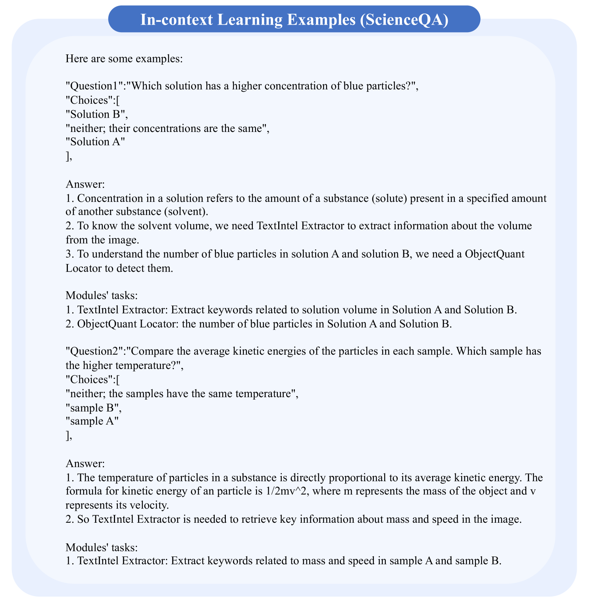

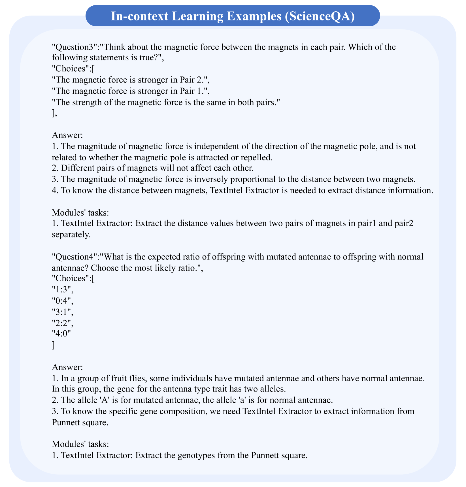

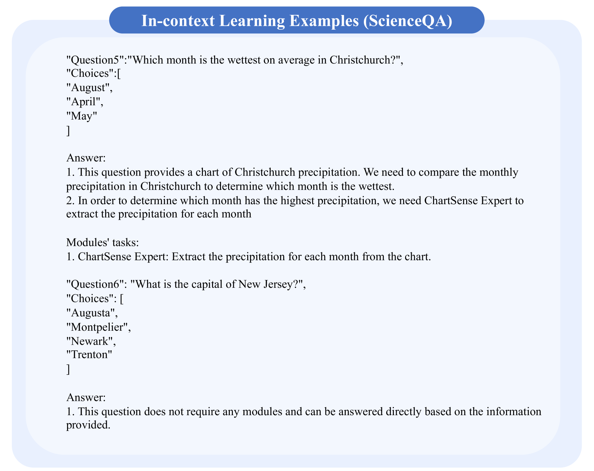

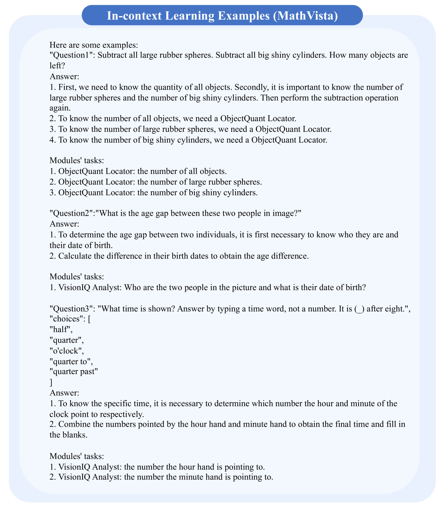

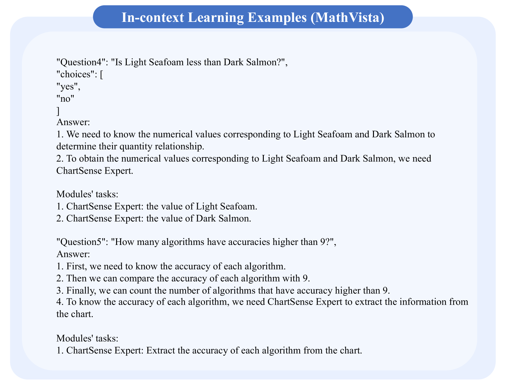

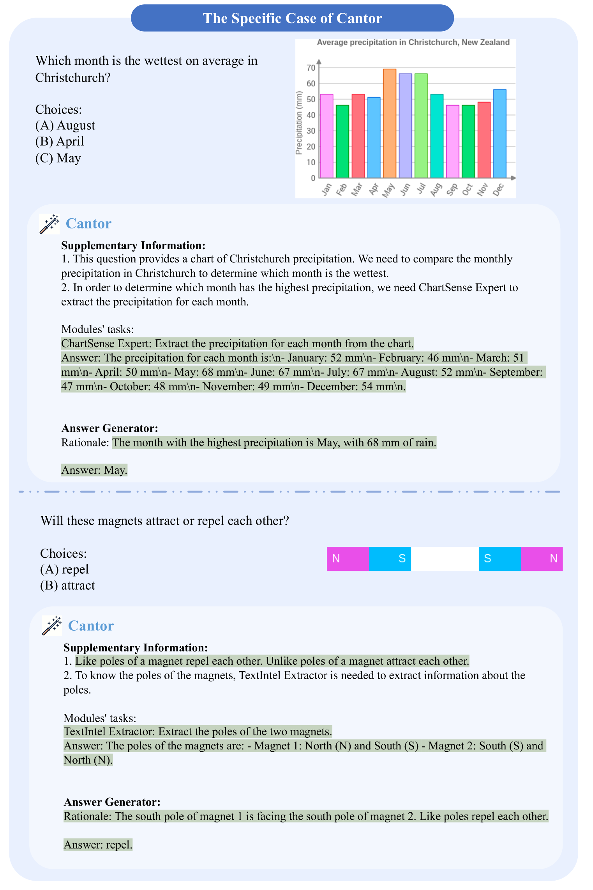

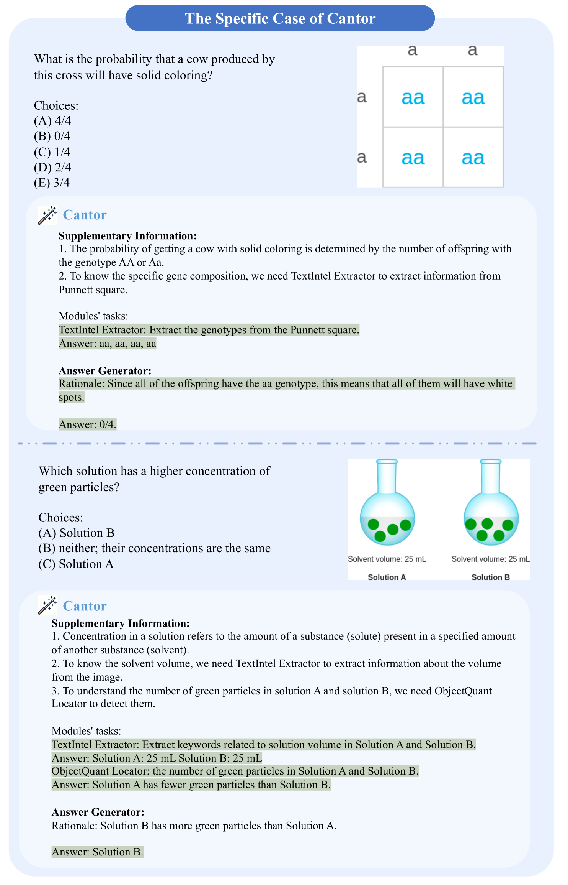

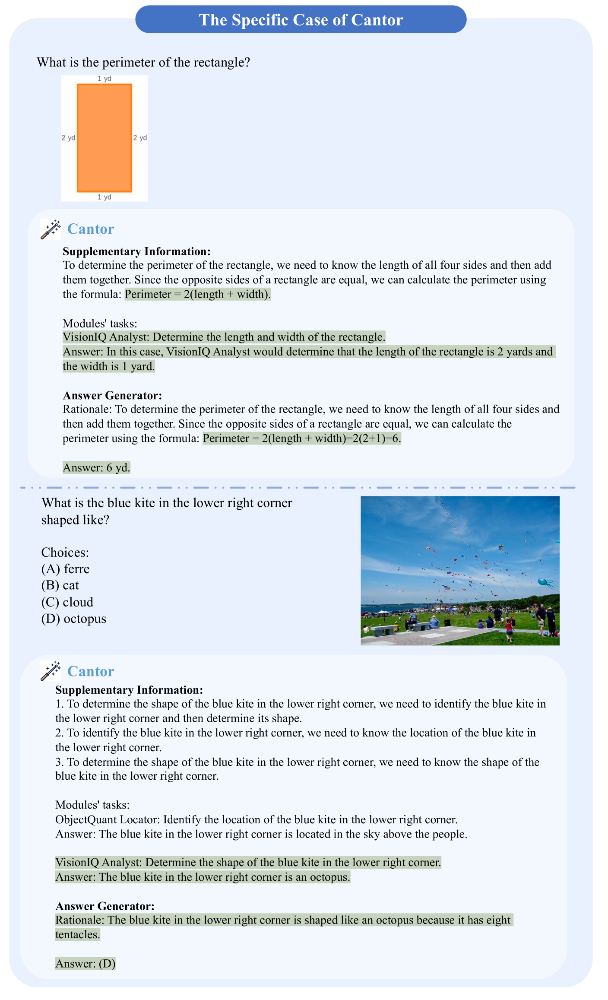

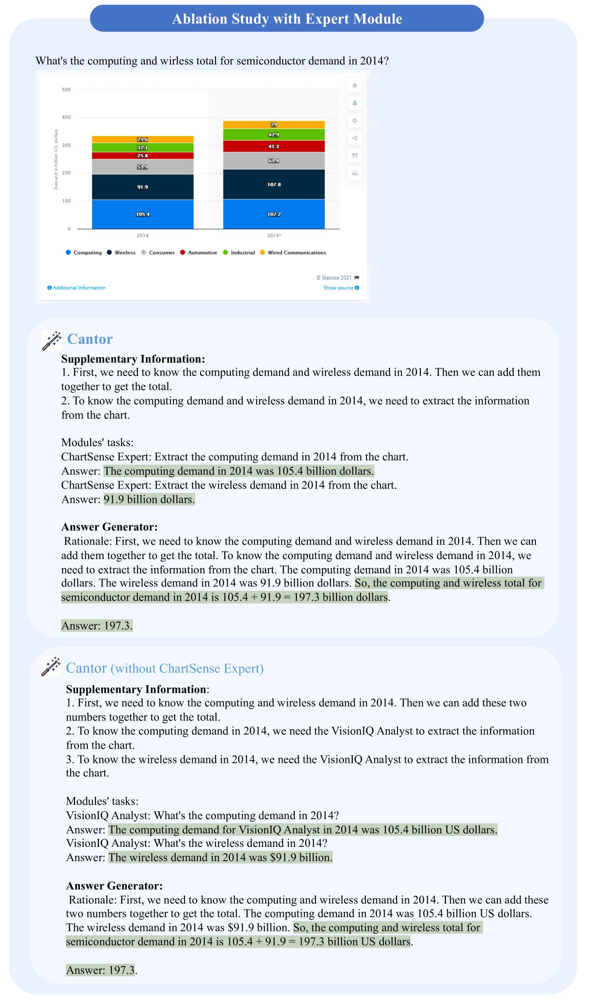

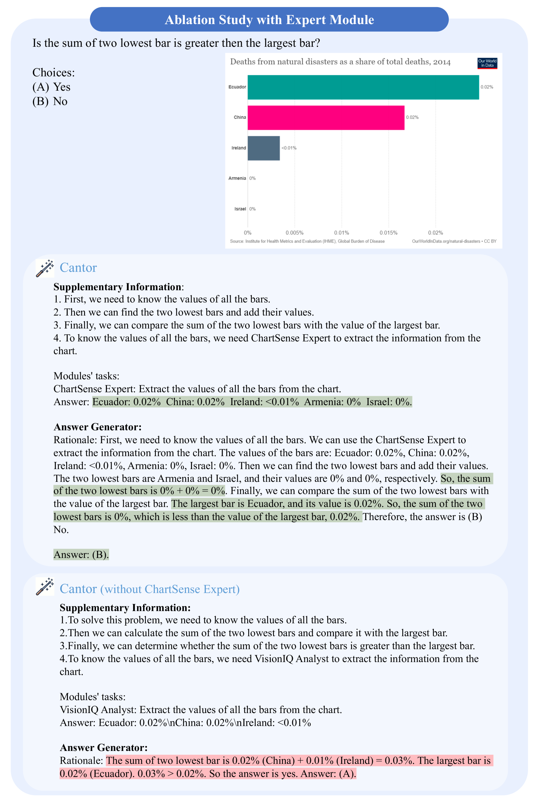

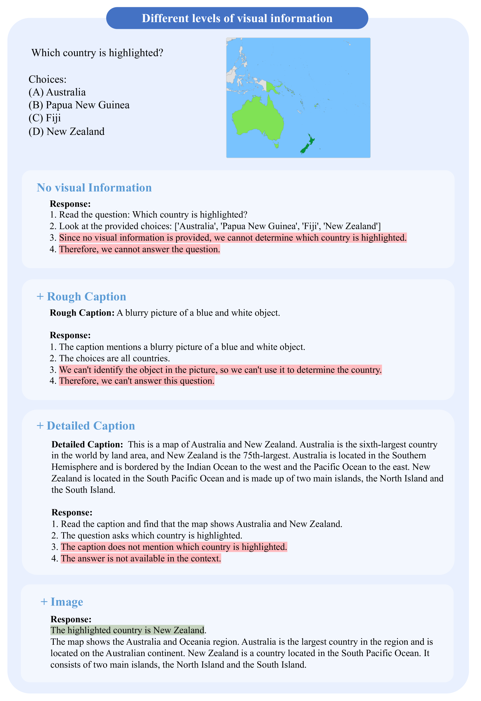

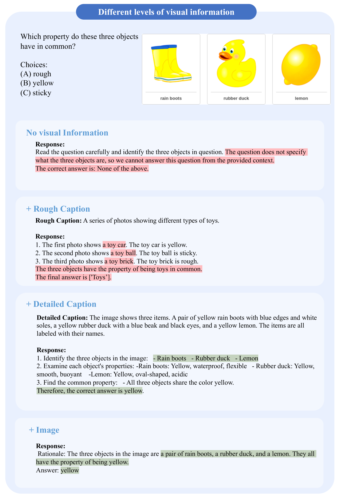

[Arxiv](https://arxiv.org/abs/2404.16033)