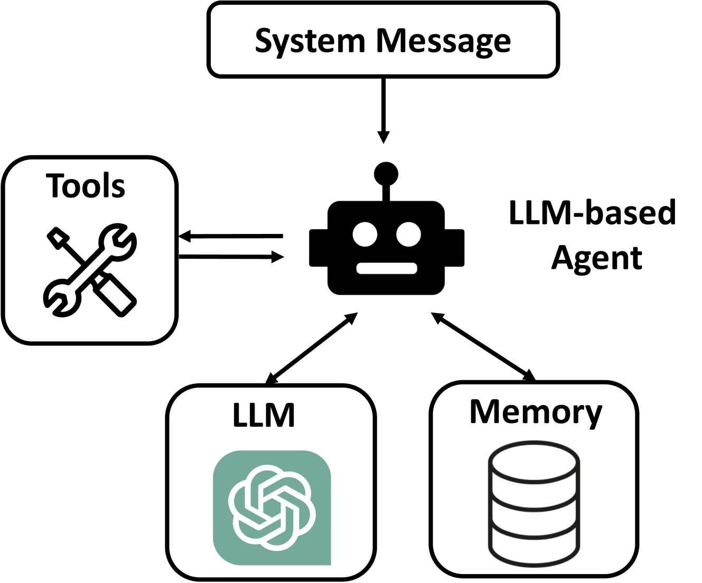
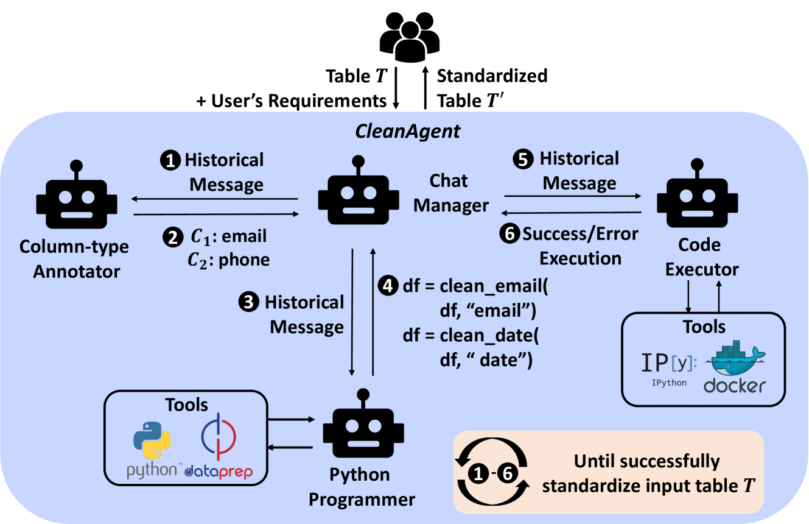
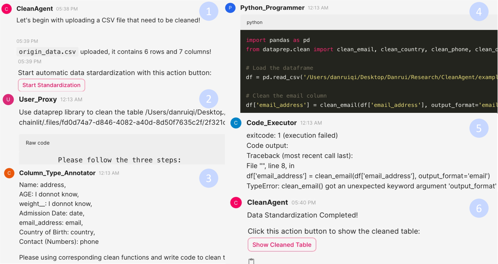

# CleanAgent：利用基于大型语言模型的智能代理，实现数据标准化流程的自动化。

发布时间：2024年04月24日

`Agent` `数据科学` `自动化`

> CleanAgent: Automating Data Standardization with LLM-based Agents

# 摘要

> 数据标准化对于数据科学至关重要，但传统的工具如 Pandas 复杂且定制化工作繁琐。大型语言模型（LLM）如 ChatGPT 在自动化数据标准化方面展现出潜力，却要求高阶编程技能和不断的交互优化。为克服这些难题，我们提出了一个 Python 库，它采用声明式、统一的 API 设计，简化了列类型标准化和 LLM 代码生成的过程。我们首先推出了 Dataprep.Clean，作为 Dataprep 库的一部分，它通过简化的单行代码极大降低了特定列类型的标准化难度。接着，我们推出了 CleanAgent 框架，整合了 Dataprep.Clean 和基于 LLM 的智能代理，实现了数据标准化流程的自动化。CleanAgent 让数据科学家只需明确提出需求，即可享受到自动化、无需人工干预的标准化服务。

> Data standardization is a crucial part in data science life cycle. While tools like Pandas offer robust functionalities, their complexity and the manual effort required for customizing code to diverse column types pose significant challenges. Although large language models (LLMs) like ChatGPT have shown promise in automating this process through natural language understanding and code generation, it still demands expert-level programming knowledge and continuous interaction for prompt refinement. To solve these challenges, our key idea is to propose a Python library with declarative, unified APIs for standardizing column types, simplifying the code generation of LLM with concise API calls. We first propose Dataprep.Clean which is written as a component of the Dataprep Library, offers a significant reduction in complexity by enabling the standardization of specific column types with a single line of code. Then we introduce the CleanAgent framework integrating Dataprep.Clean and LLM-based agents to automate the data standardization process. With CleanAgent, data scientists need only provide their requirements once, allowing for a hands-free, automatic standardization process.

[Arxiv](https://arxiv.org/abs/2403.08291)