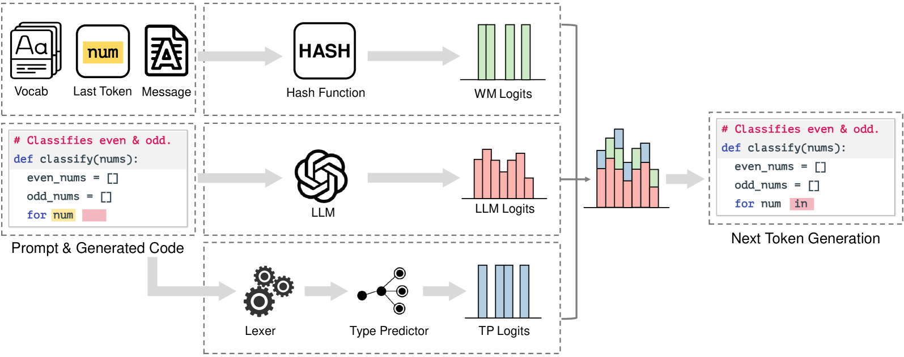
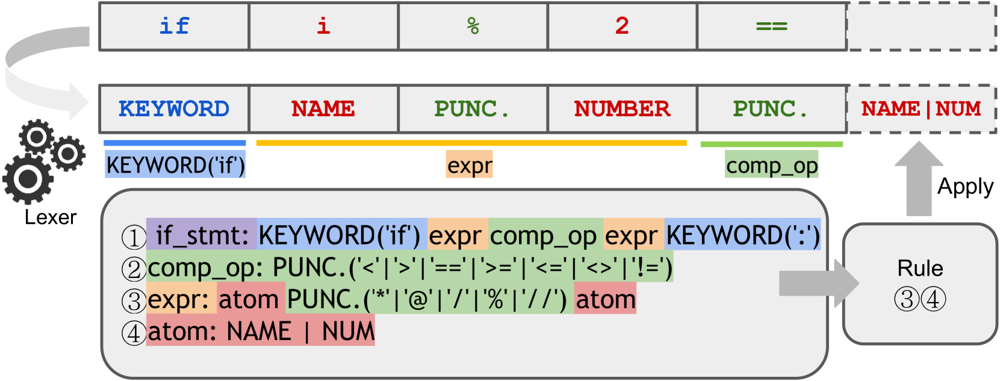
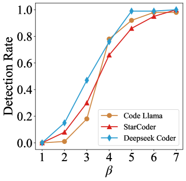
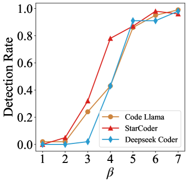
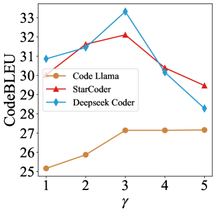
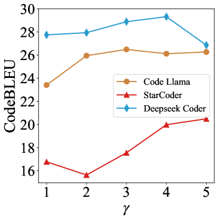
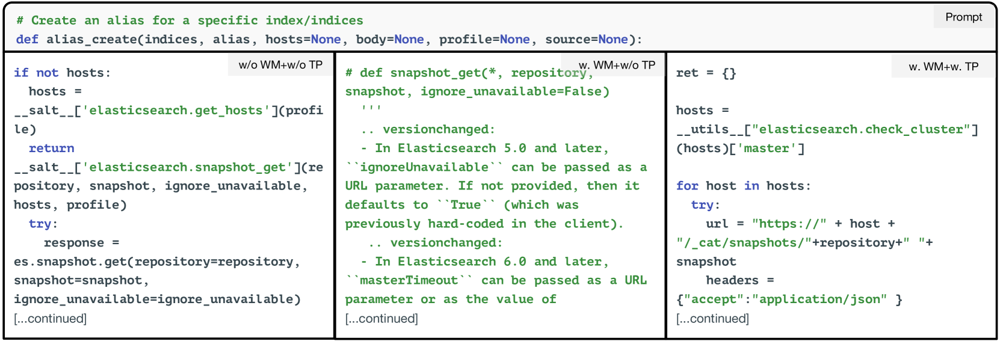
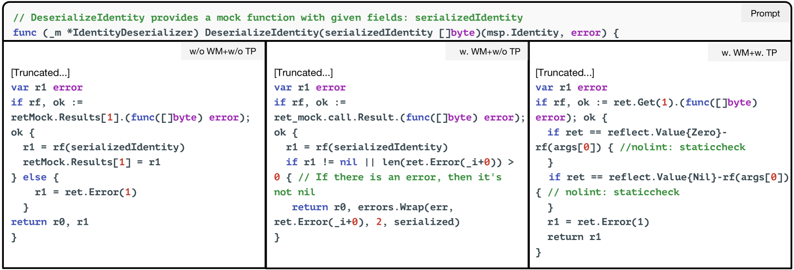
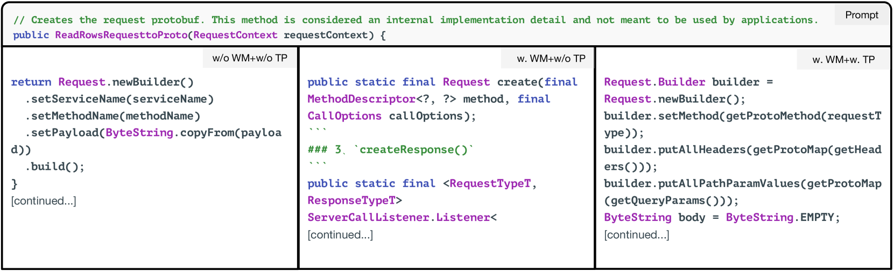

# CodeIP：一种语法引导的多比特水印技术，专为大型代码语言模型设计。

发布时间：2024年04月24日

`LLM应用` `软件工程`

> CodeIP: A Grammar-Guided Multi-Bit Watermark for Large Language Models of Code

# 摘要

> 随着大型语言模型（LLMs）在自动化代码生成领域的广泛应用，识别代码是否由人工智能生成及其生成模型的身份变得愈发重要，这在保护工业产权和防止学术不端行为中尤为关键。CodeIP，一种创新的水印技术，为基于LLM的代码生成提供了解决方案。与传统方法相比，CodeIP能够嵌入多位信息，且不影响代码语义，从而增强了水印的强度和多样性。这一技术通过训练一个类型预测器来预测下一个标记的语法类型，进一步提升了代码的语法和语义准确性。在涵盖五种编程语言的真实世界数据集上的实验，证明了CodeIP的卓越性能。

> As Large Language Models (LLMs) are increasingly used to automate code generation, it is often desired to know if the code is AI-generated and by which model, especially for purposes like protecting intellectual property (IP) in industry and preventing academic misconduct in education. Incorporating watermarks into machine-generated content is one way to provide code provenance, but existing solutions are restricted to a single bit or lack flexibility. We present CodeIP, a new watermarking technique for LLM-based code generation. CodeIP enables the insertion of multi-bit information while preserving the semantics of the generated code, improving the strength and diversity of the inerseted watermark. This is achieved by training a type predictor to predict the subsequent grammar type of the next token to enhance the syntactical and semantic correctness of the generated code. Experiments on a real-world dataset across five programming languages showcase the effectiveness of CodeIP.

[Arxiv](https://arxiv.org/abs/2404.15639)