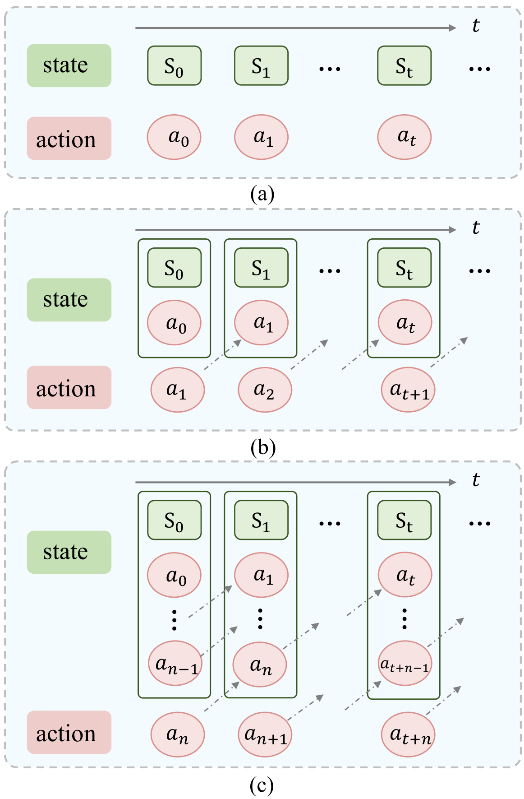
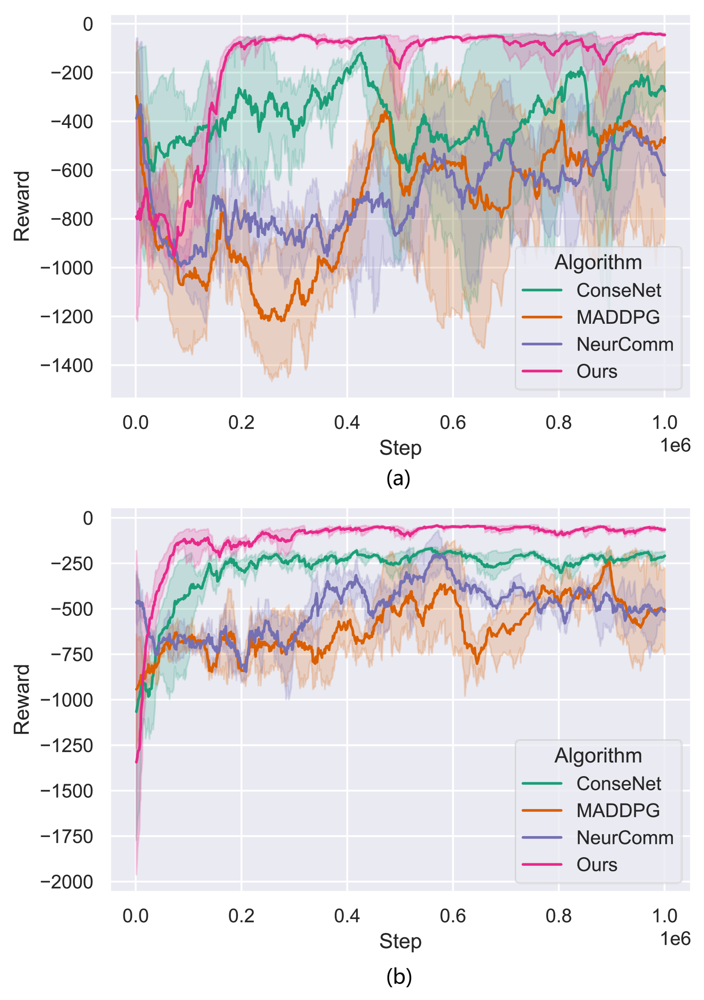

# 本文介绍了一种新颖的多智能体强化学习方法，旨在实现具有模型基础稳定性增强功能的合作自适应巡航控制（CACC）。该方法特别关注了通信延迟对系统性能的影响，通过智能体之间的协同学习，优化了在存在延迟情况下的控制策略，从而提高了整体系统的稳定性和响应速度。

发布时间：2024年04月24日

`Agent` `自动驾驶` `交通控制`

> Delay-Aware Multi-Agent Reinforcement Learning for Cooperative Adaptive Cruise Control with Model-based Stability Enhancement

# 摘要

> 协同自适应巡航控制（CACC）作为智能网联和自动驾驶车辆（CAV）系统中车队协同运动的关键控制策略，有效提升了交通流畅度并降低了能耗。近年来，数据驱动技术，尤其是强化学习（RL），因其高效和灵活的特点，被广泛应用于此类任务。然而，现有RL方法往往忽略了现实CACC系统中常见的通信延迟问题。为应对这一挑战，我们设计了一种延迟感知的多智能体强化学习（DAMARL）框架，以实现CACC的安全性与稳定性控制。该框架采用多智能体延迟感知马尔可夫决策过程（MADA-MDP）对决策过程进行全面建模，并构建了集中式训练与分布式执行（CTDE）的多智能体强化学习（MARL）体系，以优化CACC车队的控制。此外，引入了融合注意力机制的策略网络，以提升CAV间的通信和决策效率。同时，通过整合基于速度优化模型的动作过滤器，进一步确保了车队的行驶稳定性。在不同延迟情境和车队规模下的实验结果显示，我们的方案在提升车队的安全性、稳定性以及整体表现方面，均显著优于传统基线方法。

> Cooperative Adaptive Cruise Control (CACC) represents a quintessential control strategy for orchestrating vehicular platoon movement within Connected and Automated Vehicle (CAV) systems, significantly enhancing traffic efficiency and reducing energy consumption. In recent years, the data-driven methods, such as reinforcement learning (RL), have been employed to address this task due to their significant advantages in terms of efficiency and flexibility. However, the delay issue, which often arises in real-world CACC systems, is rarely taken into account by current RL-based approaches. To tackle this problem, we propose a Delay-Aware Multi-Agent Reinforcement Learning (DAMARL) framework aimed at achieving safe and stable control for CACC. We model the entire decision-making process using a Multi-Agent Delay-Aware Markov Decision Process (MADA-MDP) and develop a centralized training with decentralized execution (CTDE) MARL framework for distributed control of CACC platoons. An attention mechanism-integrated policy network is introduced to enhance the performance of CAV communication and decision-making. Additionally, a velocity optimization model-based action filter is incorporated to further ensure the stability of the platoon. Experimental results across various delay conditions and platoon sizes demonstrate that our approach consistently outperforms baseline methods in terms of platoon safety, stability and overall performance.

[Arxiv](https://arxiv.org/abs/2404.15696)