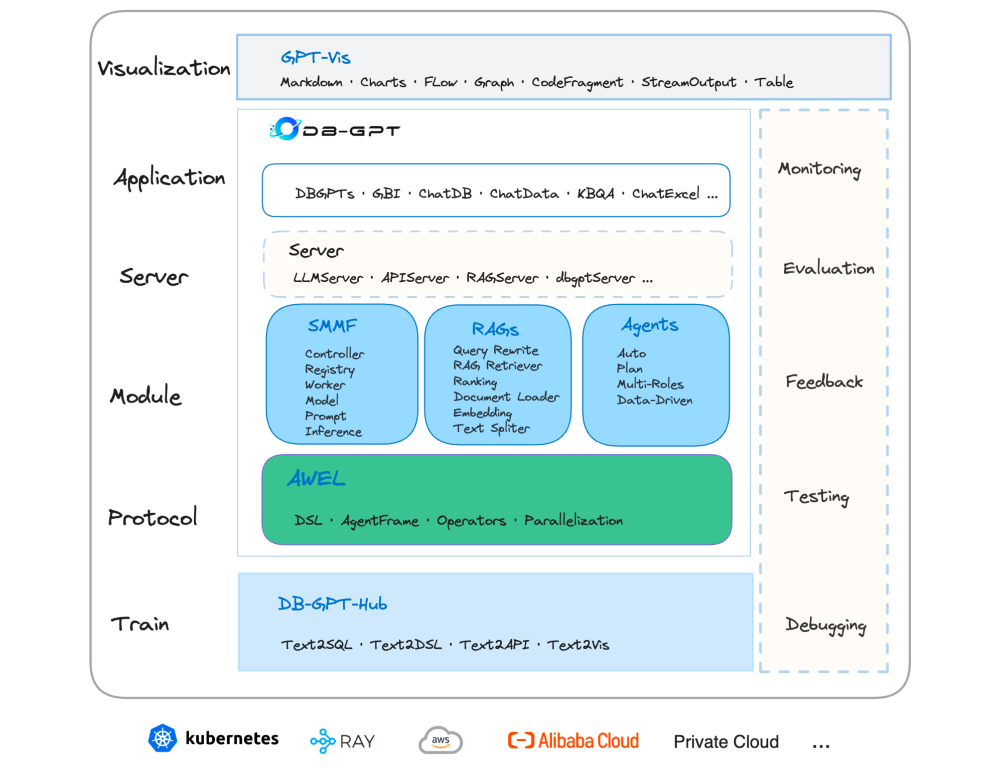
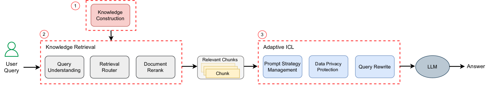
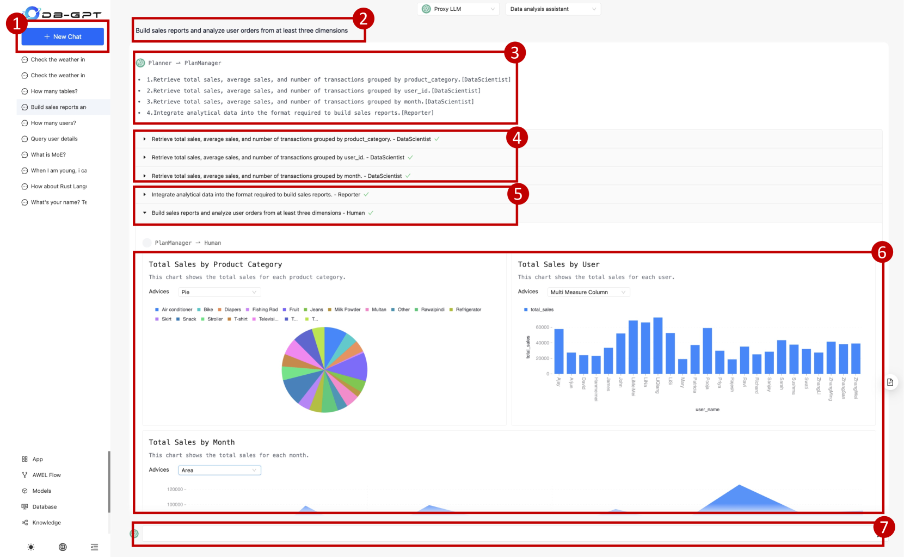

# 展示 DB-GPT：新一代数据交互系统，由大型语言模型赋能。

发布时间：2024年04月24日

`LLM应用` `软件工程` `数据交互`

> Demonstration of DB-GPT: Next Generation Data Interaction System Empowered by Large Language Models

# 摘要

> 近期大型语言模型（LLMs）的创新进展，预示着软件行业多个领域的变革。在与数据交互技术领域，LLMs扮演着尤为关键的角色，因为高效且直观的数据操作是至关重要的。本文介绍了DB-GPT，这是一款创新的、即插即用的Python库，它将LLMs融入到日常的数据交互任务之中，旨在提升用户体验和便捷性。DB-GPT能够理解用自然语言描述的数据交互需求，并提供由LLMs驱动的上下文感知回答，无论是初学者还是资深专家都能从中受益。该库的系统架构支持本地、分布式及云端环境的部署。它不仅能处理Text-to-SQL等基础数据交互任务，还能通过多智能体框架和代理工作流表达语言（AWEL）进行复杂的生成性数据分析。面向服务的多模型管理框架（SMMF）保障了数据的隐私与安全，让用户能够安心使用私有LLMs。此外，DB-GPT还提供了一系列即用型特性，方便用户轻松集成到他们的产品生态中。DB-GPT的源代码已在Github发布（https://github.com/eosphoros-ai/DB-GPT），并迅速获得了超过10.7k的星标认可。按照官方指南（https://github.com/eosphoros-ai/DB-GPT#install）安装DB-GPT，或通过YouTube的5分钟简明视频（https://youtu.be/n_8RI1ENyl4）深入了解DB-GPT的强大功能。

> The recent breakthroughs in large language models (LLMs) are positioned to transition many areas of software. The technologies of interacting with data particularly have an important entanglement with LLMs as efficient and intuitive data interactions are paramount. In this paper, we present DB-GPT, a revolutionary and product-ready Python library that integrates LLMs into traditional data interaction tasks to enhance user experience and accessibility. DB-GPT is designed to understand data interaction tasks described by natural language and provide context-aware responses powered by LLMs, making it an indispensable tool for users ranging from novice to expert. Its system design supports deployment across local, distributed, and cloud environments. Beyond handling basic data interaction tasks like Text-to-SQL with LLMs, it can handle complex tasks like generative data analysis through a Multi-Agents framework and the Agentic Workflow Expression Language (AWEL). The Service-oriented Multi-model Management Framework (SMMF) ensures data privacy and security, enabling users to employ DB-GPT with private LLMs. Additionally, DB-GPT offers a series of product-ready features designed to enable users to integrate DB-GPT within their product environments easily. The code of DB-GPT is available at Github(https://github.com/eosphoros-ai/DB-GPT) which already has over 10.7k stars. Please install DB-GPT for your own usage with the instructions(https://github.com/eosphoros-ai/DB-GPT#install) and watch a 5-minute introduction video on Youtube(https://youtu.be/n_8RI1ENyl4) to further investigate DB-GPT.

[Arxiv](https://arxiv.org/abs/2404.10209)