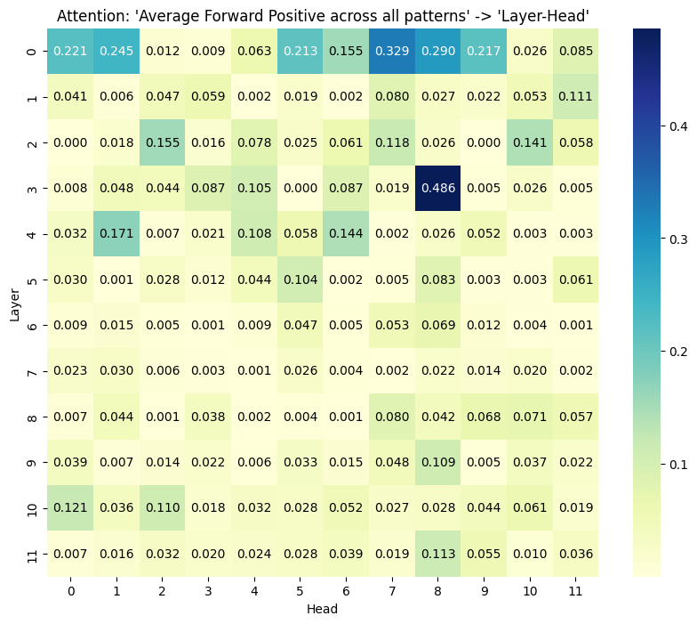
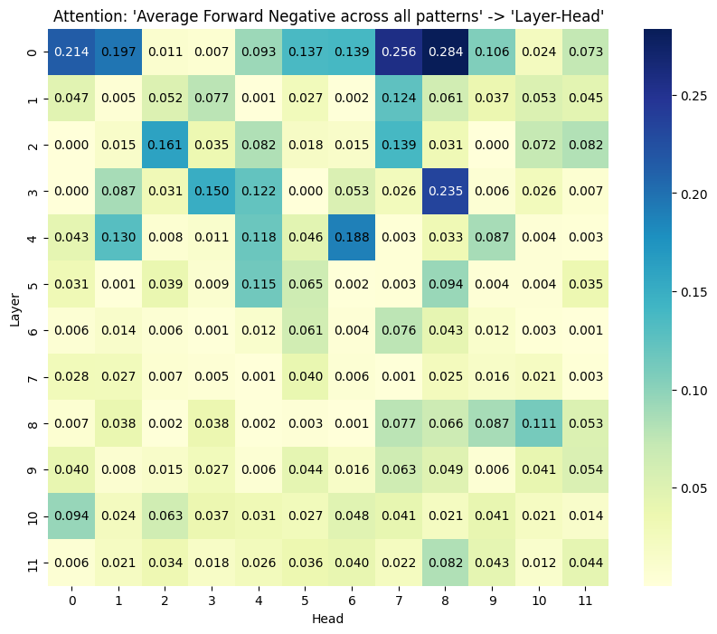
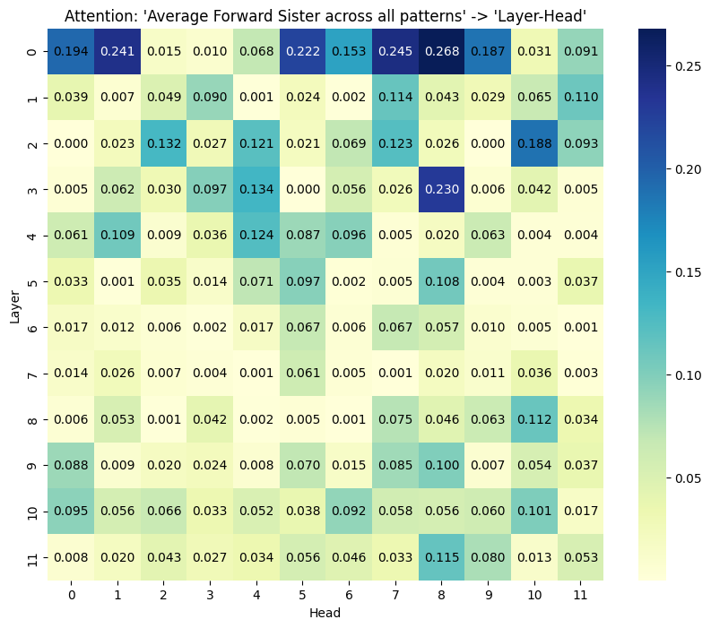

# 探索大型语言模型中的概念抽象识别

发布时间：2024年04月24日

`LLM理论` `心理学`

> Detecting Conceptual Abstraction in LLMs

# 摘要

> 本研究提出了一种创新的方法，用于在大型语言模型（LLM）内识别名词的抽象化。我们从心理学角度出发，选取了一组处于分类关系的名词对，通过表面模式来标示上义关系，并深入分析了BERT生成的注意力矩阵。通过与两组对照情境的比较，我们证实了能够在抽象机制中识别出上义关系，这不仅仅与名词对的分布相似性相关。这些发现标志着我们向理解和解释LLM中概念抽象迈出的初步。

> We present a novel approach to detecting noun abstraction within a large language model (LLM). Starting from a psychologically motivated set of noun pairs in taxonomic relationships, we instantiate surface patterns indicating hypernymy and analyze the attention matrices produced by BERT. We compare the results to two sets of counterfactuals and show that we can detect hypernymy in the abstraction mechanism, which cannot solely be related to the distributional similarity of noun pairs. Our findings are a first step towards the explainability of conceptual abstraction in LLMs.

[Arxiv](https://arxiv.org/abs/2404.15848)