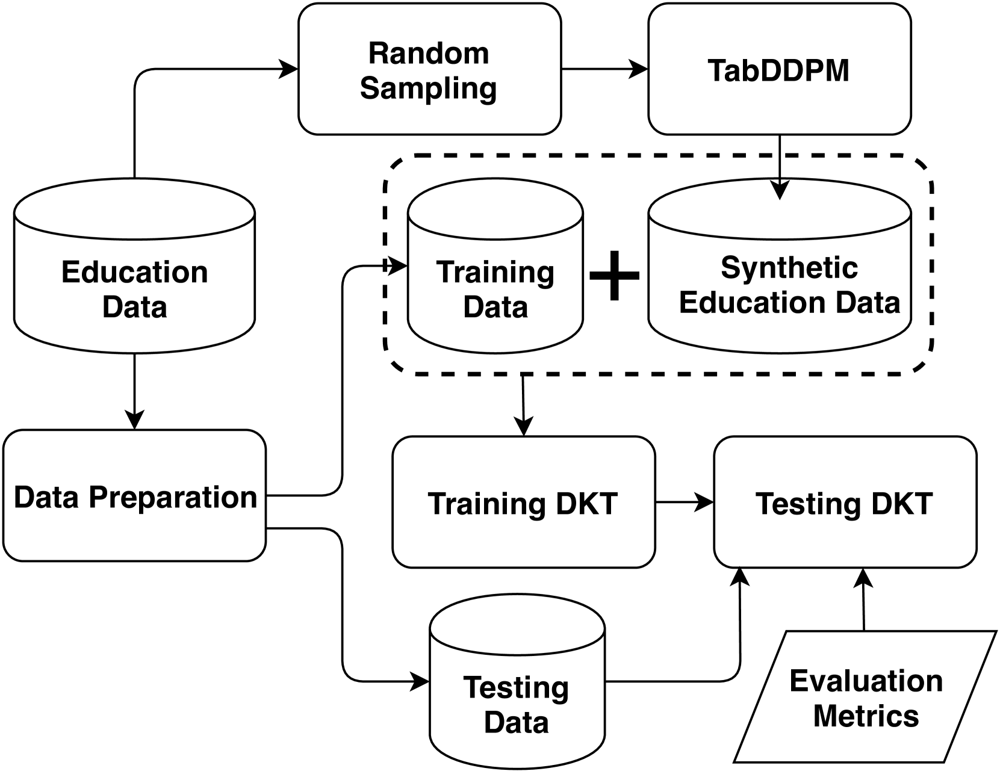
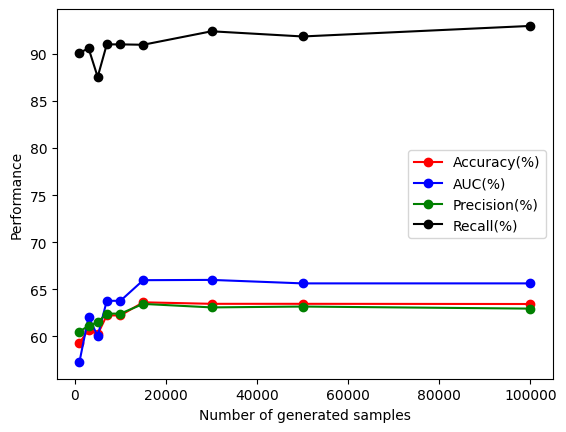

# 借助扩散模型，深度知识追踪得以强化，为个性化适应性学习开辟了新径。

发布时间：2024年04月24日

`Agent

这篇论文探讨了个性化自适应学习（PAL）中的知识追踪技术，特别是深度知识追踪（DKT），并提出了使用生成式AI模型来生成合成数据以解决数据稀缺问题。这种方法可以被视为一种智能代理（Agent），因为它通过生成数据来辅助和优化学习过程，类似于一个智能系统在执行任务时采取的行动。因此，这篇论文更符合Agent分类，而不是RAG、LLM应用或LLM理论，因为它主要关注的是如何利用AI技术来改善教育领域的学习体验，而不是直接涉及语言模型的应用或理论研究。` `教育技术` `人工智能辅助学习`

> Enhancing Deep Knowledge Tracing via Diffusion Models for Personalized Adaptive Learning

# 摘要

> 个性化自适应学习（PAL）通过密切跟踪学生个体进步，并为其量身定制学习路径，与传统的基于证据的教学方法形成鲜明对比。知识追踪作为PAL的核心技术，通过模拟学生的知识演变来预测其学习成效，进而提供定制化的学习资源和路径。深度学习领域的突破，尤其是深度知识追踪（DKT），已显著提升了这一技术。本文进一步探索了生成式AI模型在DKT中的应用，这些模型通过生成合成数据，有效缓解了数据稀缺问题，广泛应用于NLP和CV等领域。本研究聚焦于学生学习记录的数据不足问题，利用TabDDPM扩散模型生成合成教育数据，以优化DKT在PAL中的表现。实验结果显示，TabDDPM生成的AI数据在数据量有限的情况下，显著提升了DKT的性能，尤其是在训练数据稀缺而测试数据丰富的情况下。

> In contrast to pedagogies like evidence-based teaching, personalized adaptive learning (PAL) distinguishes itself by closely monitoring the progress of individual students and tailoring the learning path to their unique knowledge and requirements. A crucial technique for effective PAL implementation is knowledge tracing, which models students' evolving knowledge to predict their future performance. Based on these predictions, personalized recommendations for resources and learning paths can be made to meet individual needs. Recent advancements in deep learning have successfully enhanced knowledge tracking through Deep Knowledge Tracing (DKT). This paper introduces generative AI models to further enhance DKT. Generative AI models, rooted in deep learning, are trained to generate synthetic data, addressing data scarcity challenges in various applications across fields such as natural language processing (NLP) and computer vision (CV). This study aims to tackle data shortage issues in student learning records to enhance DKT performance for PAL. Specifically, it employs TabDDPM, a diffusion model, to generate synthetic educational records to augment training data for enhancing DKT. The proposed method's effectiveness is validated through extensive experiments on ASSISTments datasets. The experimental results demonstrate that the AI-generated data by TabDDPM significantly improves DKT performance, particularly in scenarios with small data for training and large data for testing.

[Arxiv](https://arxiv.org/abs/2405.05134)