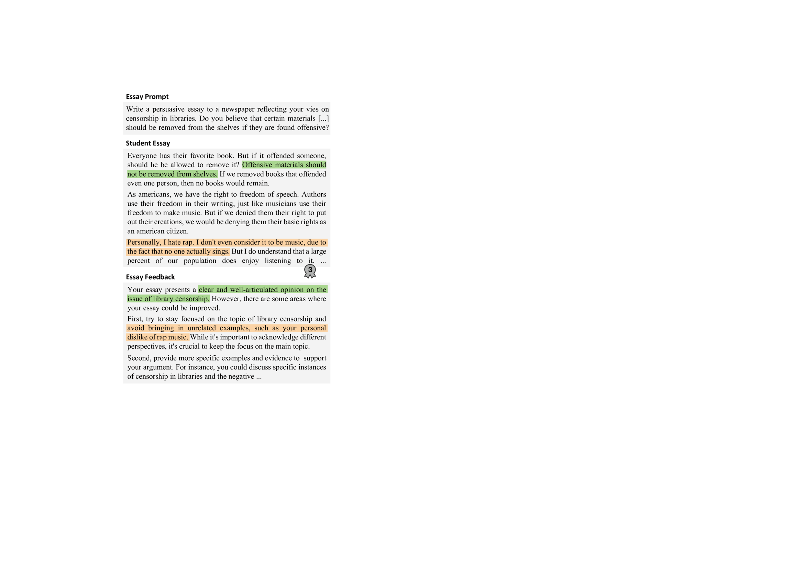
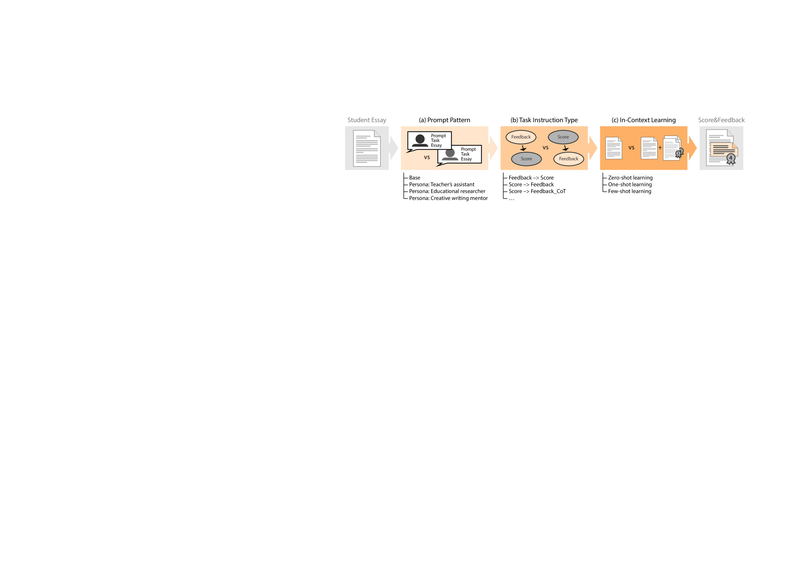

# 本研究旨在探索大型语言模型在论文评分与反馈生成任务中的提示策略，以期提高评分的准确性和反馈的有效性。

发布时间：2024年04月24日

`LLM应用`

> Exploring LLM Prompting Strategies for Joint Essay Scoring and Feedback Generation

# 摘要

> 个性化反馈对于提升学生的论文写作至关重要，但手工提供此类反馈的过程限制了其在实际教学中的广泛应用。自动生成的论文反馈系统能够根据学生的需求，提供个性化的指导。大型语言模型（LLMs）在文本生成方面表现出色，但其在提供有益的论文反馈方面的效能尚未明确。本研究尝试了多种提示策略，以实现基于LLM的零样本和少样本论文反馈生成。借鉴思维链提示的方法，我们探讨了自动化论文评分（AES）如何提升生成反馈的质量。我们对LLMs仅通过提示实现的AES表现以及生成反馈的实用性进行了评估。研究结果显示，将AES和反馈生成结合起来可以提升AES的效果。尽管如此，尽管我们手动评估了生成反馈的质量，但论文评分对生成反馈的实际影响仍然有限。

> Individual feedback can help students improve their essay writing skills. However, the manual effort required to provide such feedback limits individualization in practice. Automatically-generated essay feedback may serve as an alternative to guide students at their own pace, convenience, and desired frequency. Large language models (LLMs) have demonstrated strong performance in generating coherent and contextually relevant text. Yet, their ability to provide helpful essay feedback is unclear. This work explores several prompting strategies for LLM-based zero-shot and few-shot generation of essay feedback. Inspired by Chain-of-Thought prompting, we study how and to what extent automated essay scoring (AES) can benefit the quality of generated feedback. We evaluate both the AES performance that LLMs can achieve with prompting only and the helpfulness of the generated essay feedback. Our results suggest that tackling AES and feedback generation jointly improves AES performance. However, while our manual evaluation emphasizes the quality of the generated essay feedback, the impact of essay scoring on the generated feedback remains low ultimately.

[Arxiv](https://arxiv.org/abs/2404.15845)