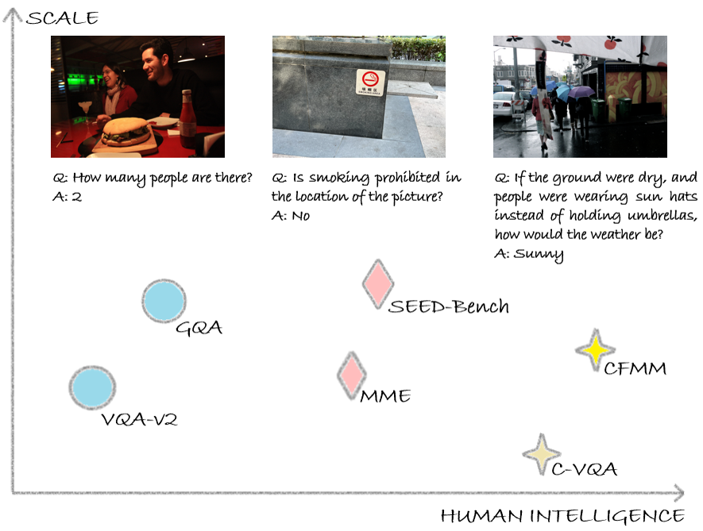
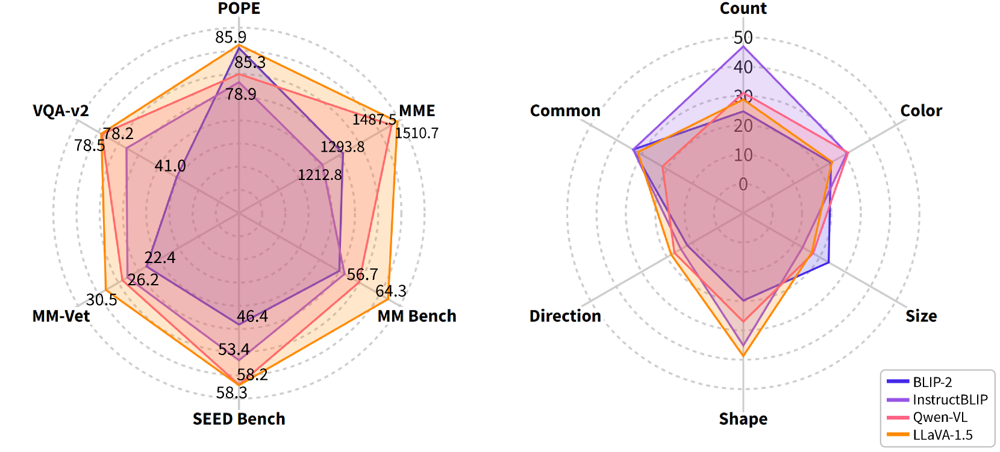
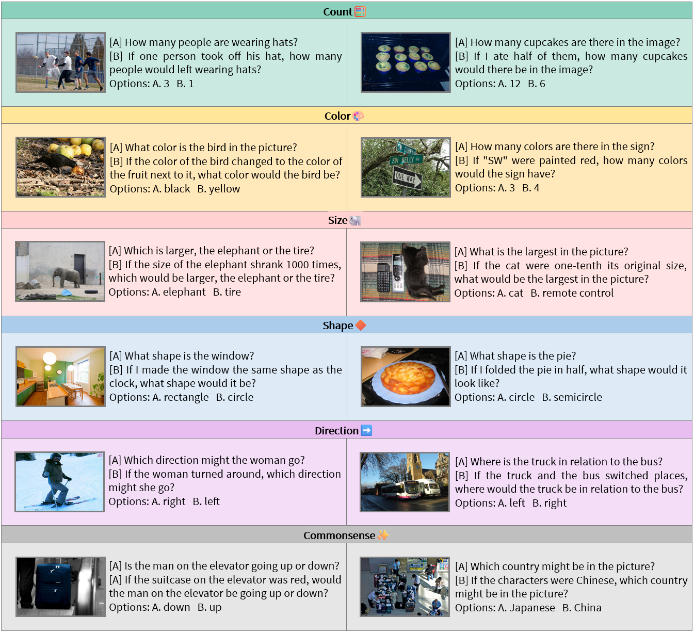
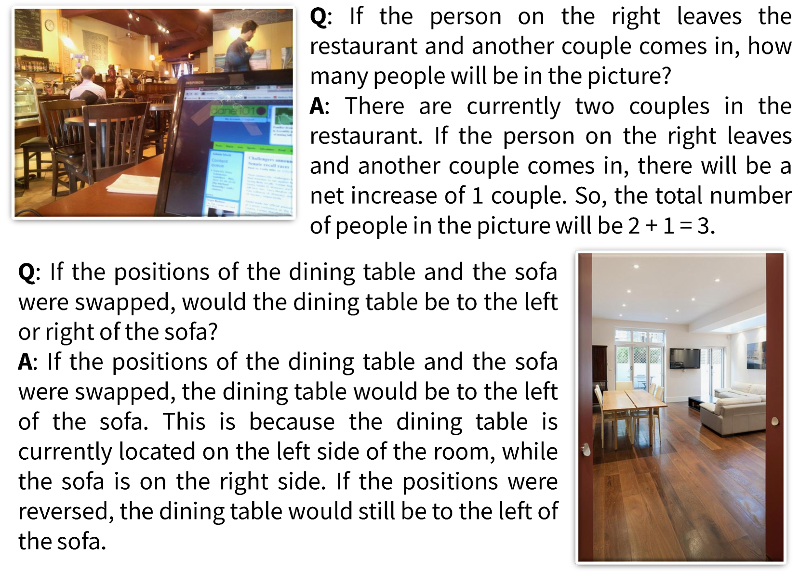

# 眼睛或有误导：评估多模态大型语言模型的反事实推理能力

发布时间：2024年04月24日

`LLM应用` `人工智能` `视觉问答`

> Eyes Can Deceive: Benchmarking Counterfactual Reasoning Abilities of Multi-modal Large Language Models

# 摘要

> 反事实推理是人类智慧的关键体现，它涉及基于确凿事实提出假设并预测可能的结果。当前的多模态大型语言模型（MLLMs）在视觉问答（VQA）的多项基准测试中已经显示出卓越的认知和推理技能。但是，当遇到反事实问题时，这些模型的表现如何呢？为了探究这一问题，我们首次创建了一个名为\textbf{CFMM}的新颖反事实多模态推理基准测试，全面评估MLLMs的反事实推理技能。CFMM包含六项挑战性任务，每个任务都包含数百个精心设计的人工标注反事实问题，旨在多角度考验MLLMs的推理能力。实验结果显示，现有MLLMs倾向于信赖直观所见，而忽视问题中提出的反事实前提，这导致了反应的不准确。此外，我们在CFMM上对多种主流MLLMs进行了评估。它们在CFMM上的表现与在VQA基准测试上的表现存在显著差异，这表明现有MLLMs在达到人类智能水平方面还有很大的提升空间。同时，通过在未来提高MLLMs在CFMM上的表现，我们可以探索发展更高级智能MLLMs的潜在路径。

> Counterfactual reasoning, as a crucial manifestation of human intelligence, refers to making presuppositions based on established facts and extrapolating potential outcomes. Existing multimodal large language models (MLLMs) have exhibited impressive cognitive and reasoning capabilities, which have been examined across a wide range of Visual Question Answering (VQA) benchmarks. Nevertheless, how will existing MLLMs perform when faced with counterfactual questions? To answer this question, we first curate a novel \textbf{C}ounter\textbf{F}actual \textbf{M}ulti\textbf{M}odal reasoning benchmark, abbreviated as \textbf{CFMM}, to systematically assess the counterfactual reasoning capabilities of MLLMs. Our CFMM comprises six challenging tasks, each including hundreds of carefully human-labeled counterfactual questions, to evaluate MLLM's counterfactual reasoning capabilities across diverse aspects. Through experiments, interestingly, we find that existing MLLMs prefer to believe what they see, but ignore the counterfactual presuppositions presented in the question, thereby leading to inaccurate responses. Furthermore, we evaluate a wide range of prevalent MLLMs on our proposed CFMM. The significant gap between their performance on our CFMM and that on several VQA benchmarks indicates that there is still considerable room for improvement in existing MLLMs toward approaching human-level intelligence. On the other hand, through boosting MLLMs performances on our CFMM in the future, potential avenues toward developing MLLMs with advanced intelligence can be explored.

[Arxiv](https://arxiv.org/abs/2404.12966)