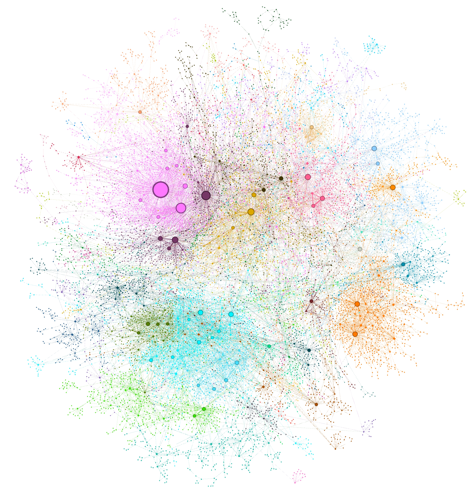
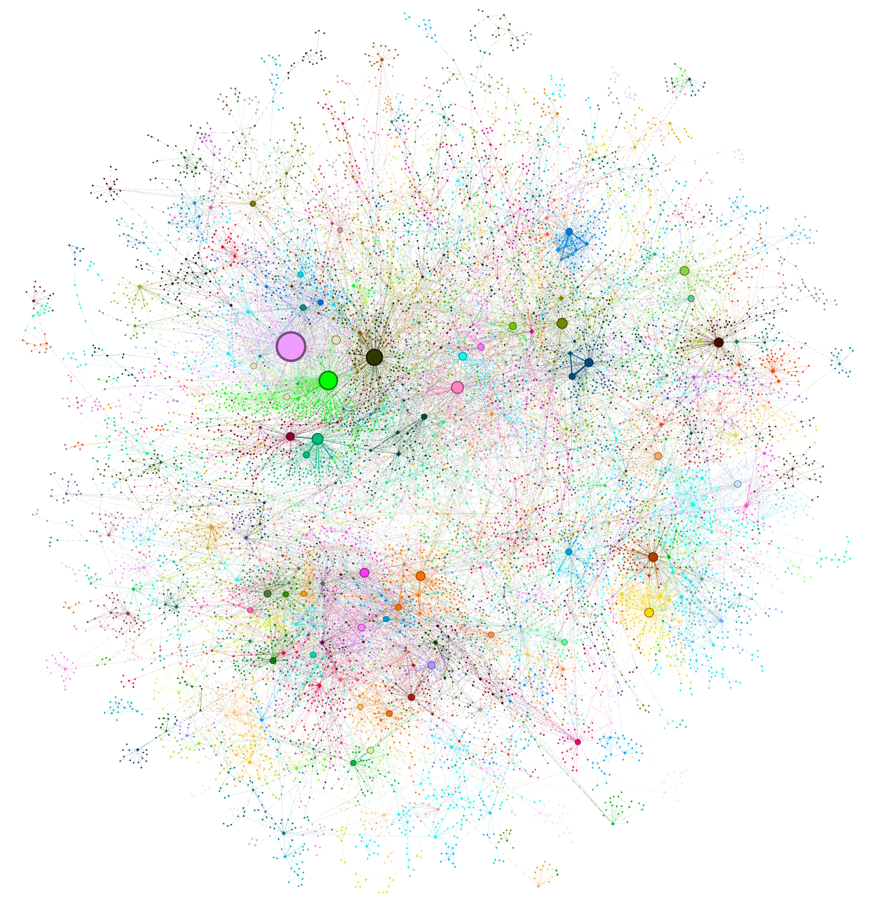

# 从局部到全局：探索一种基于图 RAG 的查询聚焦摘要方法

发布时间：2024年04月24日

`RAG` `信息技术` `数据分析`

> From Local to Global: A Graph RAG Approach to Query-Focused Summarization

# 摘要

> 摘要：通过检索增强生成（RAG），大型语言模型（LLM）能够从外部知识源检索信息，从而回答涉及私有或未见文档的问题。然而，RAG在处理全局问题（如“数据集的主要主题是什么？”）时表现不佳，因为这类问题本质上是查询聚焦的摘要任务，而非直接检索。现有的QFS方法也难以处理大规模文本。为此，我们提出图RAG方法，该方法结合了两种方法的优势，能够随着问题普遍性和文本量的增加而扩展。图RAG通过LLM构建图索引，先从文档中提取实体图，再预生成相关实体的摘要。在回答问题时，每个摘要生成部分答案，最终汇总为完整回答。实验表明，图RAG在处理大规模数据集的全局问题时，能显著提升答案的全面性和多样性。全球和本地图RAG的开源Python实现即将发布。

> 
Abstract:The use of retrieval-augmented generation (RAG) to retrieve relevant information from an external knowledge source enables large language models (LLMs) to answer questions over private and/or previously unseen document collections. However, RAG fails on global questions directed at an entire text corpus, such as "What are the main themes in the dataset?", since this is inherently a query-focused summarization (QFS) task, rather than an explicit retrieval task. Prior QFS methods, meanwhile, fail to scale to the quantities of text indexed by typical RAG systems. To combine the strengths of these contrasting methods, we propose a Graph RAG approach to question answering over private text corpora that scales with both the generality of user questions and the quantity of source text to be indexed. Our approach uses an LLM to build a graph-based text index in two stages: first to derive an entity knowledge graph from the source documents, then to pregenerate community summaries for all groups of closely-related entities. Given a question, each community summary is used to generate a partial response, before all partial responses are again summarized in a final response to the user. For a class of global sensemaking questions over datasets in the 1 million token range, we show that Graph RAG leads to substantial improvements over a naïve RAG baseline for both the comprehensiveness and diversity of generated answers. An open-source, Python-based implementation of both global and local Graph RAG approaches is forthcoming at this https URL.
    

[Arxiv](https://arxiv.org//pdf/2404.16130)