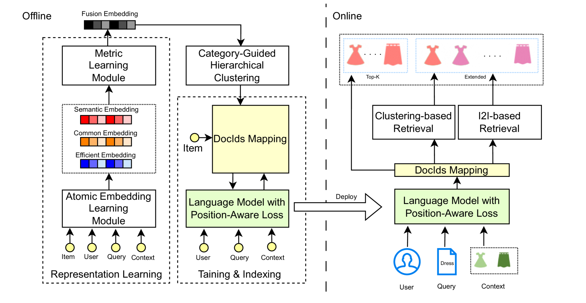
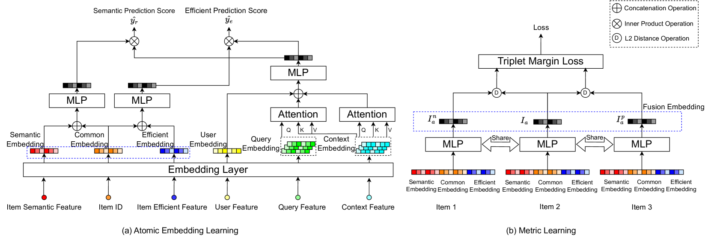
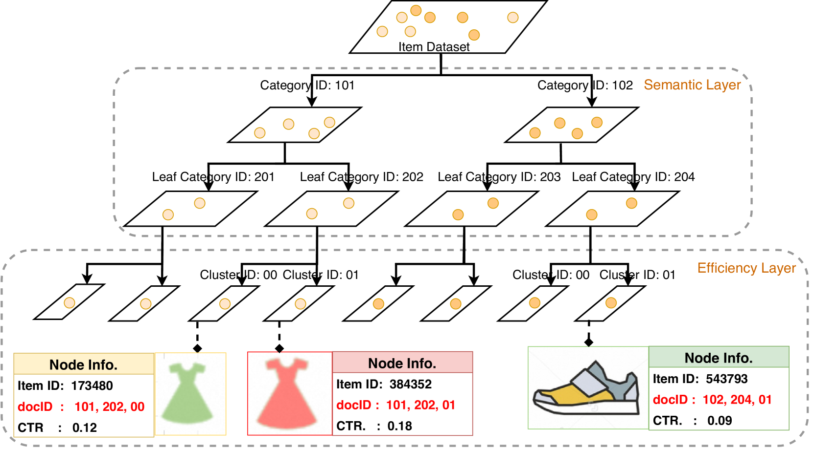
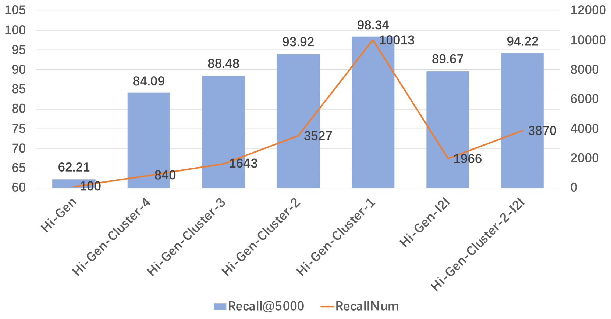

# Hi-Gen：个性化电商搜索的创新生成式检索解决方案

发布时间：2024年04月24日

`LLM应用` `电商搜索` `信息检索`

> Hi-Gen: Generative Retrieval For Large-Scale Personalized E-commerce Search

# 摘要

> 近年来，采用生成式检索（GR）技术提升搜索系统性能的方法展现出了显著成效。在这一技术中，文本到文本模型将查询字符串直接映射为文档标识符（docIDs），极大简化了检索流程。但在大规模个性化电商搜索中应用GR模型时，我们面临编码和解码两大挑战：一是现有生成docID的方法未充分考虑电商中至关重要的效率信息编码；二是位置信息在解码docIDs时极为关键，而以往研究尚未充分认识其重要性或有效利用位置间的内在联系。为解决这些问题，我们提出了一种高效的分层编码-解码生成式检索方法（Hi-Gen），专为大规模个性化电商搜索系统设计。我们首先构建了一个结合度量学习的表现学习模型，以学习项目的特征表示，同时捕捉语义相关性和效率信息。接着，引入了一种类别导向的分层聚类策略，充分利用项目语义和效率信息，优化docID生成过程。此外，设计了一种位置感知的损失函数，以识别位置的重要性并挖掘同一位置标记间的内在联系，从而提升解码阶段语言模型的性能。我们还推出了Hi-Gen的两个变种（Hi-Gen-I2I和Hi-Gen-Cluster），以支持在线服务中的实时大规模检索。在公共和行业数据集上的广泛测试验证了Hi-Gen的有效性和高效率。

> Leveraging generative retrieval (GR) techniques to enhance search systems is an emerging methodology that has shown promising results in recent years. In GR, a text-to-text model maps string queries directly to relevant document identifiers (docIDs), so it dramatically simplifies the whole retrieval process. However, when applying most GR models in large-scale E-commerce for personalized item search, we have to face two key problems in encoding and decoding. (1) Existing docID generation methods ignore the encoding of efficiency information, which is critical in E-commerce. (2) The positional information is important in decoding docIDs, while prior studies have not adequately discriminated the significance of positional information or well exploited the inherent interrelation among these positions. To overcome these problems, we introduce an efficient Hierarchical encoding-decoding Generative retrieval method (Hi-Gen) for large-scale personalized E-commerce search systems. Specifically, we first design a representation learning model along with metric learning to learn discriminative feature representations of items to capture both semantic relevance and efficiency information. Then, we propose a category-guided hierarchical clustering scheme that makes full use of the semantic and efficiency information of items to facilitate docID generation. Finally, we design a position-aware loss to discriminate the importance of positions and mine the inherent interrelation between different tokens at the same position. This loss boosts the performance of the language model used in the decoding stage. Besides, we propose two variants of Hi-Gen (i.e.,Hi-Gen-I2I and Hi-Gen-Cluster) to support online real-time large-scale recall in the online serving process. Extensive experiments on both public and industry datasets demonstrate the effectiveness and efficiency of Hi-Gen.

[Arxiv](https://arxiv.org/abs/2404.15675)