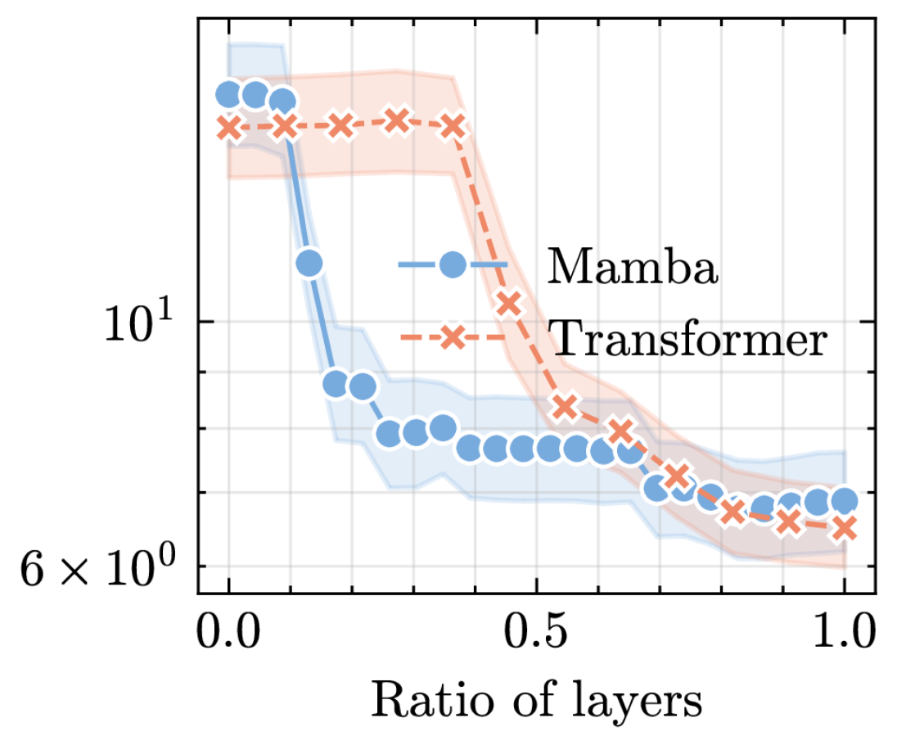

# 曼巴是否具备情境学习的能力？

发布时间：2024年04月24日

`分类：LLM理论` `机器学习`

> Is Mamba Capable of In-Context Learning?

# 摘要

> 当前领先的基础模型例如 GPT-4 在上下文学习（ICL）方面展现出惊人的能力，ICL 是一种元学习形式，它涉及在神经网络的前向传播过程中学习解决问题，同时利用输入给模型的上下文信息。这种能力是基础模型在大规模预训练过程中的一个额外收获。尽管目前变换器模型在 ICL 领域占据领先地位，但我们的研究提供了实证证据，表明新提出的 Mamba 模型在处理输入序列长度方面比变换器模型更具扩展性，并且在 ICL 能力上与变换器相当。我们在简单函数逼近和更复杂的自然语言处理问题上对 Mamba 进行了评估，结果显示 Mamba 在这两类任务的 ICL 性能上与变换器模型不相上下。深入分析发现，Mamba 与变换器模型一样，似乎通过逐步优化其内部表示来解决 ICL 问题。总的来说，我们的研究指出 Mamba 可能是变换器模型在处理长输入序列的 ICL 任务上的一个高效替代选择。这一发现在元学习领域令人振奋，并可能推动像 TabPFN 或 Optformer 这样的上下文学习 AutoML 算法扩展到更长的输入序列。

> State of the art foundation models such as GPT-4 perform surprisingly well at in-context learning (ICL), a variant of meta-learning concerning the learned ability to solve tasks during a neural network forward pass, exploiting contextual information provided as input to the model. This useful ability emerges as a side product of the foundation model's massive pretraining. While transformer models are currently the state of the art in ICL, this work provides empirical evidence that Mamba, a newly proposed state space model which scales better than transformers w.r.t. the input sequence length, has similar ICL capabilities. We evaluated Mamba on tasks involving simple function approximation as well as more complex natural language processing problems. Our results demonstrate that, across both categories of tasks, Mamba closely matches the performance of transformer models for ICL. Further analysis reveals that, like transformers, Mamba appears to solve ICL problems by incrementally optimizing its internal representations. Overall, our work suggests that Mamba can be an efficient alternative to transformers for ICL tasks involving long input sequences. This is an exciting finding in meta-learning and may enable generalizations of in-context learned AutoML algorithms (like TabPFN or Optformer) to long input sequences.

[Arxiv](https://arxiv.org/abs/2402.03170)