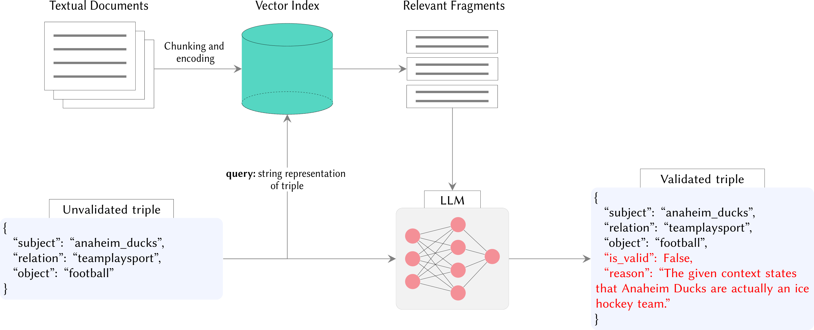
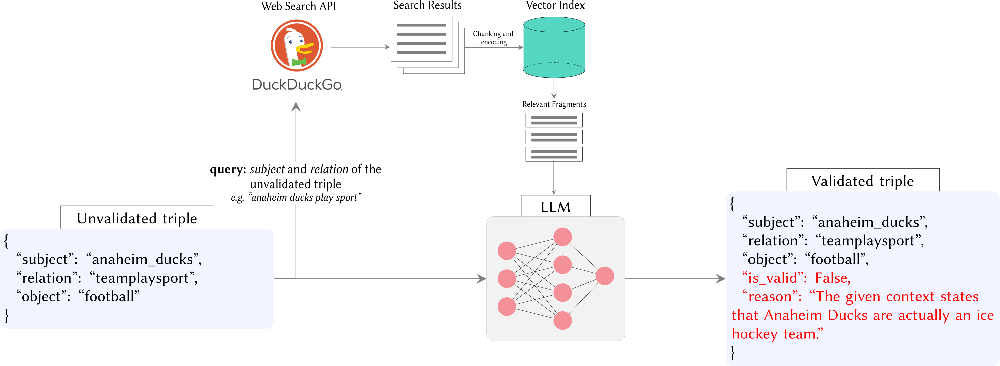
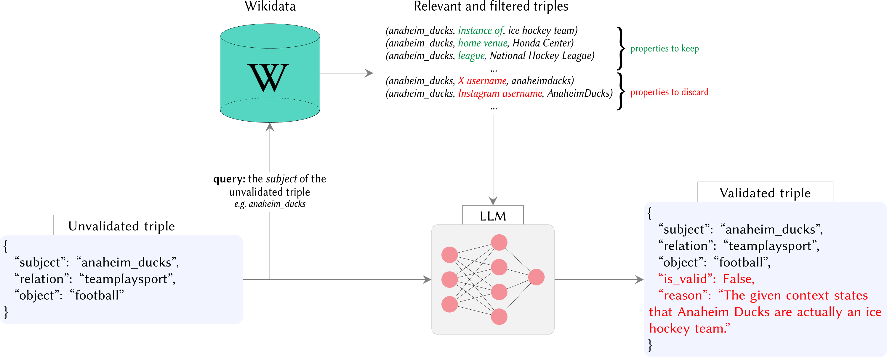

# KGValidator：自动化知识图谱构建验证的框架。

发布时间：2024年04月24日

`分类：LLM应用` `知识图谱` `人工智能`

> KGValidator: A Framework for Automatic Validation of Knowledge Graph Construction

# 摘要

> 本研究着眼于利用大型语言模型（LLMs）自动评估知识图谱（KG）补全模型的应用。传统上，KG中的信息验证是一项成本高昂且充满挑战的任务，通常需要大量的人工注释。随着通用生成性AI和LLMs的发展，现在有理由相信可以由生成性代理取代传统的人工验证环节。我们提出了一个框架，旨在使用生成模型进行KG验证时确保一致性和有效性。该框架依托于最新的开源进展，不仅涵盖了LLM输出的结构和语义验证，还包括了灵活的事实核查与验证方法，这些方法能够利用各种类型的外部知识源。设计上易于调整和扩展，能够通过结合模型内生知识、用户定义的上下文以及能够执行外部知识检索的代理，来验证各种图结构化数据。

> This study explores the use of Large Language Models (LLMs) for automatic evaluation of knowledge graph (KG) completion models. Historically, validating information in KGs has been a challenging task, requiring large-scale human annotation at prohibitive cost. With the emergence of general-purpose generative AI and LLMs, it is now plausible that human-in-the-loop validation could be replaced by a generative agent. We introduce a framework for consistency and validation when using generative models to validate knowledge graphs. Our framework is based upon recent open-source developments for structural and semantic validation of LLM outputs, and upon flexible approaches to fact checking and verification, supported by the capacity to reference external knowledge sources of any kind. The design is easy to adapt and extend, and can be used to verify any kind of graph-structured data through a combination of model-intrinsic knowledge, user-supplied context, and agents capable of external knowledge retrieval.

[Arxiv](https://arxiv.org/abs/2404.15923)