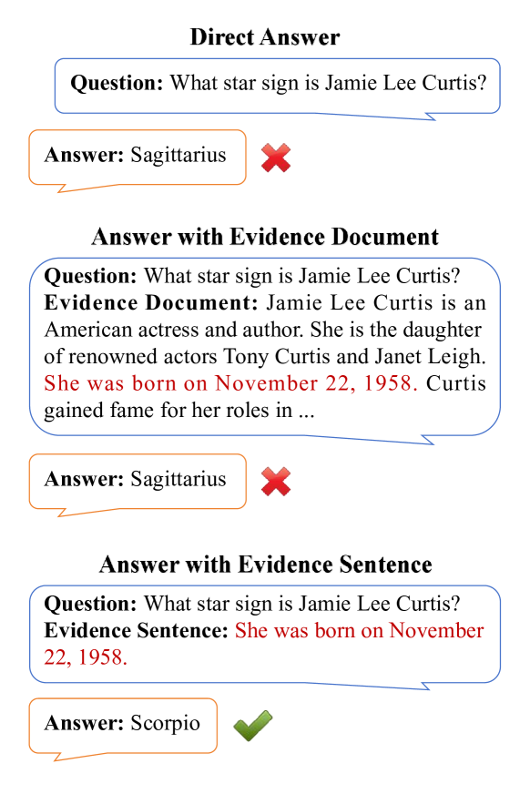
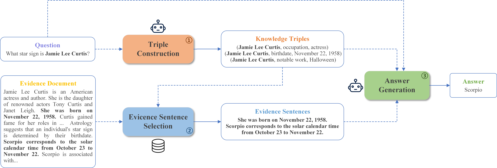
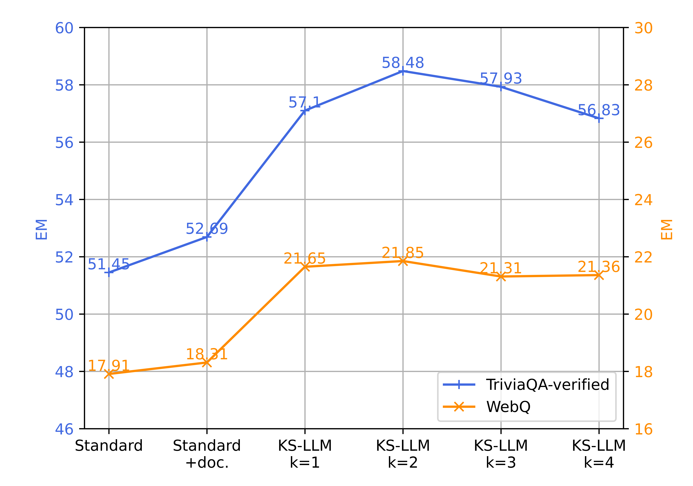

# KS-LLM：一种为问答任务设计的，能够从证据文档中选择知识的大规模语言模型。

发布时间：2024年04月24日

`分类：LLM应用

这篇论文主要研究了如何改进大型语言模型（LLMs）在处理知识密集型任务时的性能，通过引入证据文档作为补充知识来源，并提出了一种知识选择大型语言模型（KS-LLM）的方法。这个方法通过筛选和提炼证据文档中的有用信息，以提高模型在问答任务中的性能。因此，这篇论文属于LLM应用的范畴，因为它探讨了如何将大型语言模型应用于实际问题，并提出了一种具体的改进方法。` `问答系统` `知识提取`

> KS-LLM: Knowledge Selection of Large Language Models with Evidence Document for Question Answering

# 摘要

> 大型语言模型（LLMs）在处理知识密集型任务时，常遭遇幻觉问题，面临不小的挑战。一种充满希望的解决方案是借助证据文档作为补充知识来源，这些文档可以通过检索或生成获得。但现有技术直接应用证据文档的全部内容，可能会混入噪声信息，影响模型性能。为此，我们提出了一种创新的方法——知识选择大型语言模型（KS-LLM），目的在于从证据文档中提炼出有价值的信息。该方法通过三元组形式，精准挑选出对解答问题有益的知识片段。具体操作流程是：首先根据提问生成三元组，然后在证据文档中筛选出与这些三元组最为匹配的句子，最终将这些句子与三元组合并，辅助大型语言模型产出答案。在TriviaQA、WebQ和NQ等多个问答数据集上的实验对比显示，我们的方法不仅超越了现有基线，还取得了最优的成绩。

> Large language models (LLMs) suffer from the hallucination problem and face significant challenges when applied to knowledge-intensive tasks. A promising approach is to leverage evidence documents as extra supporting knowledge, which can be obtained through retrieval or generation. However, existing methods directly leverage the entire contents of the evidence document, which may introduce noise information and impair the performance of large language models. To tackle this problem, we propose a novel Knowledge Selection of Large Language Models (KS-LLM) method, aiming to identify valuable information from evidence documents. The KS-LLM approach utilizes triples to effectively select knowledge snippets from evidence documents that are beneficial to answering questions. Specifically, we first generate triples based on the input question, then select the evidence sentences most similar to triples from the evidence document, and finally combine the evidence sentences and triples to assist large language models in generating answers. Experimental comparisons on several question answering datasets, such as TriviaQA, WebQ, and NQ, demonstrate that the proposed method surpasses the baselines and achieves the best results.

[Arxiv](https://arxiv.org/abs/2404.15660)