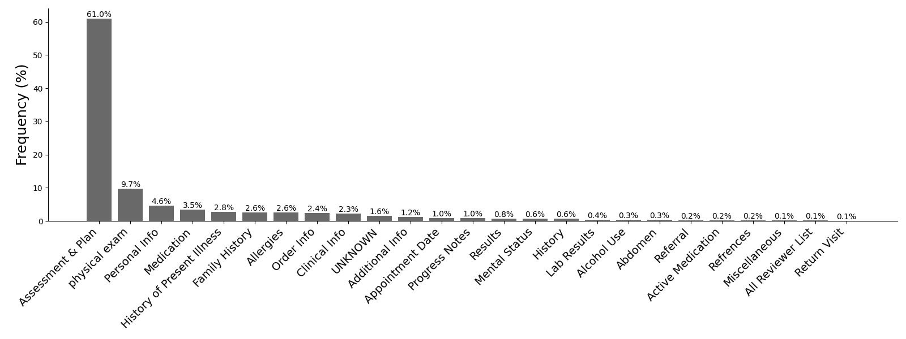

# 基于大型语言模型的章节识别器在开源项目中表现优异，然而在现实世界的应用场景中却步履蹒跚。

发布时间：2024年04月24日

`LLM应用` `机器学习`

> LLM-Based Section Identifiers Excel on Open Source but Stumble in Real World Applications

# 摘要

> 电子健康记录（EHR）为医疗专业人员带来了便利，但其内容日益庞杂和冗长，使得在这些繁复的记录中寻找信息变得既费力又繁琐。尽管提出了多种解决方案，如摘要化或分节，但真正有效的办法并不多。随着自动化技术的兴起，机器学习（ML）在识别 EHR 中的关键部分方面展现出潜力。不过，大多数 ML 方法需要依赖难以获得的标记数据。与此同时，大型语言模型（LLMs）在无需任何标记数据的情况下，在自然语言处理（NLP）领域取得了显著成就。基于此，我们提出利用 LLMs 来识别 EHR 中的相关章节标题。实验结果表明，GPT-4 不仅在零样本和少样本情境下能够有效完成任务，而且在数据分段上也显著优于现有技术。此外，我们还对一个更具挑战性的现实世界数据集进行了标注，发现 GPT-4 在此任务上的表现仍有提升空间，这为未来的研究和更严格的评估标准提供了方向。

> Electronic health records (EHR) even though a boon for healthcare practitioners, are growing convoluted and longer every day. Sifting around these lengthy EHRs is taxing and becomes a cumbersome part of physician-patient interaction. Several approaches have been proposed to help alleviate this prevalent issue either via summarization or sectioning, however, only a few approaches have truly been helpful in the past. With the rise of automated methods, machine learning (ML) has shown promise in solving the task of identifying relevant sections in EHR. However, most ML methods rely on labeled data which is difficult to get in healthcare. Large language models (LLMs) on the other hand, have performed impressive feats in natural language processing (NLP), that too in a zero-shot manner, i.e. without any labeled data. To that end, we propose using LLMs to identify relevant section headers. We find that GPT-4 can effectively solve the task on both zero and few-shot settings as well as segment dramatically better than state-of-the-art methods. Additionally, we also annotate a much harder real world dataset and find that GPT-4 struggles to perform well, alluding to further research and harder benchmarks.

[Arxiv](https://arxiv.org/abs/2404.16294)