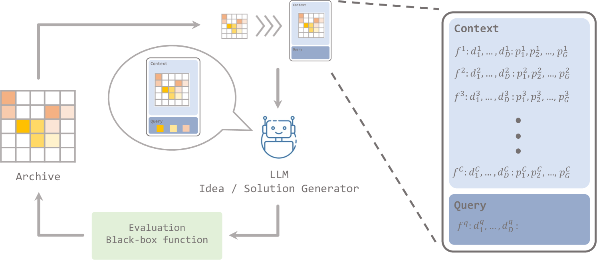
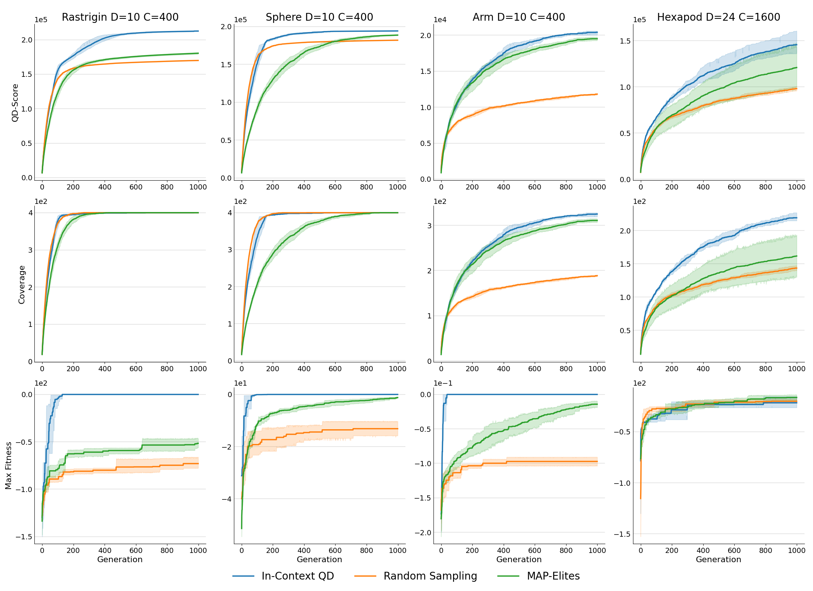
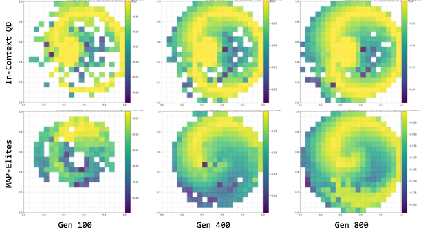
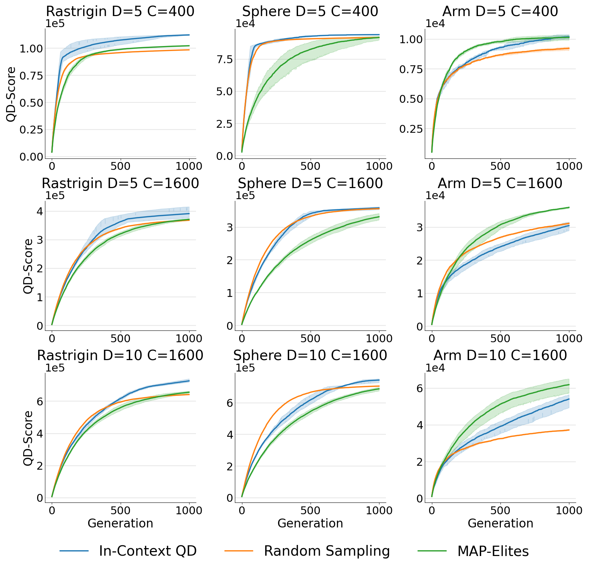
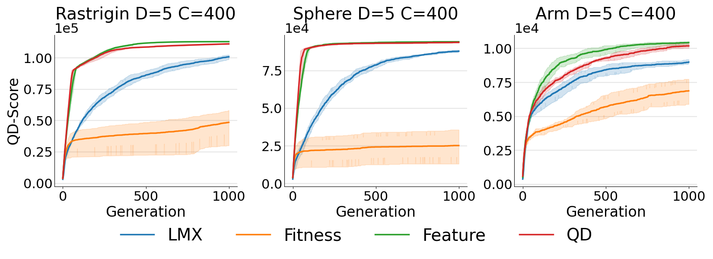
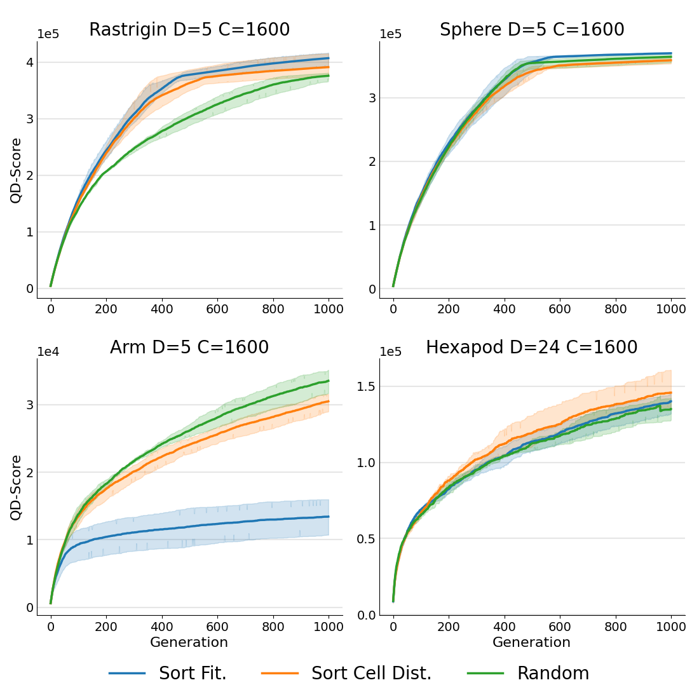
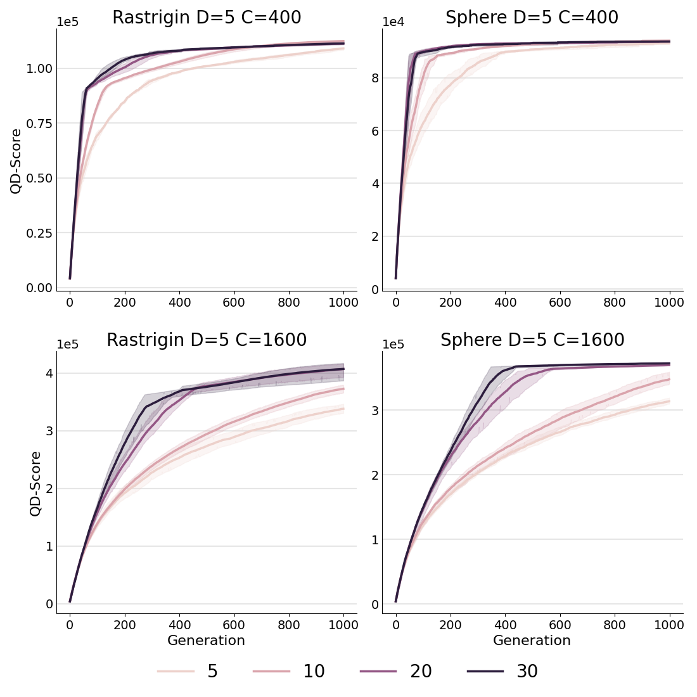

# 大型语言模型，作为质量多样性的上下文AI生成器。

发布时间：2024年04月24日

`LLM应用` `进化计算` `模式识别`

> Large Language Models as In-context AI Generators for Quality-Diversity

# 摘要

> 质量多样性（QD）方法在开放式进化等过程中展现出巨大潜力，它们能够跨越多样化的领域发掘出高质量的解决方案。尽管在多种应用中已取得显著成效，QD方法多依赖于将一两个解决方案结合以孕育新的候选解。本研究提出利用生成模型的模式识别功能，以更高效地结合多样化的解决方案，从而催生更具创新性的结果，并可能极大提升QD搜索的效率。我们引入了In-context QD框架，这是一系列技术，旨在激发预训练的大型语言模型（LLMs）的上下文潜能，以QD档案为背景，创造出引人入胜的解决方案。在多个常见QD领域的应用中，In-context QD与QD基线和单目标优化策略相比，展现出了卓越的成效。这些成果不仅在不同参数规模和档案种群规模下保持稳定，而且在从BBO函数到策略搜索等不同特性的领域中均有体现。最终，我们进行了深入的消融分析，揭示了促进QD解决方案生成的关键提示设计要素。

> Quality-Diversity (QD) approaches are a promising direction to develop open-ended processes as they can discover archives of high-quality solutions across diverse niches. While already successful in many applications, QD approaches usually rely on combining only one or two solutions to generate new candidate solutions. As observed in open-ended processes such as technological evolution, wisely combining large diversity of these solutions could lead to more innovative solutions and potentially boost the productivity of QD search. In this work, we propose to exploit the pattern-matching capabilities of generative models to enable such efficient solution combinations. We introduce In-context QD, a framework of techniques that aim to elicit the in-context capabilities of pre-trained Large Language Models (LLMs) to generate interesting solutions using the QD archive as context. Applied to a series of common QD domains, In-context QD displays promising results compared to both QD baselines and similar strategies developed for single-objective optimization. Additionally, this result holds across multiple values of parameter sizes and archive population sizes, as well as across domains with distinct characteristics from BBO functions to policy search. Finally, we perform an extensive ablation that highlights the key prompt design considerations that encourage the generation of promising solutions for QD.

[Arxiv](https://arxiv.org/abs/2404.15794)