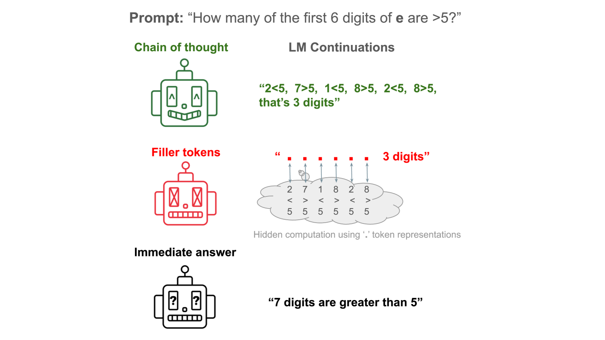
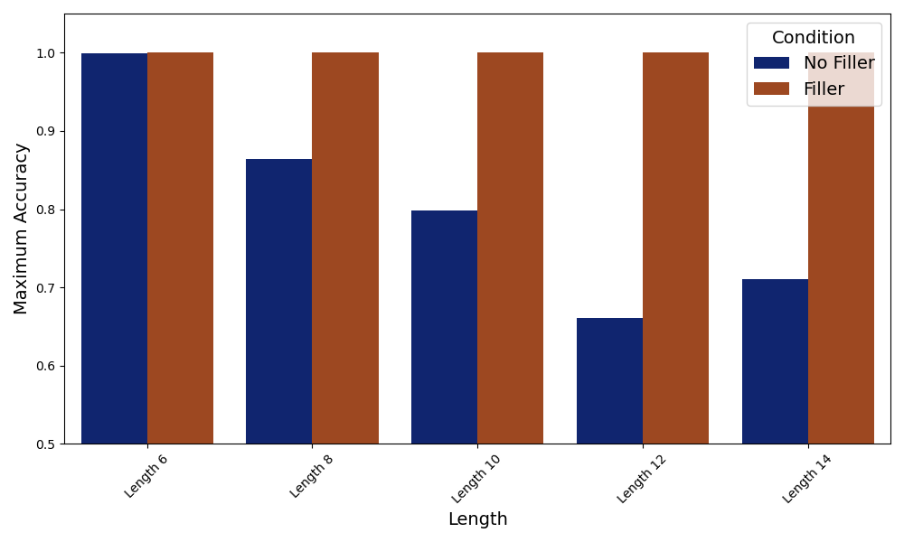
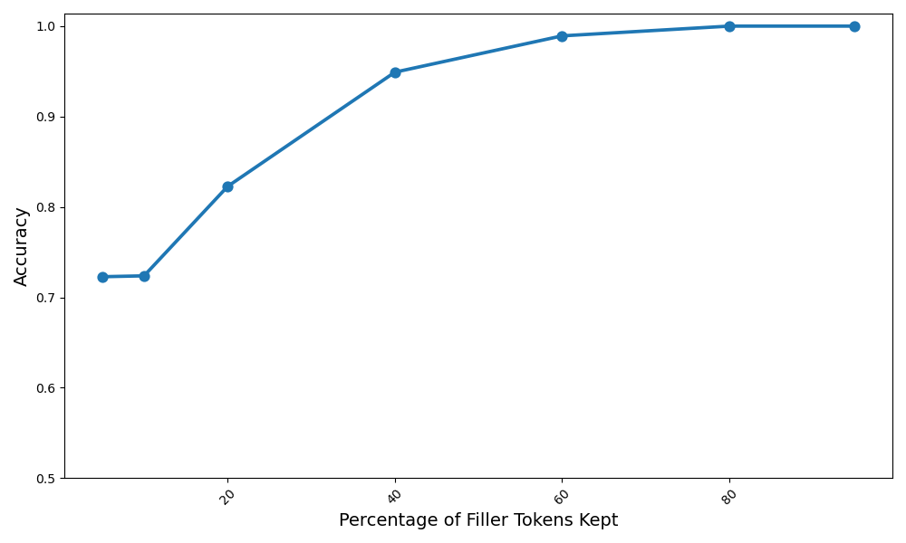
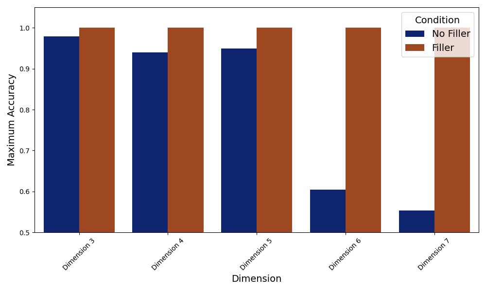
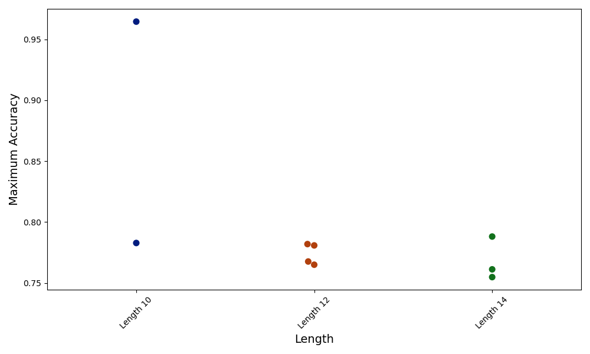
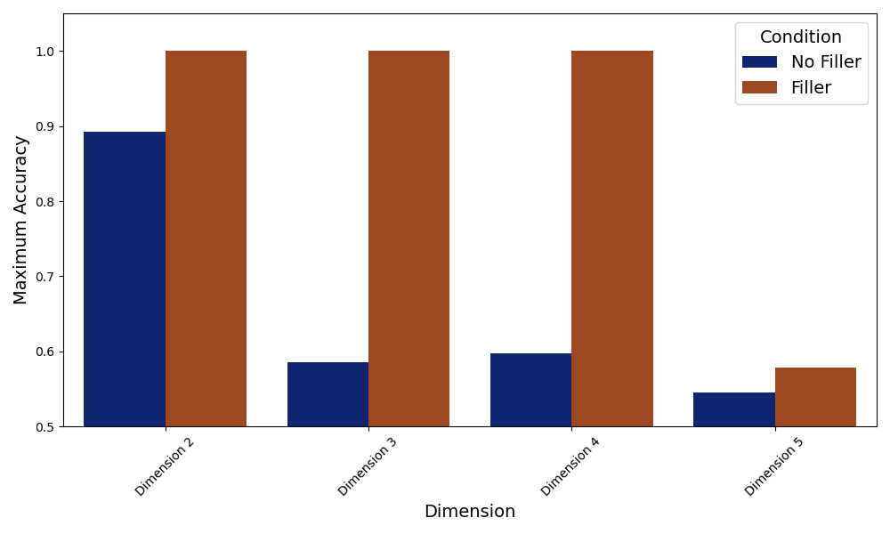
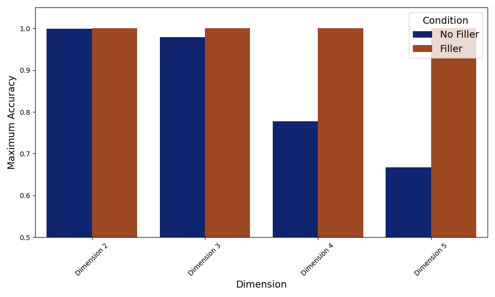
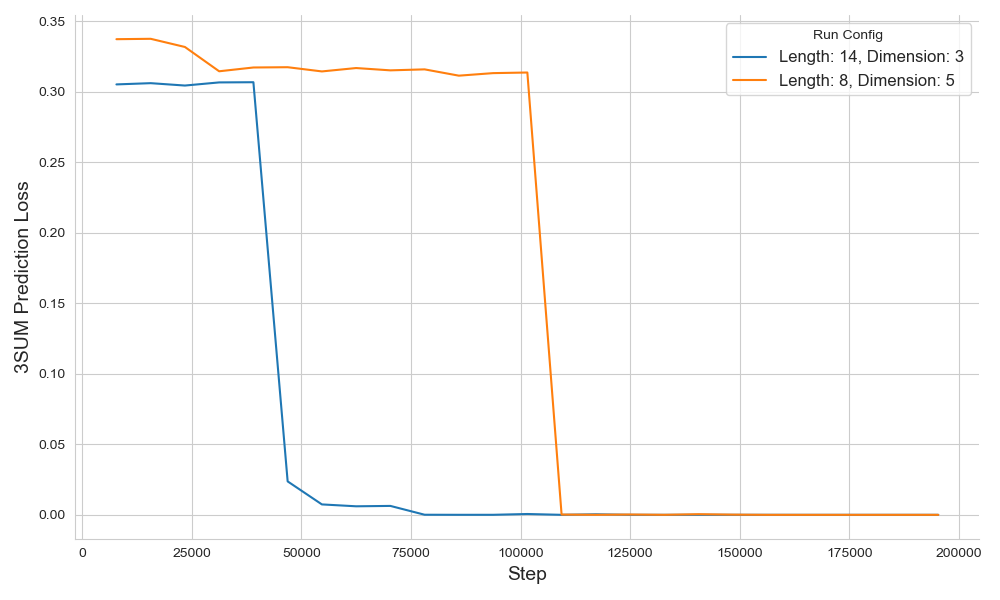

# 让我们一点一滴地思考：探索 Transformer 语言模型中的隐式计算。

发布时间：2024年04月24日

`LLM理论` `计算理论`

> Let's Think Dot by Dot: Hidden Computation in Transformer Language Models

# 摘要

> 语言模型通过“思维链”回答提升了多数测试的性能。但这种提升是否源于类似人类的任务分解，还是仅仅因为额外标记带来的更大计算量，目前尚不明确。我们发现，变换器可以利用无意义的填充标记（如 '......'）代替思考过程，解决原本无法完成的复杂算法任务。然而，学习如何使用这些填充标记颇具挑战，需要密集且具体的监督才能实现。我们还理论上界定了填充标记有效的问题类别，即一阶公式的量词深度。对于这类问题，思维链标记并不需要揭示多标记计算中的中间步骤。总体而言，我们的研究显示，额外的标记能带来计算上的优势，这与标记的具体选择无关。同时，中间标记能够作为填充标记，这引发了对大型语言模型可能进行的不可审计、隐秘计算的担忧，这些计算可能与我们所见的思维链标记越来越不相关。

> Chain-of-thought responses from language models improve performance across most benchmarks. However, it remains unclear to what extent these performance gains can be attributed to human-like task decomposition or simply the greater computation that additional tokens allow. We show that transformers can use meaningless filler tokens (e.g., '......') in place of a chain of thought to solve two hard algorithmic tasks they could not solve when responding without intermediate tokens. However, we find empirically that learning to use filler tokens is difficult and requires specific, dense supervision to converge. We also provide a theoretical characterization of the class of problems where filler tokens are useful in terms of the quantifier depth of a first-order formula. For problems satisfying this characterization, chain-of-thought tokens need not provide information about the intermediate computational steps involved in multi-token computations. In summary, our results show that additional tokens can provide computational benefits independent of token choice. The fact that intermediate tokens can act as filler tokens raises concerns about large language models engaging in unauditable, hidden computations that are increasingly detached from the observed chain-of-thought tokens.

[Arxiv](https://arxiv.org/abs/2404.15758)