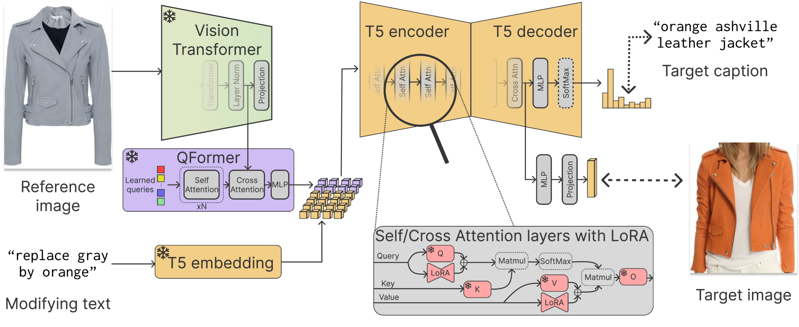
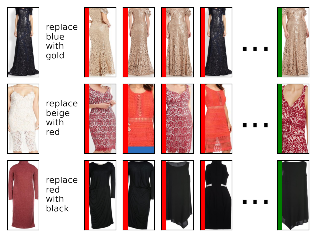
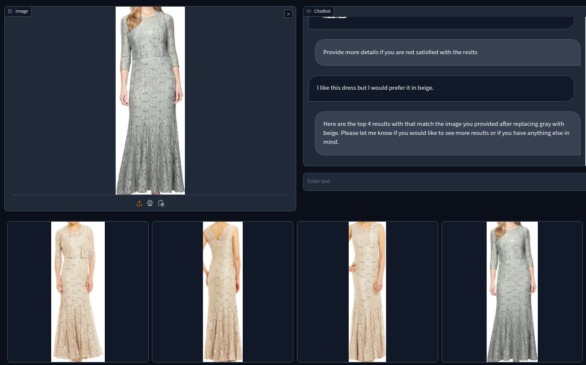

# 运用大型语言模型开展多模态搜索研究。

发布时间：2024年04月24日

`LLM应用` `电子商务` `多模态交互`

> Leveraging Large Language Models for Multimodal Search

# 摘要

> 多模态搜索正日益成为帮助用户自然而高效地表达搜索意图的关键工具。它通过图像展示产品的精细特征，同时利用文本便捷地调整搜索条件。尽管如此，现有的一些多模态搜索系统在处理简单查询时表现不稳定，且难以应对充满歧义、隐含意义和无关信息的自然语言文本查询。为了克服这些挑战，我们需要构建具备更强匹配能力、推理技巧以及能够感知上下文并重写查询的系统。本文提出了一种创新的多模态搜索模型，它在Fashion200K数据集上刷新了性能记录。我们还设计了一种新型搜索界面，整合了大型语言模型（LLMs），以便更好地进行自然语言交互。该界面能够在与用户进行对话式互动的同时，考虑用户的历史搜索记录，并将查询有效路由至搜索系统。结合我们的多模态搜索模型，这一创新预示着购物助手将迈入一个新时代，它们能够提供更加人性化的互动体验，极大提升用户的搜索感受。

> Multimodal search has become increasingly important in providing users with a natural and effective way to ex-press their search intentions. Images offer fine-grained details of the desired products, while text allows for easily incorporating search modifications. However, some existing multimodal search systems are unreliable and fail to address simple queries. The problem becomes harder with the large variability of natural language text queries, which may contain ambiguous, implicit, and irrelevant in-formation. Addressing these issues may require systems with enhanced matching capabilities, reasoning abilities, and context-aware query parsing and rewriting. This paper introduces a novel multimodal search model that achieves a new performance milestone on the Fashion200K dataset. Additionally, we propose a novel search interface integrating Large Language Models (LLMs) to facilitate natural language interaction. This interface routes queries to search systems while conversationally engaging with users and considering previous searches. When coupled with our multimodal search model, it heralds a new era of shopping assistants capable of offering human-like interaction and enhancing the overall search experience.

[Arxiv](https://arxiv.org/abs/2404.15790)