# 多模态代理学习：迈向个性化视觉的多聚类技术。

发布时间：2024年04月24日

`Agent` `数据挖掘` `人工智能`

> Multi-Modal Proxy Learning Towards Personalized Visual Multiple Clustering

# 摘要

> 多聚类技术因其能够从多元视角揭示数据的多重潜在结构而日益受到重视，深度多聚类技术的突破更是通过挖掘大型数据集中的复杂模式与联系，显著提升了其性能。但用户往往不需要算法生成的所有聚类结果，确定所需聚类需要对每个结果有深刻的理解。以往，将用户关注的关键词与相应的视觉元素匹配颇为困难，但随着多模态及大型语言模型（LLMs）的兴起，这一难题开始得到解决。为此，面对未标记的目标视觉数据，我们提出了Multi-MaP，这是一种创新的多模态代理学习方法。该方法利用CLIP编码器提取一致的文本和图像嵌入，并通过GPT-4整合用户兴趣，构建有效的文本环境。同时，我们还设计了参考词约束和概念级约束，以学习符合用户兴趣的最优文本代理。Multi-MaP不仅能够精准捕捉用户通过关键词表达的兴趣，还有助于识别相关的聚类。我们的广泛实验证明，Multi-MaP在所有基准多聚类视觉任务中均超越了现有最先进方法。相关代码已在 https://github.com/Alexander-Yao/Multi-MaP 上发布。

> Multiple clustering has gained significant attention in recent years due to its potential to reveal multiple hidden structures of data from different perspectives. The advent of deep multiple clustering techniques has notably advanced the performance by uncovering complex patterns and relationships within large datasets. However, a major challenge arises as users often do not need all the clusterings that algorithms generate, and figuring out the one needed requires a substantial understanding of each clustering result. Traditionally, aligning a user's brief keyword of interest with the corresponding vision components was challenging, but the emergence of multi-modal and large language models (LLMs) has begun to bridge this gap. In response, given unlabeled target visual data, we propose Multi-MaP, a novel method employing a multi-modal proxy learning process. It leverages CLIP encoders to extract coherent text and image embeddings, with GPT-4 integrating users' interests to formulate effective textual contexts. Moreover, reference word constraint and concept-level constraint are designed to learn the optimal text proxy according to the user's interest. Multi-MaP not only adeptly captures a user's interest via a keyword but also facilitates identifying relevant clusterings. Our extensive experiments show that Multi-MaP consistently outperforms state-of-the-art methods in all benchmark multi-clustering vision tasks. Our code is available at https://github.com/Alexander-Yao/Multi-MaP.

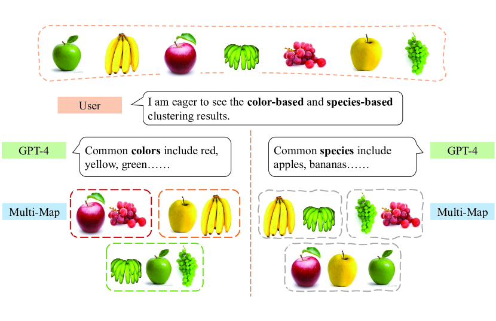

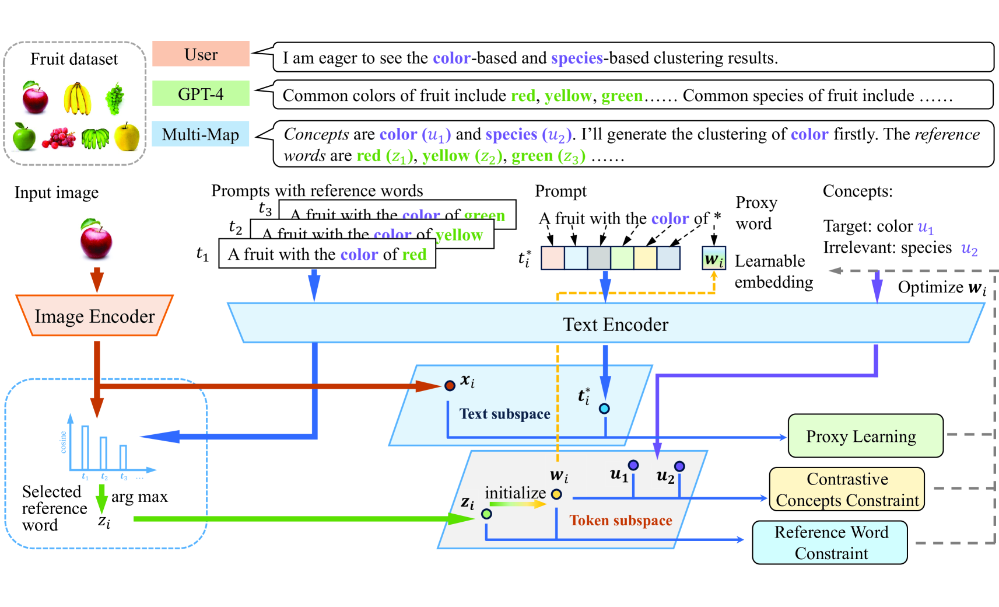

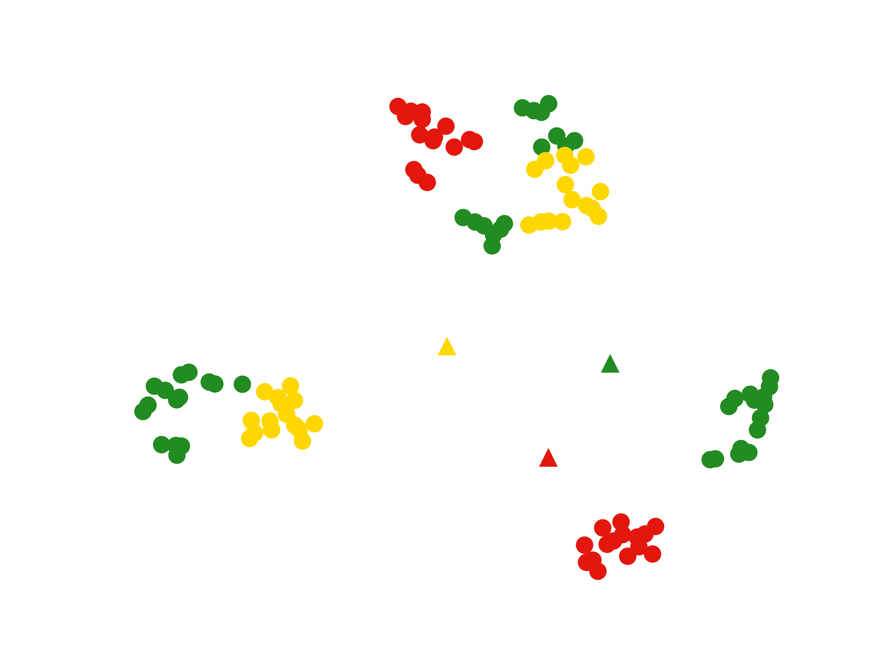

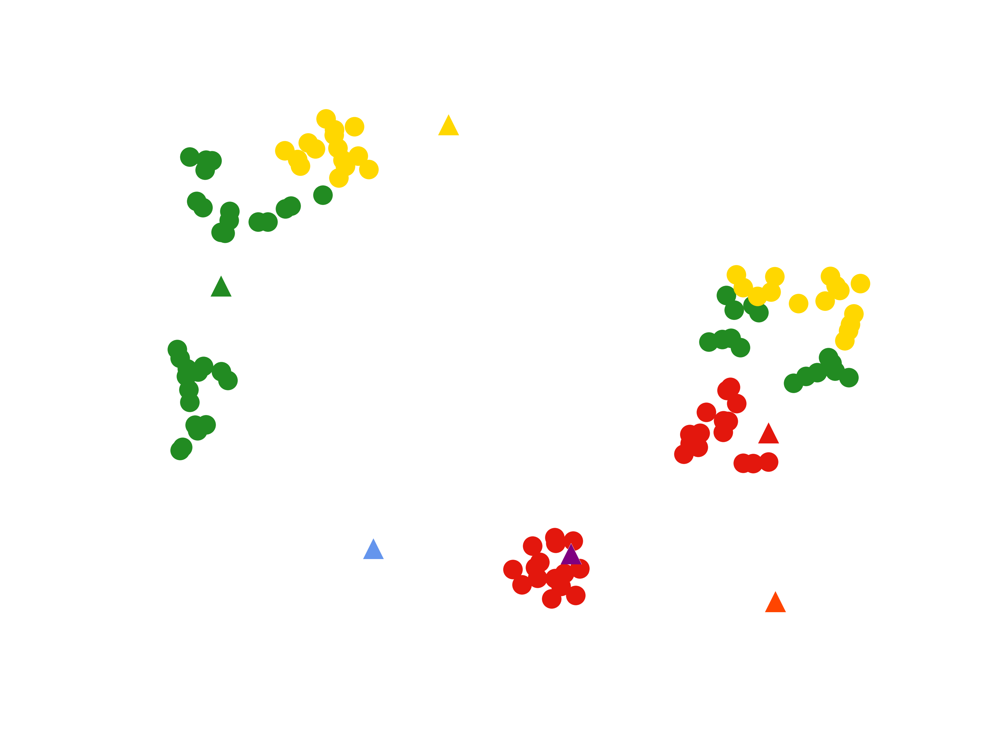

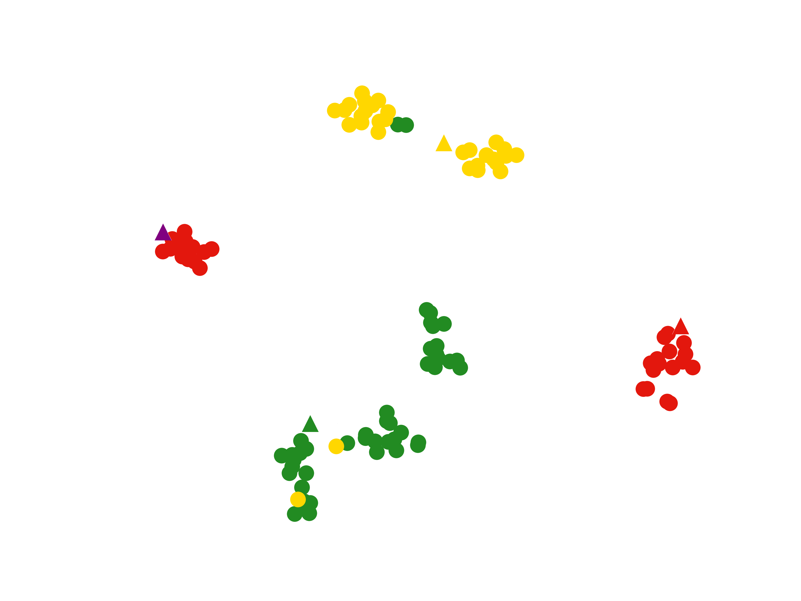

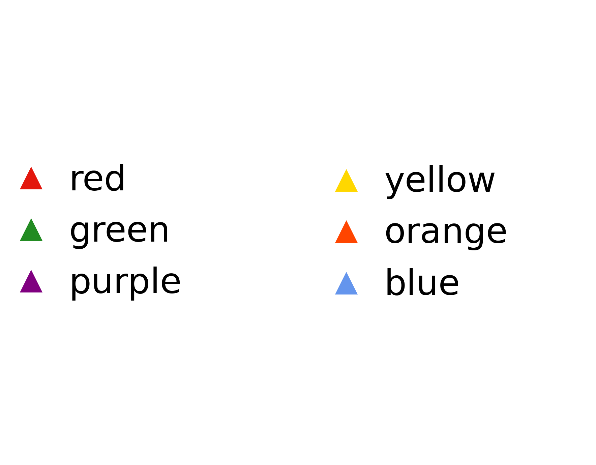

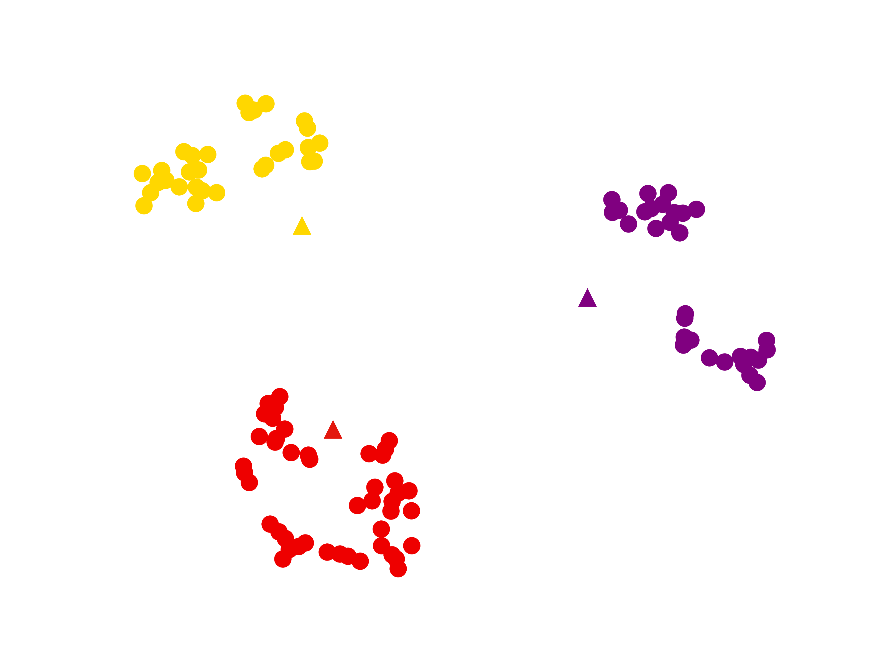

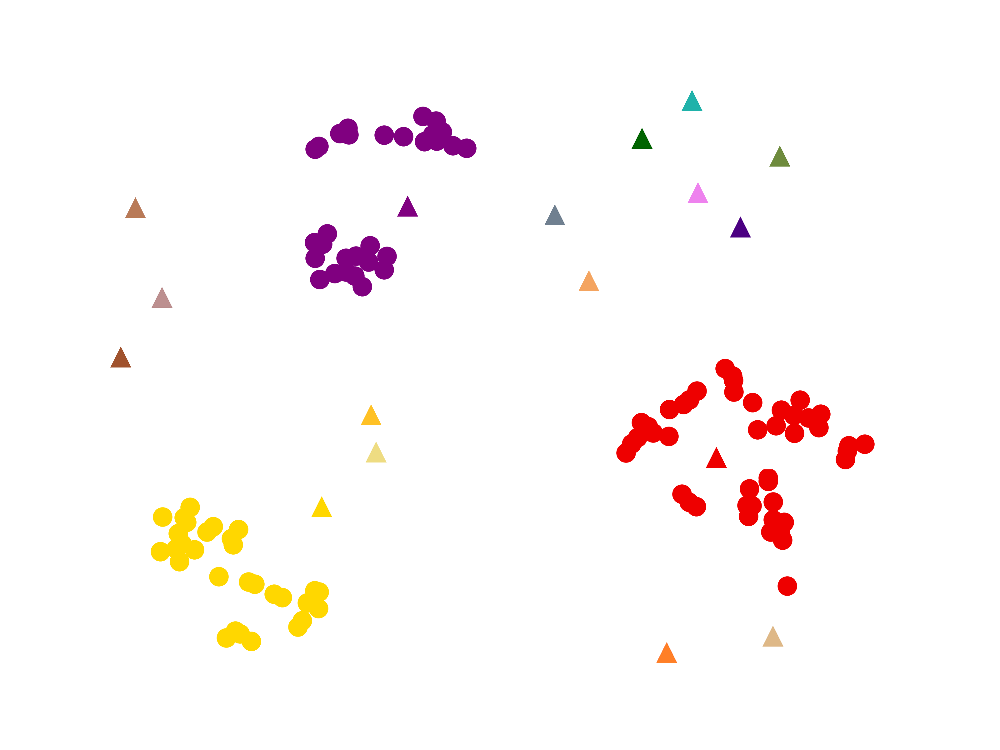

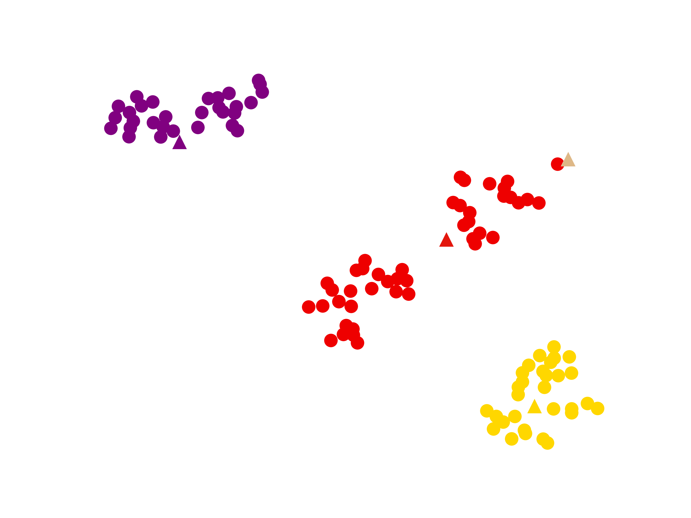

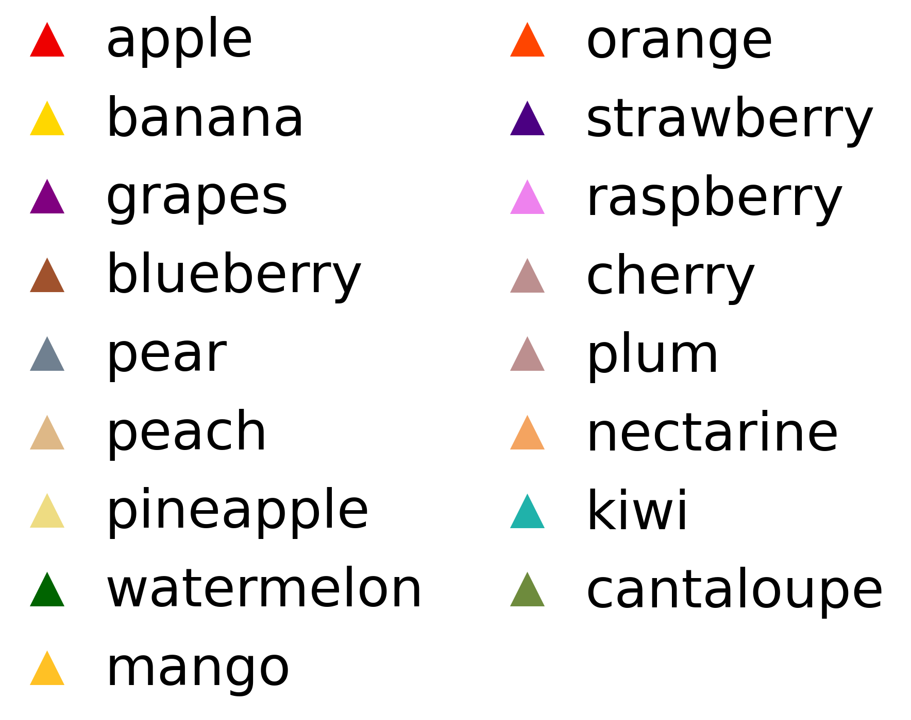

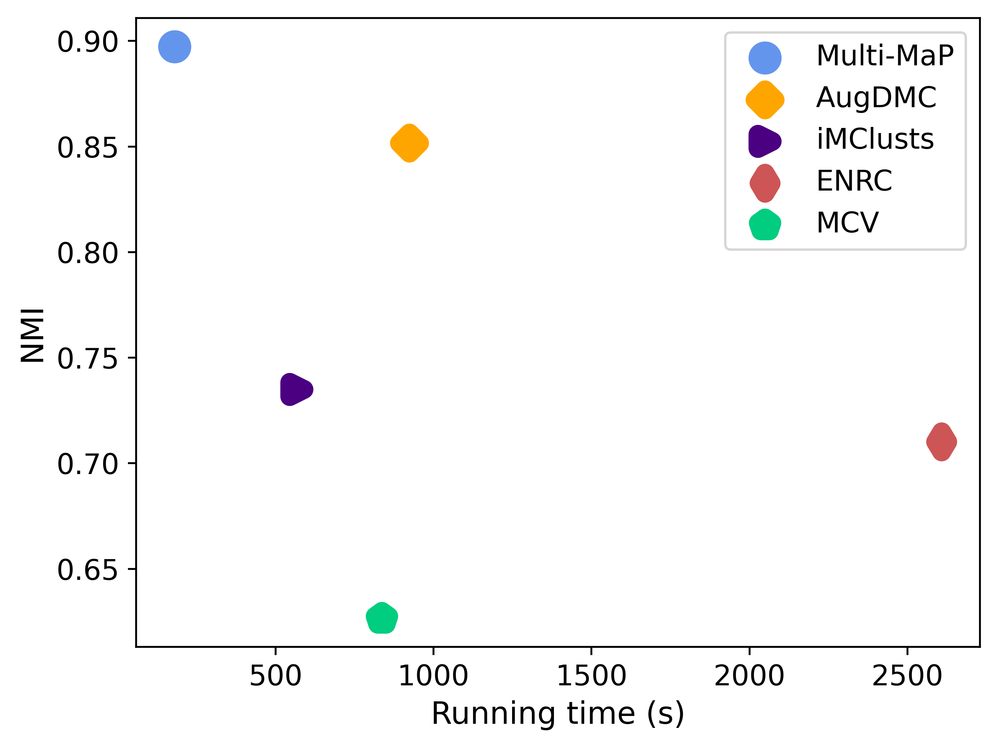

[Arxiv](https://arxiv.org/abs/2404.15655)