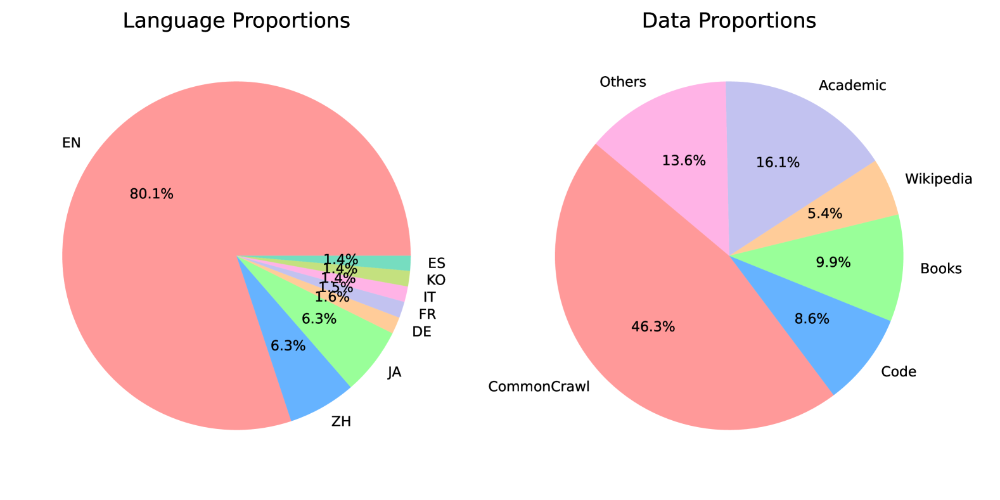
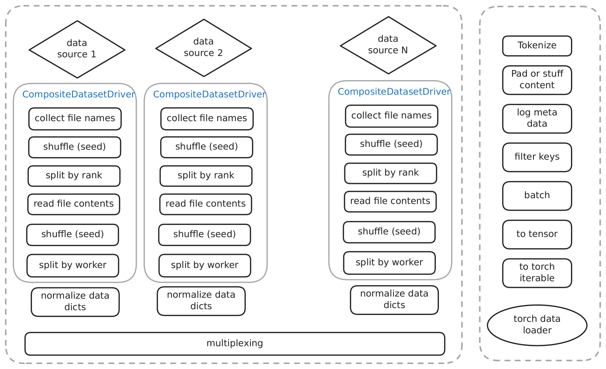
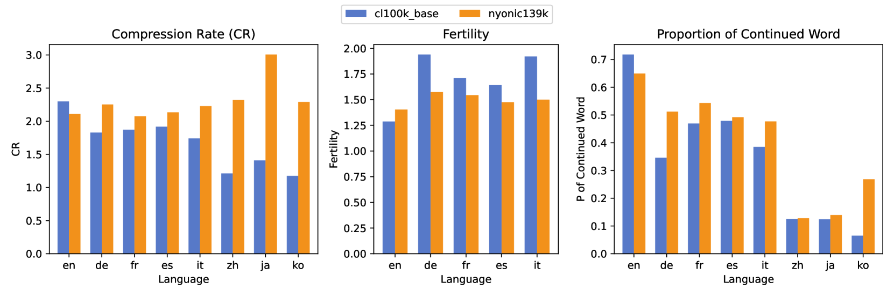
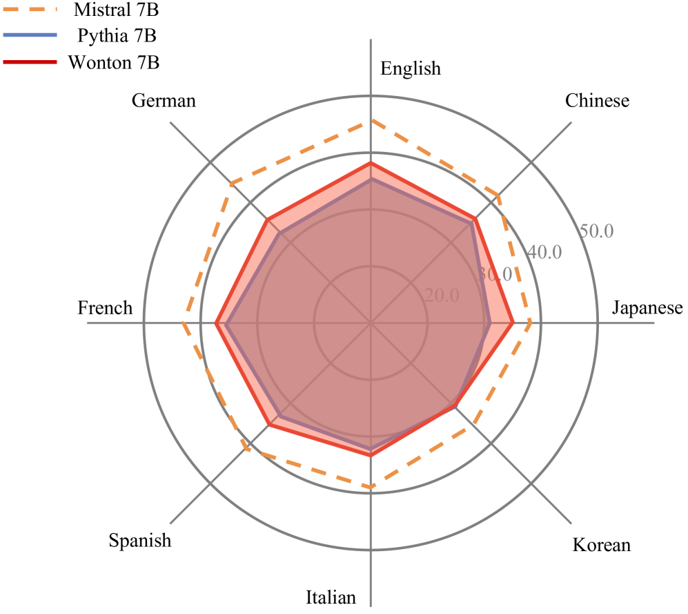

# Nyonic 技术报告

发布时间：2024年04月24日

`LLM理论` `机器学习`

> Nyonic Technical Report

# 摘要

> 本篇报告深入阐述了我们最新定制的大型语言模型的开发进程及主要成就。新引入的亮点包括创新的在线数据调度器，它允许灵活调整训练数据和课程式学习。模型结构采用了尖端技术，例如旋转位置嵌入、QK-LayerNorm，以及专为多语言设计的分词器，以提升模型的稳定性与性能。此外，我们的训练框架融合了先进的监控系统和快速恢复机制，确保训练过程的高效性。我们的 Wonton 7B 模型在多语言及英语基准测试中展现了强劲的竞争力。展望未来，我们将持续优化，力争缩小与更高级训练模型之间的性能差异，以提升模型在现实世界中的实用性和灵活性。GitHub 项目地址：\url{https://github.com/nyonicai/nyonic-public}

> This report details the development and key achievements of our latest language model designed for custom large language models. The advancements introduced include a novel Online Data Scheduler that supports flexible training data adjustments and curriculum learning. The model's architecture is fortified with state-of-the-art techniques such as Rotary Positional Embeddings, QK-LayerNorm, and a specially crafted multilingual tokenizer to enhance stability and performance. Moreover, our robust training framework incorporates advanced monitoring and rapid recovery features to ensure optimal efficiency. Our Wonton 7B model has demonstrated competitive performance on a range of multilingual and English benchmarks. Future developments will prioritize narrowing the performance gap with more extensively trained models, thereby enhancing the model's real-world efficacy and adaptability.GitHub: \url{https://github.com/nyonicai/nyonic-public}

[Arxiv](https://arxiv.org/abs/2404.15702)