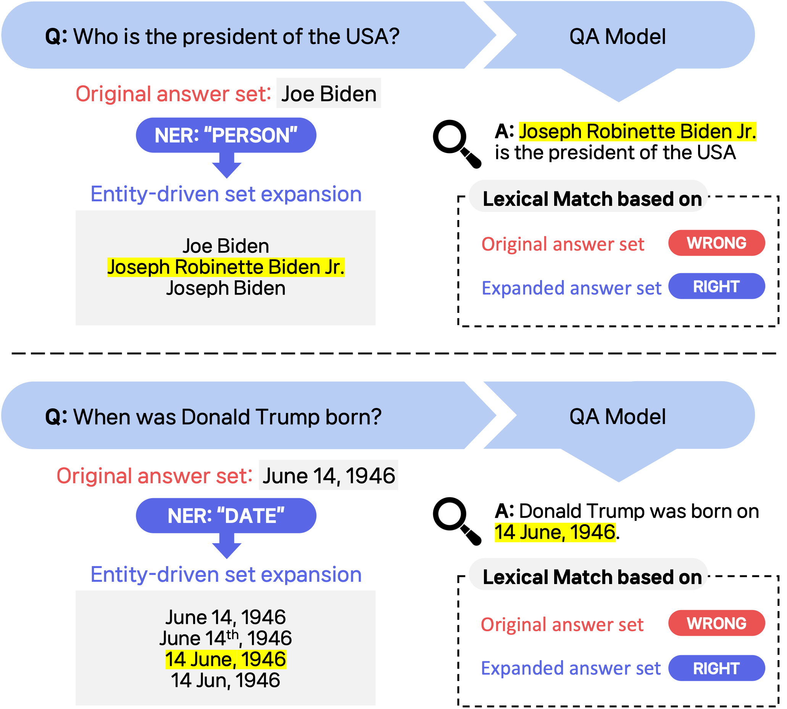
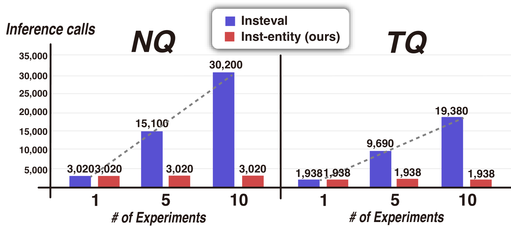
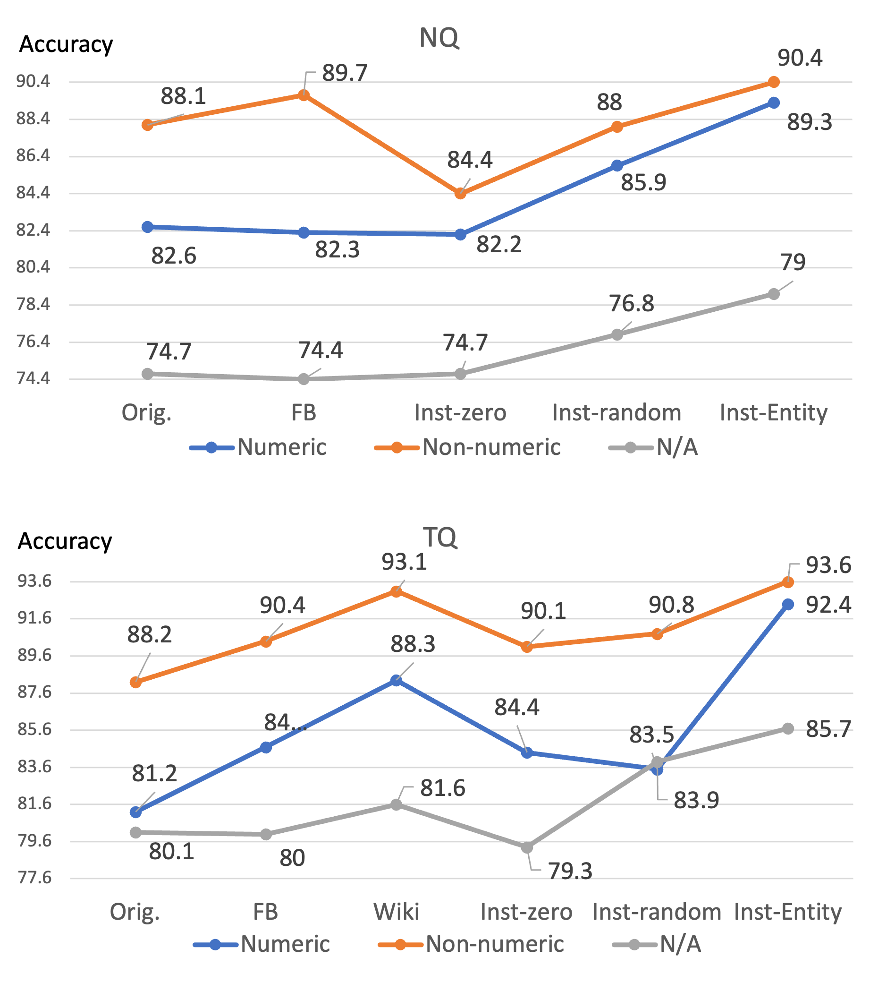

# EM 回归：以实体为驱动力，为问答评估扩展答案集

发布时间：2024年04月24日

`LLM应用` `问答系统` `环境科学`

> Return of EM: Entity-driven Answer Set Expansion for QA Evaluation

# 摘要

> 近期研究显示，直接应用大型语言模型（LLMs）评估问答（QA）模型最为可靠。但这种方法存在可解释性不强、成本高和对环境有害等缺点。为克服这些问题，我们提出了一种新方法：利用软实体匹配（EM）配合实体驱动的答案集扩展。该方法通过观察到不同实体类型的表面形式往往遵循特定模式，将标准答案集扩展为包含多样化表达形式。实验结果显示，此方法在性能上大幅超越了传统评估手段。而且，我们的评估方法在可靠性上与基于LLM的方法不相上下，同时具备更高的可解释性和更低的环境影响。

> Recently, directly using large language models (LLMs) has been shown to be the most reliable method to evaluate QA models. However, it suffers from limited interpretability, high cost, and environmental harm. To address these, we propose to use soft EM with entity-driven answer set expansion. Our approach expands the gold answer set to include diverse surface forms, based on the observation that the surface forms often follow particular patterns depending on the entity type. The experimental results show that our method outperforms traditional evaluation methods by a large margin. Moreover, the reliability of our evaluation method is comparable to that of LLM-based ones, while offering the benefits of high interpretability and reduced environmental harm.

[Arxiv](https://arxiv.org/abs/2404.15650)