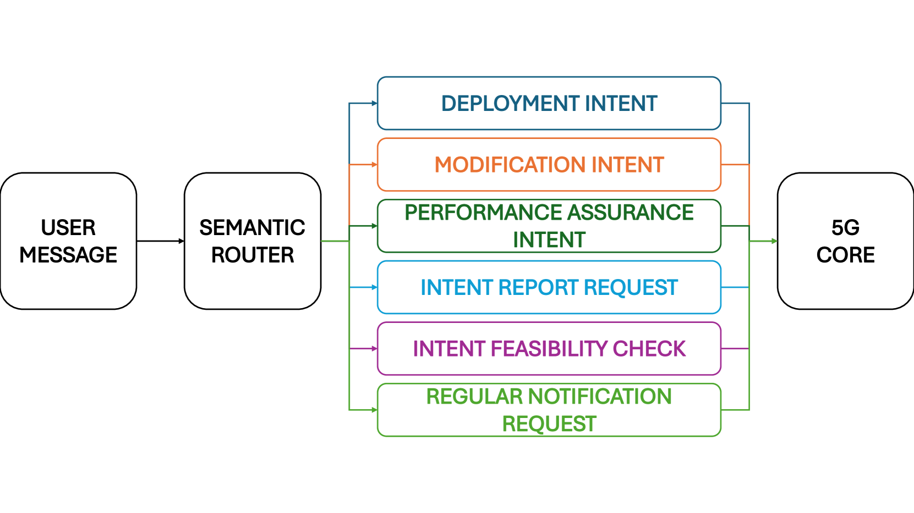
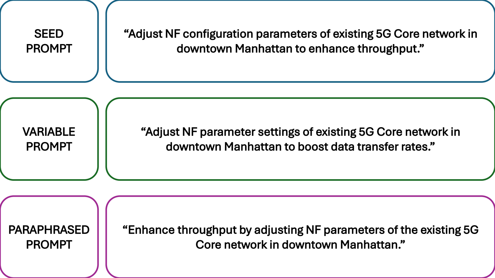
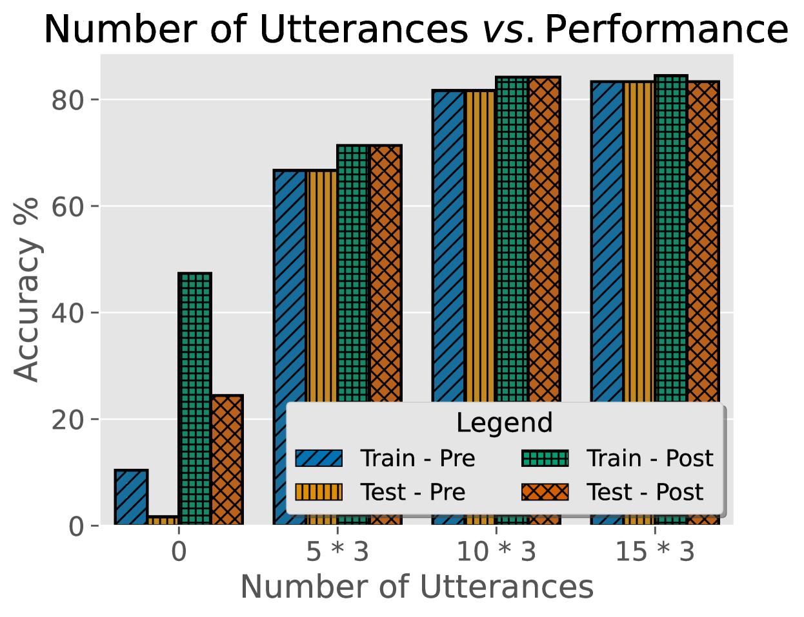
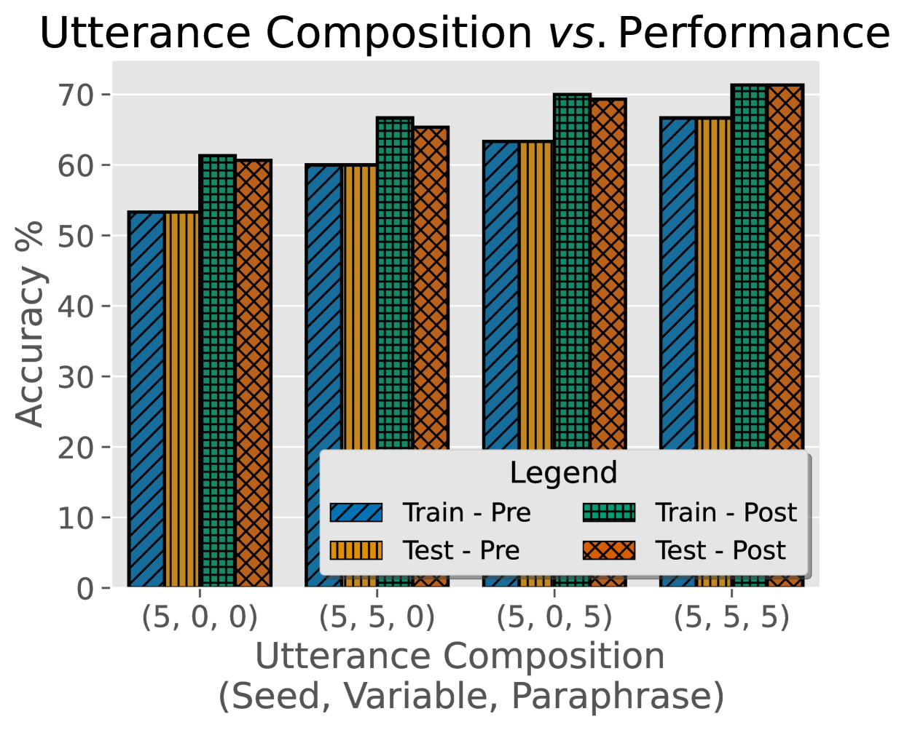
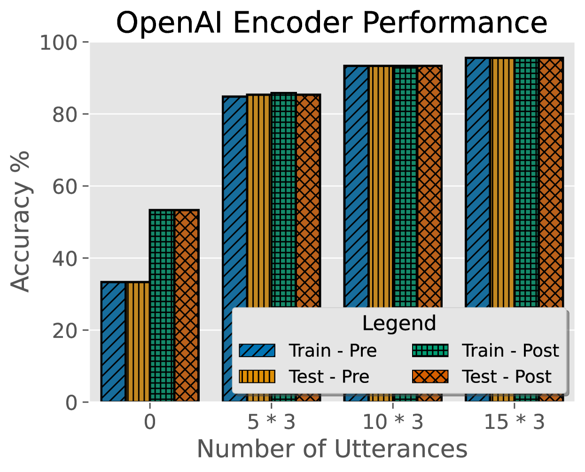

# 通过引入语义路由技术，我们旨在提升大型语言模型（LLM）在辅助实现基于意图的5G核心网络管理和编排方面的性能。

发布时间：2024年04月24日

`LLM应用` `5G核心网络`

> Semantic Routing for Enhanced Performance of LLM-Assisted Intent-Based 5G Core Network Management and Orchestration

# 摘要

> 大型语言模型（LLMs）在AI领域迅速露头角，尤其是在自然语言处理和AI生成领域。这些模型不仅限于文本生成，它们天生具备通过提示工程来优化输入结构，从而清晰表达模型意图的能力。一个典型案例是意图驱动网络，这是一种用于自动化网络运维和管理的新兴技术。本文探讨了语义路由技术，旨在提升LLM在5G核心网络的意图驱动管理和编排中的性能。研究建立了一个端到端的意图提取框架，并通过多样化的用户意图样本数据集，深入分析了编码器和量化技术对系统性能的影响。研究结果表明，采用语义路由能够显著提升LLM部署的精准度和效率，超越了传统的独立LLM提示架构。

> Large language models (LLMs) are rapidly emerging in Artificial Intelligence (AI) applications, especially in the fields of natural language processing and generative AI. Not limited to text generation applications, these models inherently possess the opportunity to leverage prompt engineering, where the inputs of such models can be appropriately structured to articulate a model's purpose explicitly. A prominent example of this is intent-based networking, an emerging approach for automating and maintaining network operations and management. This paper presents semantic routing to achieve enhanced performance in LLM-assisted intent-based management and orchestration of 5G core networks. This work establishes an end-to-end intent extraction framework and presents a diverse dataset of sample user intents accompanied by a thorough analysis of the effects of encoders and quantization on overall system performance. The results show that using a semantic router improves the accuracy and efficiency of the LLM deployment compared to stand-alone LLMs with prompting architectures.

[Arxiv](https://arxiv.org/abs/2404.15869)