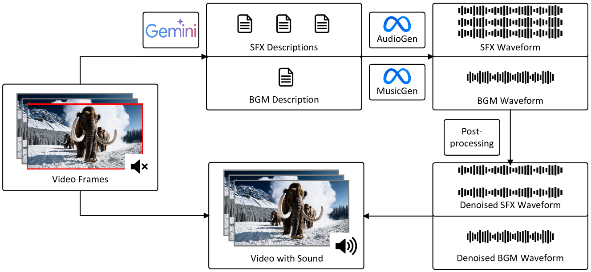

# 利用多模态大型语言模型，实现视频到音频的语义一致性生成。

发布时间：2024年04月24日

`分类：LLM应用` `视频制作` `音频生成`

> Semantically consistent Video-to-Audio Generation using Multimodal Language Large Model

# 摘要

> 尽管现有研究在视频生成技术上取得了显著进步，但缺少声效和背景音乐的融入，使得观众的沉浸式体验仍有所欠缺。为此，我们提出了一个创新的视频到音频生成框架SVA，它能够智能化地生成与视频内容语义相匹配的音频。SVA框架依托于多模态大型语言模型，通过关键帧解析视频语义，并构思出创新的音频方案，这些方案随后作为文本到音频模型的输入提示，实现了以自然语言为桥梁的视频到音频的转换。通过案例分析，我们证实了SVA的卓越性能，并对其局限性进行了讨论，同时展望了未来的研究动向。更多项目详情，欢迎访问我们的项目页面 https://huiz-a.github.io/audio4video.github.io/。

> Existing works have made strides in video generation, but the lack of sound effects (SFX) and background music (BGM) hinders a complete and immersive viewer experience. We introduce a novel semantically consistent v ideo-to-audio generation framework, namely SVA, which automatically generates audio semantically consistent with the given video content. The framework harnesses the power of multimodal large language model (MLLM) to understand video semantics from a key frame and generate creative audio schemes, which are then utilized as prompts for text-to-audio models, resulting in video-to-audio generation with natural language as an interface. We show the satisfactory performance of SVA through case study and discuss the limitations along with the future research direction. The project page is available at https://huiz-a.github.io/audio4video.github.io/.

[Arxiv](https://arxiv.org/abs/2404.16305)