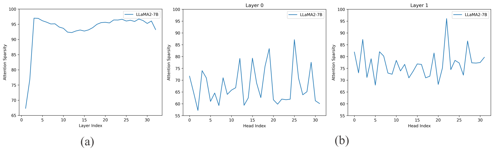
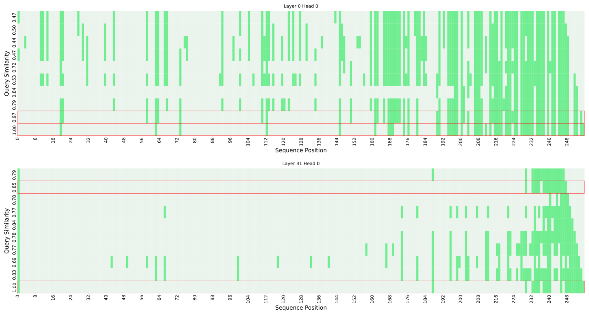
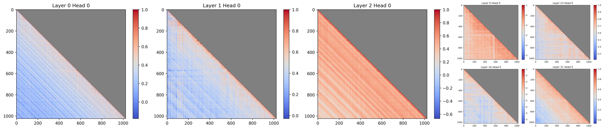
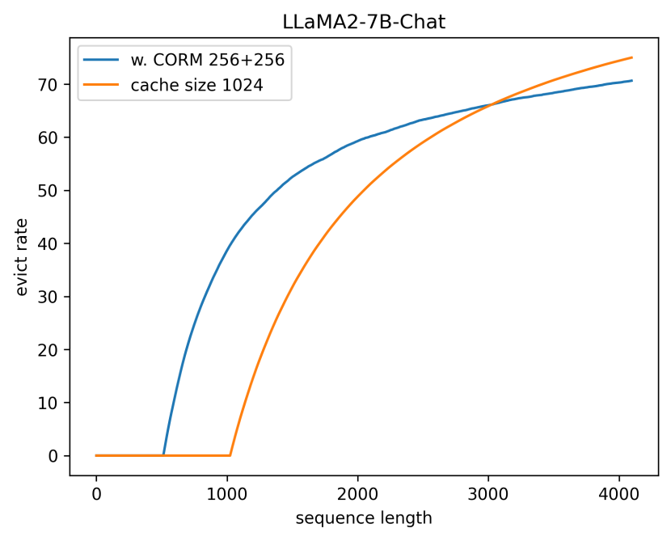
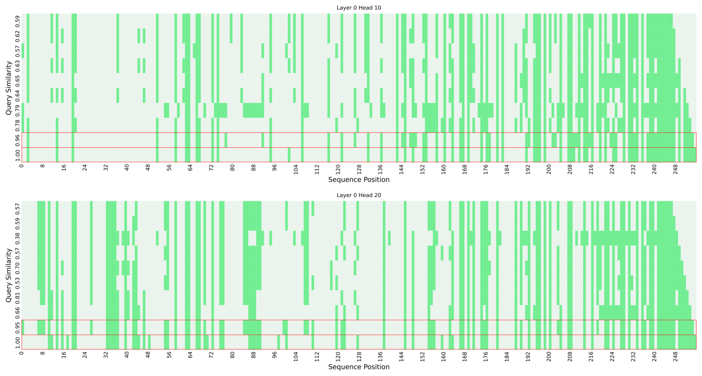
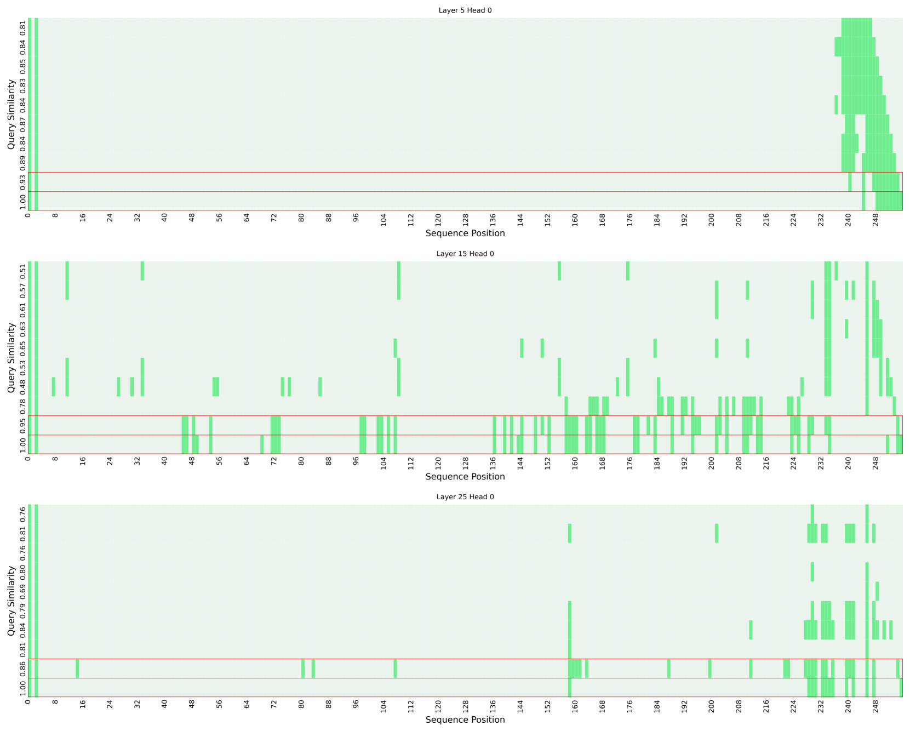
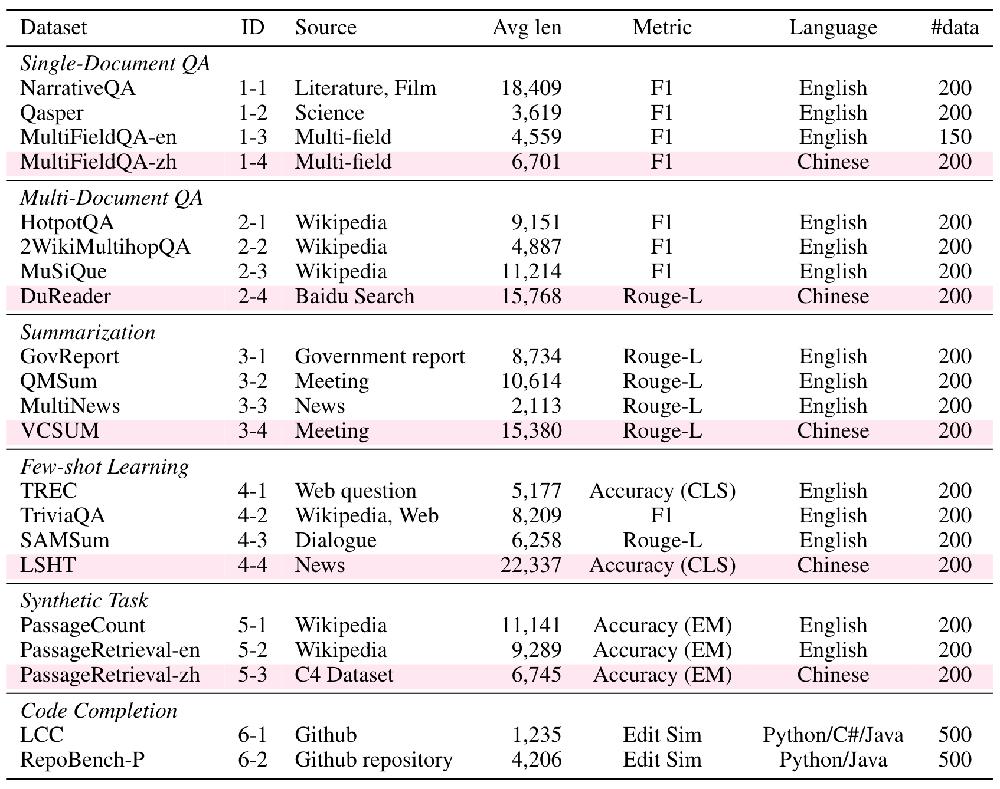

# 序列能够悄无声息地指引你哪些信息可以舍弃。

发布时间：2024年04月24日

`LLM理论` `计算机科学` `人工智能`

> Sequence can Secretly Tell You What to Discard

# 摘要

> 尽管大型语言模型（LLMs）在众多任务上有着令人瞩目的表现，但它们对GPU内存的需求巨大，计算资源的消耗也十分庞大。KV缓存的内存需求随着序列长度的增加而线性上升，逐渐成为推理过程中的一个主要障碍。本文提出了一种创新的方法来优化KV缓存，显著降低了其内存占用。我们在LLaMA2系列模型上进行了深入研究，发现相邻词汇的查询向量之间具有极高的相似性，且当前查询的注意力计算主要依赖于前序查询中的一小部分注意力信息。基于这些发现，我们设计了CORM，一种动态保留关键键值对的KV缓存逐出策略，无需对模型进行微调即可实现。实验结果表明，CORM能够在LongBench的六项任务中将KV缓存的推理内存使用量减少最多70%，同时保持了性能的稳定性。

> Large Language Models (LLMs), despite their impressive performance on a wide range of tasks, require significant GPU memory and consume substantial computational resources. In addition to model weights, the memory occupied by KV cache increases linearly with sequence length, becoming a main bottleneck for inference. In this paper, we introduce a novel approach for optimizing the KV cache which significantly reduces its memory footprint. Through a comprehensive investigation, we find that on LLaMA2 series models, (i) the similarity between adjacent tokens' query vectors is remarkably high, and (ii) current query's attention calculation can rely solely on the attention information of a small portion of the preceding queries. Based on these observations, we propose CORM, a KV cache eviction policy that dynamically retains important key-value pairs for inference without finetuning the model. We validate that CORM reduces the inference memory usage of KV cache by up to 70% without noticeable performance degradation across six tasks in LongBench.

[Arxiv](https://arxiv.org/abs/2404.15949)