# 教学视频的分步差异

发布时间：2024年04月24日

`Agent` `增强现实/虚拟现实` `自动化教学`

> Step Differences in Instructional Video

# 摘要

> 在 AR/VR 技术中，将用户视频与教学视频进行对比是实现个性化辅助的关键。但现行的基于语言的辅助方法仅能针对单一视频答疑。我们提出了一种新方法：首先，利用现有的步骤注释和旁白，自动生成大量 HowTo100M 视频对的视觉指令调整数据；其次，训练一个视频条件化的语言模型，使其能够跨多个原始视频进行联合推理。该模型在辨识视频对差异和基于差异严重性进行视频排序方面达到了行业领先水平，并展现出处理多视频通用推理的潜力。

> Comparing a user video to a reference how-to video is a key requirement for AR/VR technology delivering personalized assistance tailored to the user's progress. However, current approaches for language-based assistance can only answer questions about a single video. We propose an approach that first automatically generates large amounts of visual instruction tuning data involving pairs of videos from HowTo100M by leveraging existing step annotations and accompanying narrations, and then trains a video-conditioned language model to jointly reason across multiple raw videos. Our model achieves state-of-the-art performance at identifying differences between video pairs and ranking videos based on the severity of these differences, and shows promising ability to perform general reasoning over multiple videos.

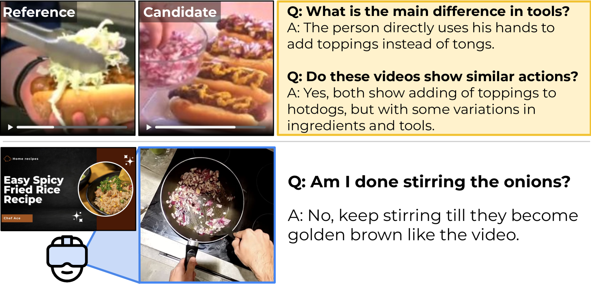

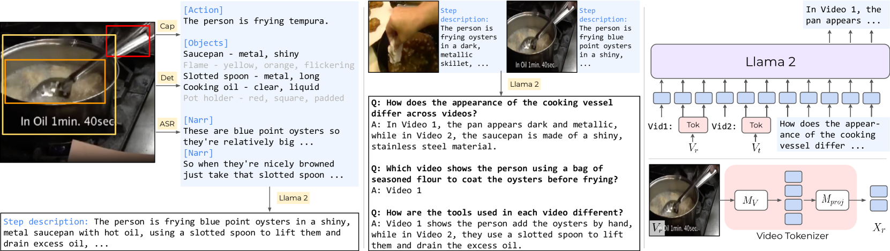

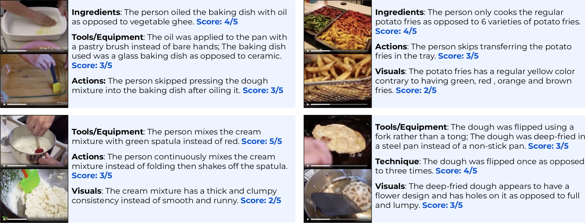

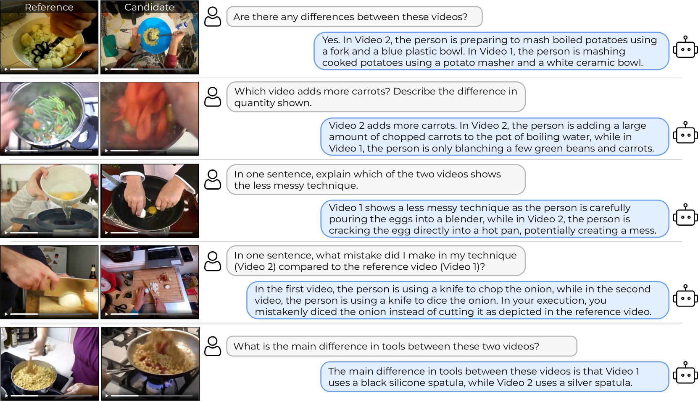

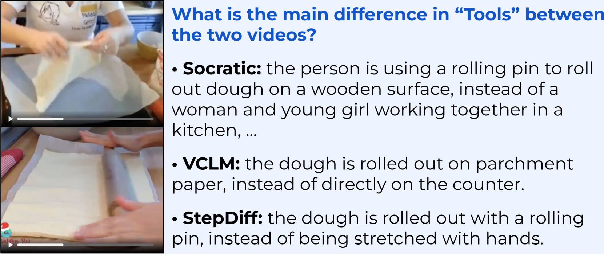

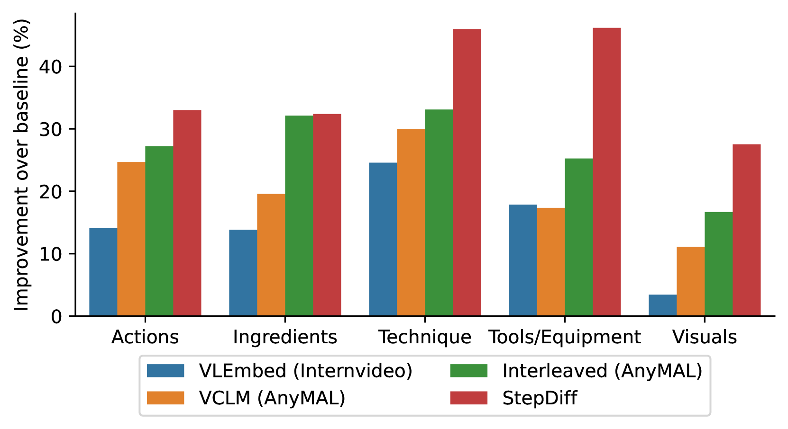

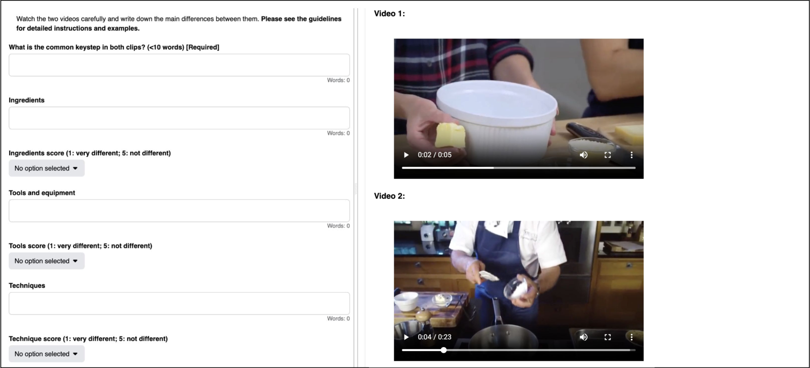

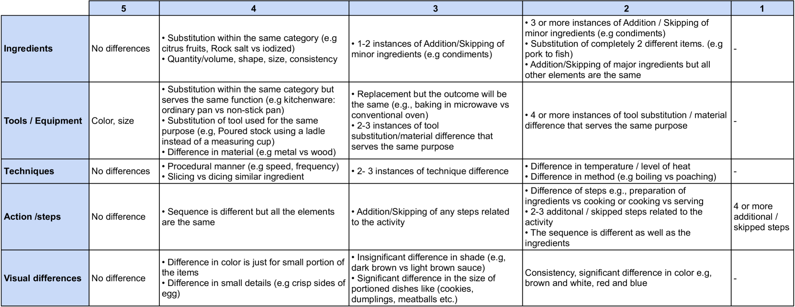

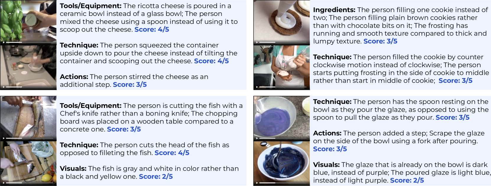

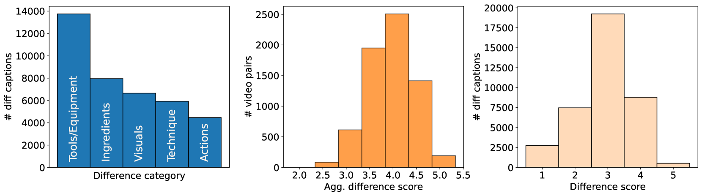

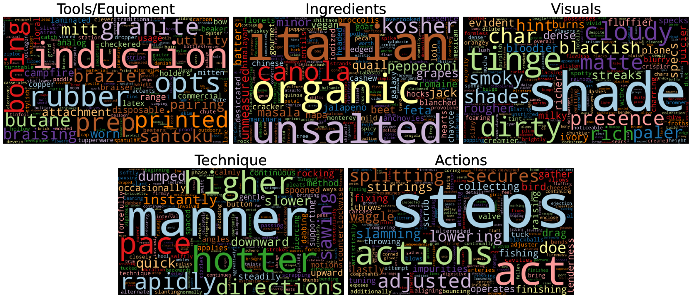

[Arxiv](https://arxiv.org/abs/2404.16222)