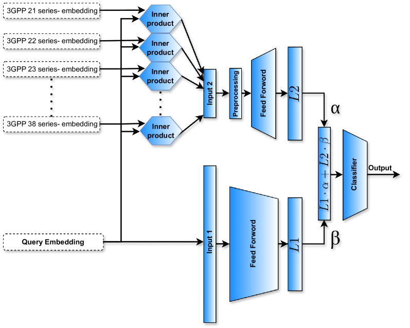
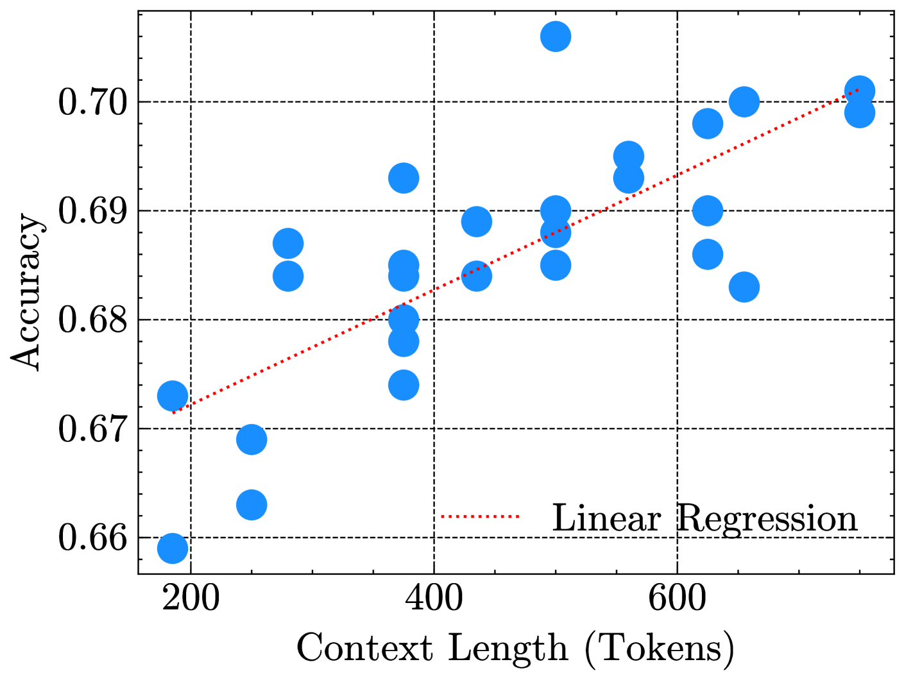
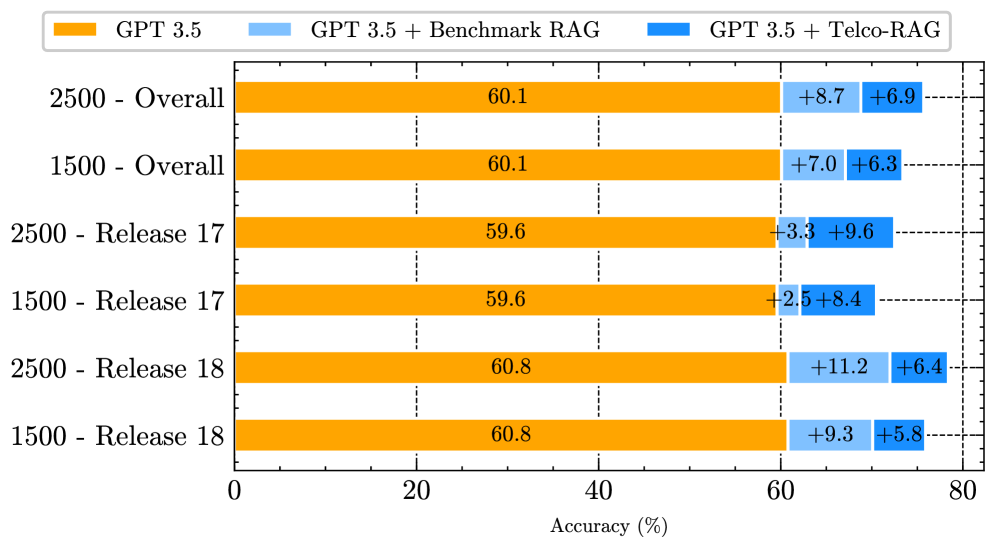
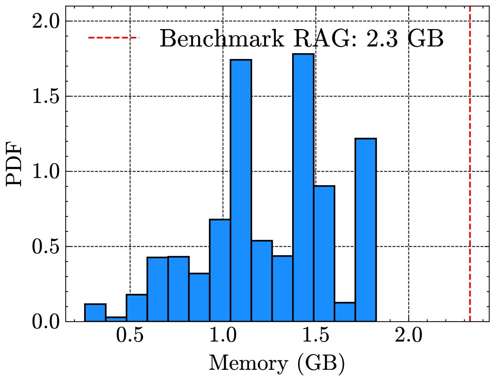

# Telco-RAG：探索电信行业中检索增强语言模型的挑战与应对之道

发布时间：2024年04月24日

`分类：RAG` `人工智能`

> Telco-RAG: Navigating the Challenges of Retrieval-Augmented Language Models for Telecommunications

# 摘要

> 大型语言模型（LLMs）和检索增强生成（RAG）系统在电信行业的应用遭遇了特别的挑战，这主要是因为电信标准文档的复杂性以及该行业的迅猛发展。本文提出了并开放源代码了Telco-RAG，这是一个专为电信标准需求量身定制的RAG框架，尤其是针对第三代合作伙伴计划（3GPP）文档。Telco-RAG克服了在技术性极强的内容上部署RAG流水线的重大挑战，为LLMs在电信领域的应用开辟了新径，并为其他技术领域的RAG实施提供了宝贵的参考。

> The application of Large Language Models (LLMs) and Retrieval-Augmented Generation (RAG) systems in the telecommunication domain presents unique challenges, primarily due to the complex nature of telecom standard documents and the rapid evolution of the field. The paper introduces and open-sources Telco-RAG, a customized RAG framework designed to handle the specific needs of telecommunications standards, particularly 3rd Generation Partnership Project (3GPP) documents. Telco-RAG addresses the critical challenges of implementing a RAG pipeline on highly technical content, paving the way for applying LLMs in telecommunications and offering guidelines for RAG implementation in other technical domains.

[Arxiv](https://arxiv.org/abs/2404.15939)