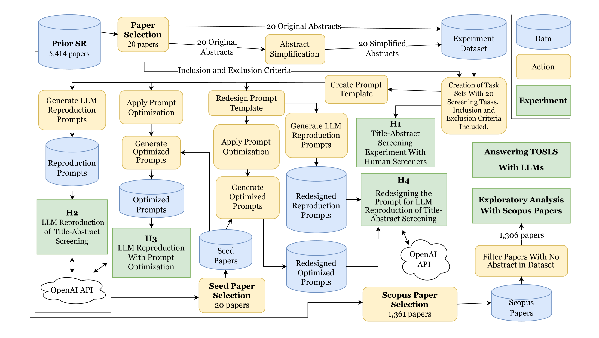
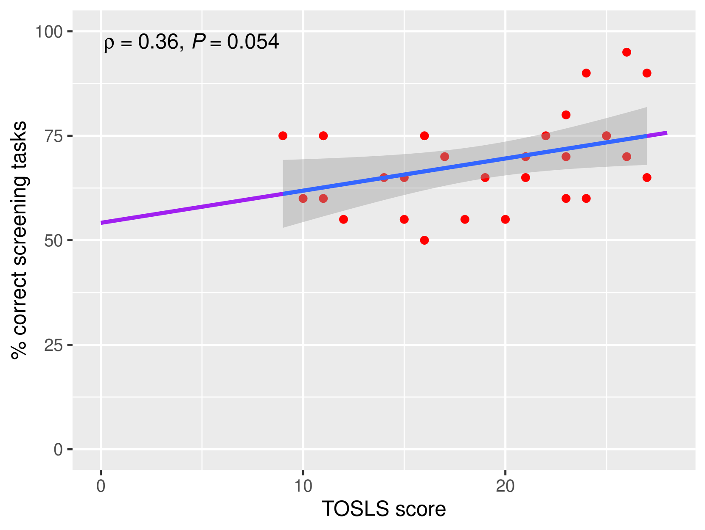

# 大型语言模型（LLMs）在加速系统性综述筛选流程中的应用前景广阔，但也面临诸多挑战。

发布时间：2024年04月24日

`LLM应用` `软件工程` `自动化`

> The Promise and Challenges of Using LLMs to Accelerate the Screening Process of Systematic Reviews

# 摘要

> 系统性回顾在软件工程领域广受欢迎，但完成这一研究方法平均需耗时67周。因此，若能自动化系统性回顾流程中的某一环节，便能减轻研究负担。本研究旨在探究大型语言模型（LLMs）是否能够通过简化摘要以助人工筛选，并自动执行标题-摘要筛选，从而加快筛选速度。我们进行了一项实验，让筛选人员对20篇论文的原始和简化后的摘要进行筛选，这些简化后的摘要来源于先前的系统性回顾。此外，我们还利用GPT-3.5和GPT-4两款大型语言模型复现了人类筛选人员的筛选工作。我们还考察了不同的提示技巧（零次提示、一次提示、少次提示以及带有思维链路的少次提示）是否能够提升LLMs的筛选效率。最后，我们研究了重新设计LLMs筛选过程中使用的提示语是否能提升性能。研究发现，文本简化并未提升筛选效率，但缩短了筛选时间。筛选人员的科学素养和研究者身份是预测筛选表现的关键因素。某些LLMs和提示组合的表现与人类筛选人员不相上下。结果表明，GPT-4相较于GPT-3.5有所提升，且少次提示和一次提示的效果优于零次提示。在筛选过程中使用LLMs进行文本简化并未显著提升人工筛选表现。尽管利用LLMs自动化标题-摘要筛选前景广阔，但目前的LLMs在准确性上并不显著优于人类筛选员。若要推荐在系统性回顾的筛选过程中采用LLMs，还需进一步研究。我们建议未来的系统性回顾研究发布包含筛选数据的复制包，以便更有效地进行LLMs筛选实验。

> Systematic review (SR) is a popular research method in software engineering (SE). However, conducting an SR takes an average of 67 weeks. Thus, automating any step of the SR process could reduce the effort associated with SRs. Our objective is to investigate if Large Language Models (LLMs) can accelerate title-abstract screening by simplifying abstracts for human screeners, and automating title-abstract screening. We performed an experiment where humans screened titles and abstracts for 20 papers with both original and simplified abstracts from a prior SR. The experiment with human screeners was reproduced with GPT-3.5 and GPT-4 LLMs to perform the same screening tasks. We also studied if different prompting techniques (Zero-shot (ZS), One-shot (OS), Few-shot (FS), and Few-shot with Chain-of-Thought (FS-CoT)) improve the screening performance of LLMs. Lastly, we studied if redesigning the prompt used in the LLM reproduction of screening leads to improved performance. Text simplification did not increase the screeners' screening performance, but reduced the time used in screening. Screeners' scientific literacy skills and researcher status predict screening performance. Some LLM and prompt combinations perform as well as human screeners in the screening tasks. Our results indicate that the GPT-4 LLM is better than its predecessor, GPT-3.5. Additionally, Few-shot and One-shot prompting outperforms Zero-shot prompting. Using LLMs for text simplification in the screening process does not significantly improve human performance. Using LLMs to automate title-abstract screening seems promising, but current LLMs are not significantly more accurate than human screeners. To recommend the use of LLMs in the screening process of SRs, more research is needed. We recommend future SR studies publish replication packages with screening data to enable more conclusive experimenting with LLM screening.

[Arxiv](https://arxiv.org/abs/2404.15667)